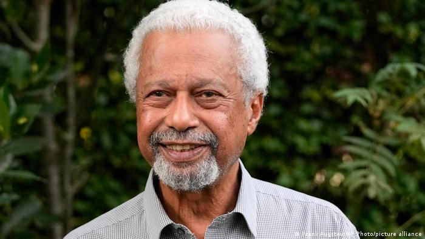

import Book from '~/components/Book.vue'

Fizemos uma pequena pausa nos escritos, mas não nos lidos. Incrível esse "vício" de não poder passar um dia sequer sem pelo menos uma página lida. Seja o lugar que for ou a dor que nos acompanhe, um livro é aquela fuga - ou enfrentamento - necessária.

Nesse intervalo fiz leituras mais curtas, mas belas e, algumas vezes, tristes viagens literárias. Na última postagem do mano Márcio ele falou sobre seu amor pelas biografias. Não é meu gênero de primeira escolha; para mim elas combinam com férias, praia. São tipo livros de relax, de conforto.

Pensando sobre isso, e sobre o que tenho escolhido para ler, notei que sou atraída por um gênero bastante semelhante às biografias, e que os entendidos chamam de autoficção. Acho que eu e toda torcida do Flamengo, como se costuma dizer, pelo que ando lendo nas revistas literárias que acompanho. Haja vista o interesse cada vez maior na obra da Marguerite Duras, uma das autoras que inauguram esse gênero ficcional, com seu imperdível [O Amante](https://amzn.to/3GK7iBF), que li há muitos anos.

Aqui, falarei de dois livros que ganharam lugar especial na minha prateleira de melhores leituras.

---

Fui ler Annie Ernaux em função da lista do Nobel de literatura deste ano. Quando a vi, pela segunda vez, no topo das apostas, não resisti. E que maravilha de escrita encontrei!

<book title="O Lugar" author="Annie Ernaux" link="https://amzn.to/3mG2mG0">

</book>

> "....Na obra, Annie se debruça sobre a vida do próprio pai para esmiuçar relações familiares e de classe, numa mistura entre história pessoal e sociologia que décadas mais tarde serviria de inspiração declarada a expoentes da autoficção mundial e grandes nomes da literatura francesa.
>   
> (...) Ernaux discute a origem operária dos pais e a posição de sua família numa França estratificada e dominada por códigos sociais, onde o menor dos detalhes põe em xeque a ascensão da autora à classe burguesa, duramente conquistada por meio dos estudos.
>   
> Annie Ernaux também explora o abismo que se abriu entre ela e o pai e dá origem a um livro moderno e profundamente humano."
>   
>
> - Nota de lançamento do livro, publicado no [rascunho](https://rascunho.com.br/noticias/romance-celebrado-da-francesa-annie-ernaux-chega-ao-brasil/)

Ernaux usa fatos do cotidiano, como um passeio com o pai numa tarde de domingo; as manhãs dele em sua mercearia ou as conversas entre o pai e a mãe, para reconstruir todo um momento histórico da França pós guerra, processo de industrialização e a inevitável estratificação das classes sociais. Em suas entrevistas, diz que o livro foi um tipo de acerto de contas com suas origens. Do seu sentimento de "traição" pela vergonha que sentia do pai, a partir do momento em que, de alguma forma, por meio dos estudos propiciados por ele, ascendeu socialmente.

> “Eu me disse ‘entendi tudo’, minha atitude de estudante de letras, minha dificuldade, o sentimento de ter vergonha dos meus pais.”

"Arrisco uma explicação: escrever é o último recurso quando se traiu.", frase de Jean Genet que Annie Ernaux utiliza como epígrafe de "O Lugar', em 1983.

Livro que se lê de um fôlego só, mas que nos acompanha por muito tempo!

Annie Ernaux nasceu em 1940, em Lillebonne, na França. Estudou na Universidade de Rouen e foi professora do Centre National d’Enseignement par Correspondance por mais de trinta anos. Seus livros são considerados clássicos modernos na França. Em 2017, Ernaux recebeu o prêmio Marguerite Yourcenar pelo conjunto de sua obra. Certamente continuará na corrida ao Nobel. Aguardemos 2022.

---

Em seguida, li outro livro que também retrata a relação de pai e filha e todo um contexto social. Aqui não mais a França e sim Moçambique, nos anos 60, alguns anos antes e depois da Guerra da Independência (1964-1974).

<book title="Caderno de memórias coloniais" author="Isabela Figueiredo" link="https://amzn.to/3CJhhVh">

</book>

Já havia lido _[A Gorda](https://amzn.to/3nUkbAr)_ de Isabela Figueiredo há alguns anos. O meu interesse nesse livro, do qual já havia ouvido falar muito bem, aumentou muito depois que reli *[Terra Sonâmbula](https://amzn.to/3CWjT2t)* do Mia Couto, que se passa no período da guerra civil (1977-1992) que sucedeu a independência de Moçambique (1975).

Isabela Figueiredo é filha de portugueses, nascida em Moçambique no fim da colonização. Nesse seu livro "Caderno de memórias coloniais", retrata de forma nua e crua a realidade vivida pelos negros e por ela mesma, além dos conflitos sociais com os colonizadores. Muito marcantes são seus conflitos internos, de como podia amar tanto o pai, um dos responsáveis pela situação que ela tanto renega.

Ao mesmo tempo que Isabela tem afeto pela figura paterna, explicita seu asco diante das ações dele que, na verdade, são a personificação das ações de um típico colonizador. Sua escrita é recheada de menções ostensivas ao poder do corpo e suas formas de exploração: relata sobre o uso dos corpos das mulheres negras como forma de prazer aos colonos – inclusive seu pai – e o uso dos corpos masculinos como força escrava, como também comentários das mulheres brancas que projetavam suas críticas às mulheres negras, etc.

> "O corpo das mulheres brancas ou negras, o corpo da terra africana, só o homem branco podia usar, tocar, abusar e violentar"

Triste história de exploração, de escravização de uma terra e de um povo. Livro a ser lido, história para nunca ser repetida.

Tenho em mim um sentimento de dívida com o povo das nações africanas, e uma urgência em conhecer muito mais sobre sua história, tão parte da nossa história.

---

Em tempo, Annie Ernaux não foi a premiada do Nobel 2021, mas fiquei muito feliz com a premiação do africano, originário da Tanzânia - **Abdulrazak Gurnah**. Uma premiação julgada por muitos como política e de momento, pois ele escreve sobre imigrantes. Mas sim, a escrita é um ato político, sempre. E que bom a Academia Sueca reconhecer ser este também o seu papel. Afinal, sem o Nobel, não teríamos no Brasil acesso tão rápido à sua obra.

---

Fiquem bem e até a próxima.
