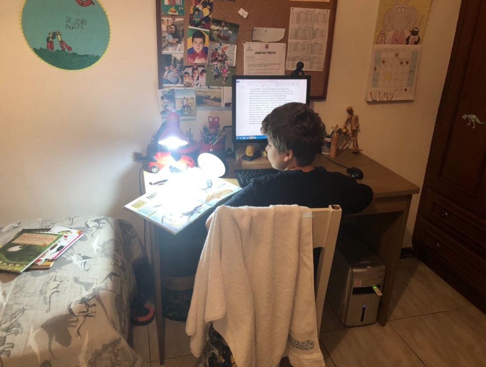

import Book from '~/components/Book.vue'

E lá se vão mais de 30 dias em quarentena. Isolamento social necessário, mas que em muito mudam nossa rotina.

Eu nunca fui de fazer metas de leitura ou programação do que ler no ano. Não me arrisco a desafios que nunca cumpro, em clubes de leitura adiro animada e saio triste comigo mesma, pois nao consigo me prender a uma leitura tipo “obrigatória”.

Me peguei esses dias traçando objetivos: ler todos os HQs de minha estante, descobrir livros para manter animado meu mini clube de leitura com os netos, ler pelo menos um clássico regularmente.

Senti , sem entender muito o porquê, a necessidade de ter objetivos e listas a cumprir. Isso com leituras e com outras coisas de minha vida também.

E tenho cumprido a risca. Meus HQs estão praticamente terminados e o meu mini clube de leitura vai de vento em popa produzindo resultados espantosos.

Minha neta de 12 leu [seu primeiro livro de 600 paginas](https://amzn.to/3bEOFim) e foi conquistada por completo pela leitura. Conversamos diariamente sobre leituras e agora livros de 200 páginas são para ela desafios menores.

---

Meu neto de 8 me ligou uns dias atrás:

_- Vovó hoje eu amanheci com uma vontade de escrever._  
_- Assim de repente? Que bom! O que você vai escrever?_  
_- Um livro vovó. Vou escrever aqui no Word._  
_- Um livro inteiro? Sobre o quê?_  
_- Sobre dinossauros. Ia se chamar a Extinção dos Dinossauros. Mas aí peguei meus livros e tenho muito mais coisa para falar. E aí esse título não serve mais._  
_- Então já começou a escrever?_  
_- Sim vovó, e já acertei com meu pai e ele vai publicar na editora dele. Posso ler para você o que já escrevi?_  
_- Claro... (e não é que está interessante!)_

Assim, esses pequenos acontecimentos vão me alegrando os dias tão complicados de enfrentar e com a  esperança forte, que depois disso tudo, dias de mais qualidade nos aguardam.

---

Bom, depois dessas pequenas histórias familiares, vamos aos livros - fontes desses pequenos casos.

<book title="Para onde vamos quando desaparecemos?" author="por Isabel Minhós Martins (Autor), Madalena Matoso (Ilustrador)" link="https://amzn.to/3eMSnZg">

</book>

Esse foi uma das leituras que fiz com meus dois netos menores -  Felipe (8) e João (6).

**_[Para onde vamos quando desaparecemos?](https://amzn.to/3eMSnZg)_** trata de um tema difícil:a morte. Sempre é complicado conversar com crianças sobre esse fato da vida. Isadora nunca admitiu falar do assunto. Como sempre, apelo para a literatura. Ofereço os livros e eles que compreendam o que a idade permite. A ideia é o contato com o tema espinhoso.

João: "Nada dura para sempre. E a meia que some pode estar debaixo da cama. A poça d'água vira nuvem, que vira chuva, que..."

Felipe: "Sim. Mas vovó, não sei ainda o que acontece com as pessoas que desaparecem. Ainda tenho que pensar."

E essa observação do Felipe gerou um dar de ombros do João, tipo "não interessa." E fim de conversa.

<book title="O Duplo" author="Fiódor Dostoiévski" link="https://amzn.to/3bGaNt2">

</book>

Este foi o clássico escolhido.

Espetáculo de livro, escrito em 1846. A história gira ao redor de um personagem que tem que lidar com o seu duplo, que é completamente diferente dele em atitudes e posições perante a vida. Com a liberdade ficcional, o duplo se concretiza fisicamente.

Situações incríveis de diálogos entre os dois deliciam qualquer leitor.  Nos dias de hoje, tanto na literatura como no cinema, esse mote é usado com frequência. Mas o incrível desse livro foi ele ter sido escrito antes que toda a psicologia que nos é familiar fosse sequer concebida.

Uma ótima resenha pode ser vista [neste vídeo](https://youtu.be/Z1X87LKatGs).

Inevitável foi o paralelo com os tempos atuais onde eu, em isolamento total, tenho tido longos diálogos com “meu duplo” que insiste em ser mais pessimista que eu própria. Quem nunca?

Não posso deixar de comentar que o final deste livro é um dos melhores que vi nos últimos tempos.

---

E aí chegamos aos meus HQs, dos quais vou destacar os que considero primorosos.

<book title="A diferença invisível" author="Mademoiselle Caroline (Autor), Julie Dachez (Autor), Renata Silveira (Tradutor)" link="https://amzn.to/2S2keLx">

</book>

**_[A diferença invisível](https://amzn.to/2S2keLx)_** é de uma sensibilidade ímpar.

Autobiográfico sobre o diagnóstico de autismo. Bom ou ruim se ter o diagnóstico de uma síndrome como a definição de “manias”?  Hora de preconceitos serem discutidos e abandonados. Hora de procurarmos nossa turma,  que nos aceitam como somos.

Fiz essa leitura junto com minha neta de 12 e ela foi só elogios. A conclusão dela foi de que todos nós somos assim "meio autistas" e temos que respeitar os "muito diferentes."

<book title="Pílulas Azuis" author="Frederik Peeters" link="https://amzn.to/3eOj28c">

</book>

Quadrinho autobiográfico onde o autor conta sua história com sua esposa.

Uma bela história de amor, permeada pelo HIV. Uma situação complexa, contada com muita sensibilidade. Uma leitura essencial, com um tema que eu nunca antes tinha visto contado na literatura e final é de uma beleza inexplicável.

<book title="O dia de Julio" author="Gilbert Hernandez" link="https://amzn.to/3bzHDf5">

</book>

Que livro incrível! 100 anos de vida, descrito em 100 páginas! O personagem principal nasce em 1900 e morre aos 100 anos, no ano 2000. Temos portanto,  um século retratado pela vida de um homem-  guerras, mudança de usos e costumes, mudanças geracionais.

Uma lição de história, descrita da forma mais criativa que já vi. Uma riqueza de livro.

<book title="O mundo de Aisha : a revolução silenciosa das mulheres no Iêmen" author="Ugo Bertotti" link="https://amzn.to/3eN6SMY">

</book>

Finalmente, outra pequena jóia.

O estilo é diferente, com fotos misturadas com o desenho. Não é ficcional, e sim um relato jornalístico de como vivem algumas mulheres no Iêmen, um país muçulmano.

Quem são essas pessoas que parecem pássaros negros quando vistas pelas ruas? Mulheres fortes e, conscientes de sua situação, fazem o que podemos chamar de revolução silenciosa. Aceitam regras, como o uso da burca, que para nós parece um suplício, para poderem aos poucos ganhar espaço no mundo do trabalho e na sociedade.

Com a força do trabalho e da educação essa mulheres lutam bravamente por seus direitos. Triste e valoroso por trazer alguma esperança.

Uma resenha detalhada pode ser vista em [neste vídeo](https://youtu.be/1vEFi1leaLs).

---

Como podem ver estou absolutamente conquistada por HQs e espero com esse meu entusiasmo conquistar mais fãs.

Agora uma parada nas HQs e novos objetivos em andamento.

O que continua igual é  só a quarentena!

Bons dias de confinamento a todos!
