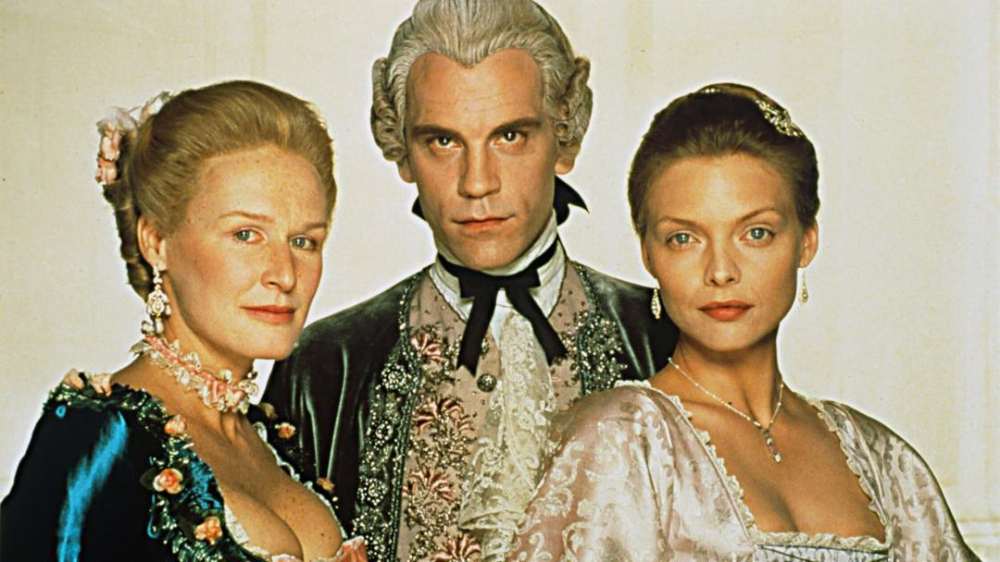

import Book from '~/components/Book.vue'

Estou há sessenta dias isolada. Nesse meio tempo foi-se meu aniversário, a Páscoa e agora o dia das mães …. Muitas demonstrações de amor recebidas, mas nenhum abraço... Sentimentos à flor da pele.

Nesses momentos nada como uma boa poesia e cartas, hoje em dia também abolidas do nosso cotidiano. Adoro cartas, e livros epistolares estão no topo da lista de meus favoritos. Me encanta descobrir histórias de vidas, ficcionais ou reais, via cartas.

Quando minha mãe faleceu, deixou inúmeras cartas guardadas em caixas. Foi uma atividade fantástica ler cada uma, procurar cada resposta e construir a vida de minha mãe e avó que desconhecia. Ali se explicitaram sentimentos que eu ignorava, e uma história de vida incrível, da qual eu tinha somente um pequeno esboço.  Estou digitalizando todas, para que essa riqueza não se perca. Quem sabe, um dia, conte essa história.

---

Dentre os inúmeros livros de cartas que tenho por aqui, vou falar hoje de um que sempre consta da lista de meus favoritos da vida: **_[As Relações Perigosas](https://amzn.to/2SQaq7A)_**, de Choderlos de Laclos.

<book title="As Relações Perigosas" author="Chordelos de Laclos" link="https://amzn.to/2SQaq7A">

</book>

Nesse livro, a narrativa  é feita em 175 cartas, divididas em quatro partes muito bem estruturadas. _[As Relações Perigosas](https://amzn.to/2SQaq7A)_ é uma trama das mais envolventes. Laclos usa do recurso de mostrar uma mesma situação sob diferentes pontos de vista e, assim, somente o leitor sabe o que realmente está acontecendo.

A trama fala de amor e sedução na aristocracia francesa, que prima por desprezar os que julga fracos e menos favorecidos. Personagens ficcionais dos mais deploráveis, como a marquesa de Merteuil e o abjeto Visconde de Valmont, que não poupam esforços para conseguir se divertir e provar o seu poder em relação a outros três personagens: a Presidenta de Tourvel e os jovens Danceny e Cécile. Muitas vezes tem-se vontade de abandonar a leitura dado o asco que nos causa. Mas prosseguir é inevitável, dada a qualidade do texto e o enredo que desafia a leitura da próxima carta.

_[As Relações Perigosas](https://amzn.to/2SQaq7A)_, para mim um clássico epistolar, foi adaptado para o cinema, onde ganhou tres Oscars. [O filme](<https://pt.wikipedia.org/wiki/Liga%C3%A7%C3%B5es_Perigosas_(filme)>), que foi nominado _Ligações Perigosas_ e dirigido por Stephen Frears, traz memoráveis interpretações de Glenn Close como a marquesa Mertuil e John Malkovich como o libertino Valmont.

E temos [a excelente minissérie brasileira](https://en.wikipedia.org/wiki/Liga%C3%A7%C3%B5es_Perigosas), também chamada Ligações Perigosas, produzida pela Globo em 2012.

Então, para _As relações perigosas_, temos o pacote completo: leia o livro, veja o filme e assista a minissérie!

---

E a poesia, como é boa companheira em dias solitários. Muitos poetas estão em minha cabeceira. Difícil escolher um, mas vou de **Paulo Leminsky**, para mim, o mais recente encanto, com **_[Toda Poesia](https://amzn.to/2LhkOkB)_**.

<book title="Toda Poesia" author="Paulo Leminsky" link="https://amzn.to/2LhkOkB">

</book>

> **Incenso fosse Música**
> isso de querer
> ser exatamente aquilo
> que a gente é
> ainda vai
> nos levar além

Em **_[Toda Poesia](https://amzn.to/2LhkOkB)_**, é possível encontrar tudo que foi escrito e publicado por Leminski. Poeta curitibano que nasceu em 1944 e faleceu em 1989. Com um texto curto, mas sempre com muita profundidade, percorrer as  páginas deste livro é uma viagem por sentimentos que perpassam cada poesia. São assuntos como o amor, a vida, alegrias, medos, tristezas, que permeiam o cotidiano de cada um de nós.

> **Contranarciso**
> em mim
> eu vejo o outro
> e outro
> e outro
> enfim dezenas
> trens passando
> vagões cheios de gente
> centenas
>
> o outro
> que há em mim
> é você
> você
> e você
>
> assim como
> eu estou em você
> eu estou nele
> em nós
> e só quando
> estamos em nós
> estamos em paz
> mesmo que estejamos a sós

Rebeca Fuks (Doutora em Estudos da Cultura), [a respeito do poema acima](https://www.culturagenial.com/leminski-melhores-poemas/):

“O belíssimo poema Contranarciso usa uma linguagem coloquial e uma construção simples para narrar a mescla de identidades e a fusão que estabelecemos com o outro.

Lemos nos versos ao mesmo tempo uma inquietação por não sermos únicos, fechados e encerrados, mas também a alegria de partilharmos com o outro, de celebrarmos a diferença, deglutindo aquilo que não somos e nos oferecendo para a troca.

É comum na poética de Leminski essa comunhão com o ser humano que é diferente de nós e a celebração do enriquecimento que essa diferença proporciona.”

Também vale conferir o poema Contranarciso recitado pelo ator Guilherme Weber [neste video](https://youtu.be/cSqiLbeikFU). A emoção e muito maior quando ouvimos uma sensível recitação!

---

Poderia ficar muito tempo escolhendo poemas do Leminsky, mas termino com um que recito diariamente quando ouço e respeito o necessário fique em casa:

> **Não Discuto**
>
> não discuto
> o destino
>
> o que pintar
> eu assino

Feliz dia das mães!

E não questione ou duvide nunca da  ciência - fique em casa!
