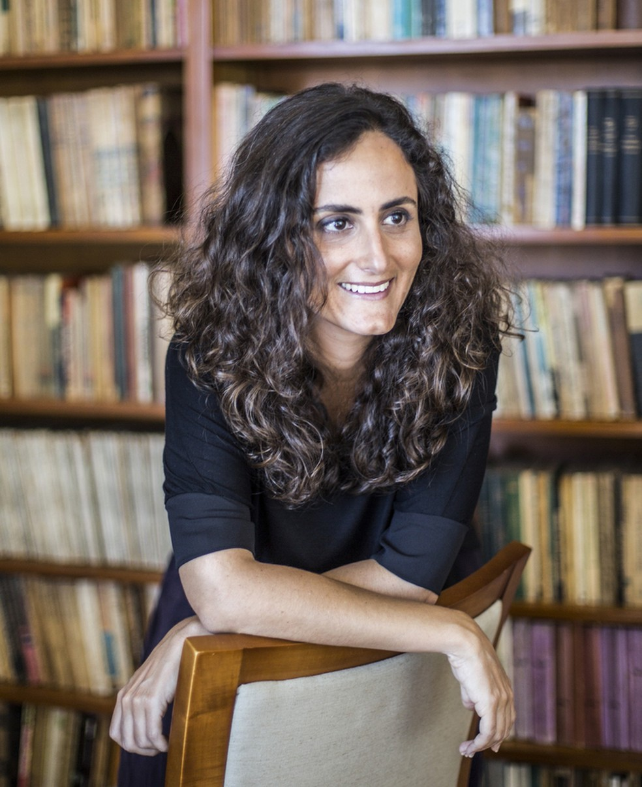

import Book from '~/components/Book.vue'

> “O lugar que chamamos de casa pode ser muito maior do que nós imaginamos. Uma casa pode ser grande, pequena, de palha, de madeira, de tijolo, um ninho, uma toca ou até uma nuvem. Tudo depende de onde você se sente mais acolhido e feliz.”  
> — Lorena Kaz, no livro Minha Casa

Nesses dias de recolhimento e com a casa sendo meu quase universo, me veio à cabeça um livro que li há mais de 10 anos. Um livro, quando é bom e marcante fica, tanto literal como metaforicamente.

<book title="A chave de casa" author="Tatiana Salem Levy" link="https://amzn.to/3hJr3wF">

</book>

***[A Chave de Casa](https://amzn.to/3hJr3wF)*** foi o livro de  estreia da **Tatiana Salem Levy**, uma autora portuguesa radicada no Brasil, com o qual ganhou  o Prêmio São Paulo de Literatura em 2008. Na trama ela combina elementos autobiográficos, romance e memorialismo e, com isso, reconstrói as origens de sua família sob o olhar da protagonista, filha de comunistas brasileiros e neta de judeus da Turquia. 

Há uma tradição lendária segundo a qual judeus sefarditas guardam até hoje a chave da casa que foi abandonada às pressas na Península Ibérica. A ficcionista reinventa isso no âmbito familiar recente. A chave guardada já não é de uma casa lisboeta ou toledana, mas da residência em Esmirna. O avô entrega a chave à narradora e a incumbe da missão de procurar a casa e parentes na Turquia.

É essa chave que permanece no centro da história, ou das histórias. A narradora desfila épocas e personagens ao longo do livro para entender o seu presente. As interrogações e as buscas dão prosseguimento à aventura iniciada pelo avô, que decide vir para o Brasil seguido do irmão, em busca de melhores perspectivas de vida. Um modo de reviver o passado sefardita e judaico do desenraizamento.

> “Para escrever esta história, tenho de sair de onde estou, fazer uma longa viagem por lugares que não conheço, terras onde nunca pisei. Uma viagem de volta, ainda que eu não tenha saído de lugar algum. Não sei se conseguirei realizá-la, se algum dia sairei do meu próprio quarto, mas a urgência existe. Meu corpo já não suporta tanto peso: tomei-me um casulo pétreo. Tenho o rosto abatido, olheiras muito mais velhas do que eu. Minhas bochechas pendem, ouvindo o chamado da terra. Meus dentes mal conseguem mastigar. Sinto um incômodo abissal, como se a gravidade agisse com mais intensidade sobre mim, puxando duas vezes meu corpo para baixo.
  

> Não tenho a mais ínfima ideia do que me aguarda nesse caminho que escolhi. Da mesma forma, não sei se faço a coisa certa. Muito menos se existe alguma lógica, alguma explicação admissível para essa empreitada. Mas ando em busca de um sentido, de um nome, de um corpo. E por isso farei essa viagem de volta, para ver se não os esqueci perdidos por aí, em algum lugar ignoto.
  

> Sem me levantar, pego a caixinha na mesa-de-cabeceira. Dentro dela, em meio a pó, bilhetes velhos, moedas e brincos, descansa a chave que ganhei do meu avô. Tome, ele disse, essa é a chave da casa onde morei na Turquia. Olhei-o com expressão de desentendimento. Agora, deitada na cama com a chave nas mãos, sozinha, continuo sem entender. E o que vou fazer com ela? Você é quem sabe, ele respondeu, como se não tivesse nada a ver com isso. As pessoas vão ficando velhas e, com medo da morte, passam aos outros aquilo que deveriam ter feito mas, por motivos diversos, não fizeram.
  

> E agora cabe a mim inventar que destino dar a essa chave, se não quiser passá-la adiante.
  

> (...)
  

> Não faço outra coisa senão olhar, tocar, observar a chave. Conheço seus detalhes de cor, o tamanho preciso de suas curvas e de sua argola, seu peso, sua cor gasta. Uma chave desse tamanho não deve abrir porta alguma. A essa altura já deveriam por certo ter mudado, se não a porta, certamente a fechadura. Seria um disparate acreditar que tanto tempo depois a chave da casa permaneceria a mesma. Tenho certeza de que até meu avô é consciente disso, mas também imagino que deva ter uma curiosidade enorme de saber se ainda está lá o que deixou para trás. Que coisa estranha, que coisa esquisita deve ser: largar o país, a língua, abandonar a família em direção a algo completamente novo e, sobretudo, incerto.
  

> Ele me contou que o navio onde viajou era descomunal, seu primeiro e único navio. A embarcação estava abarrotada de pessoas, todas com a mesma esperança que ele: conseguir uma vida melhor em país diferente. Dos irmãos, foi o primeiro a vir, apenas duas malas na mão e alguns contatos no Brasil. Não mais do que vinte anos quando deixou a Turquia. Tempos depois o irmão mais novo se juntaria a ele. A irmã gêmea faleceria de tuberculose. O irmão mais velho casaria e continuaria em Esmirna. A mãe, ele só reencontraria longos anos mais tarde, quando, viúva, decidiria se mudar para o Brasil.
  

> Quantas vezes não ouvi essa mesma história? A dor de nunca mais ter visto o pai nem a irmã, de nunca mais ter pisado na terra que primeiro fora sua. A dor de só ter trazido a mãe a tempo de perdê-la. De ter visto tanta miséria no navio, tanta miséria na terra que deixara. Quantas vezes?
  

> E agora o que ele quer? Que eu vá atrás da sua história, recuperar o seu passado? Por que essa chave, essa missão descabida? ”

Partindo em busca do passado familiar, impulsionada pela chave da casa do avô, na Turquia, a narrativa se desdobra em linhas que compõem um mosaico de episódios, vidas e lugares que convergem para a resposta da pergunta fundamental da protagonista: - afinal, quem sou eu?

Acredito que foi na lembrança desse livro que me ative nesses dias. Até que ponto a minha casa me define? Qual a chave de qual casa que eu guardo comigo?

Fiquei pensando em quantas casas eu já morei, e olha que foram muitas! Na minha infância e adolescência, morei em três casas e três cidades diferentes. Na minha vida adulta, já morei em oito casas e em outras  três cidades. 

Todas casas muito diferentes. No entanto, comigo sempre caminharam objetos significativos. De alguma forma minha história, caso possa ser contada por meio de objetos, vem me acompanhando.

---

Não sou definitivamente um ser minimalista. Sou mais para o estilo tartaruga, que “carrega sua casa nas costas” como diz minha filha. 

E a cada mudança tentei descartar um pouco de peso. Tive minha tentativa **Marie Kondo** quando presenteada pelo livro dela, ***[A mágica da arrumação](https://amzn.to/2V1xxx7)***.

<book title="A mágica da arrumação" author="Marie Kondo" link="https://amzn.to/2V1xxx7">

</book>

Li avidamente seu livro sobre minimalismo e a mágica da arrumação. Vi todos os seu videos. E, no final, conclusão feita: não sou um ser minimalista!  Para mim, TODOS os objetos que carrego comigo, muitos deles herdados de minha mãe e avó, são importantes - são A chave de casa depois de tantas casas das quais não tenho mais a chave. 

---

Tenho também sonhado muito esses dias. Pelo que li, não só eu: existem até pesquisas atualmente sobre esse fenômeno. Meus sonhos giram ao redor dos netos, amigos queridos, encontros passados, mas sempre na mesma casa. E não essa minha casa atual. Minhas raízes estão em outro lugar, outra cidade - e lá que me reconheço e me conheço melhor ao me certificar disso.

O que essa quarentena tem feito em nossa vida, não? E estar só, cuidando de mim e de minha morada, tem sido gratificante em muitos pontos. Os dias são longos e nada vazios. Certamente, a cada dia me conheço e me reconheço mais.

Enquanto escrevia esse texto, chegou para mim, indicado por uma querida amiga, a carta encíclica ***[Laudato Si, do Papa Francisco](https://w2.vatican.va/content/dam/francesco/pdf/encyclicals/documents/papa-francesco_20150524_enciclica-laudato-si_po.pdf)***, sobre o cuidado da casa comum, que traz a tona outra dimensão de casa, a casa comum a todos nós - a Terra:

> “1. Laudato si’, mi’ Signore – Louvado sejas, meu Senhor », cantava São Francisco de Assis. Neste gracioso cântico, recordava-nos que a nossa casa comum se pode comparar ora a uma irmã, com quem partilhamos a existência, ora a uma boa mãe, que nos acolhe nos seus braços: « Louvado sejas, meu Senhor, pela nossa irmã, a mãe terra, que nos sustenta e governa e produz variados frutos com flores coloridas e verduras.
  

> 2\. Esta irmã clama contra o mal que lhe provocamos por causa do uso irresponsável e do abuso dos bens que Deus nela colocou. Crescemos a pensar que éramos seus proprietários e dominadores, autorizados a saqueá-la. A violência, que está no coração humano ferido pelo pecado, vislumbra-se nos sintomas de doença que notamos no solo, na água, no ar e nos seres vivos. Por isso, entre os pobres mais abandonados e maltratados, conta-se a nossa terra oprimida e devastada, que « geme e sofre as dores do parto » (Rm 8, 22). Esquecemo-nos de que nós mesmos somos terra (cf. Gn 2, 7). O nosso corpo é constituído pelos elementos do planeta; o seu ar permite-nos respirar, e a sua água vivifica-nos e restaura-nos.”

Que bom está sendo ler esse documento. Amplia e muito toda essa minha reflexão sobre morada.  Assunto para próximas edições.

Até a próxima! Fiquem bem e fiquem em casa!
