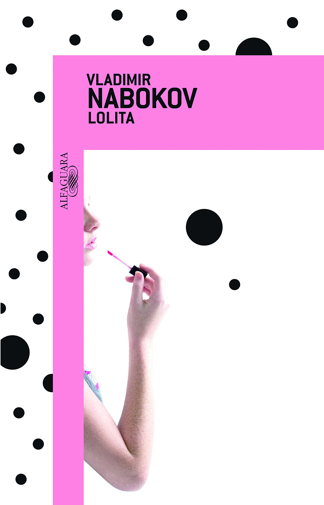
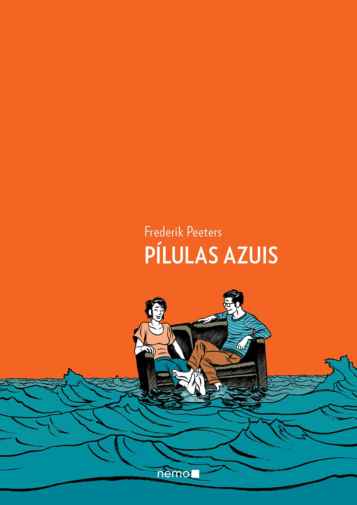
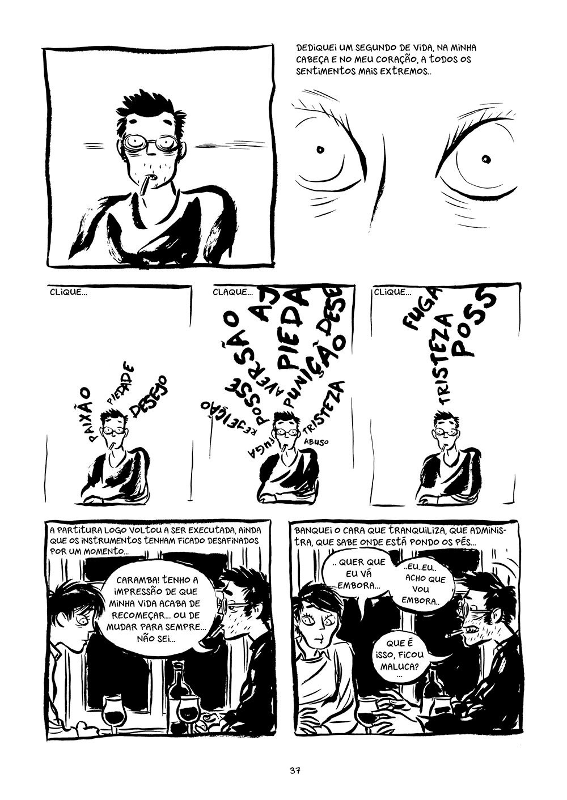
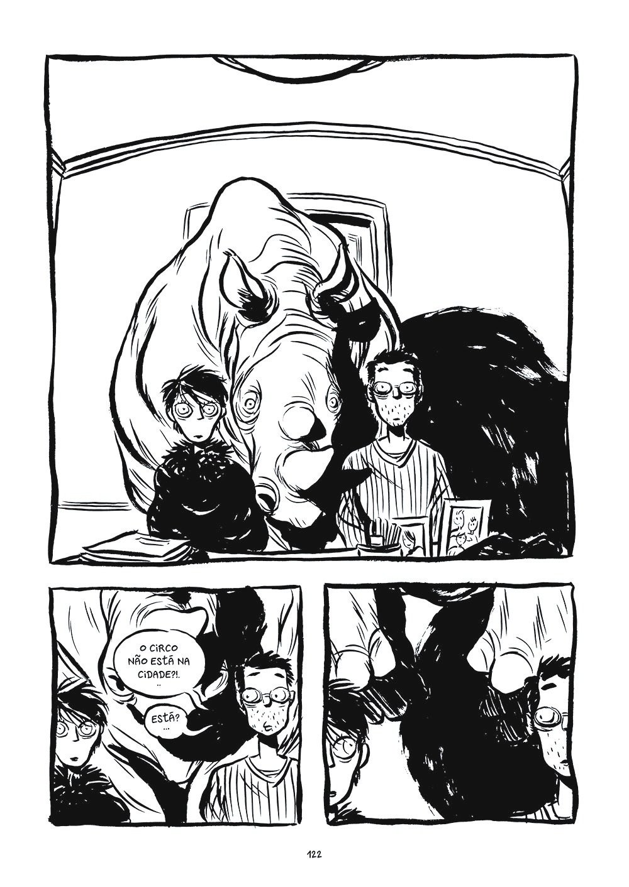

import Book from '~/components/Book.vue'

Todo leitor anseia ter com quem conversar sobre o que lê. Quando termino uma leitura, gostaria de ter alguém do lado para dizer - E aí o que você achou?

Dessa necessidade acredito que nascem os clubes de leitura. Devo confessar que não tenho uma relação muito boa com grupos de leitura. Ontem, assistindo um vídeo da última reunião do primeiro grupo que me aventurei a participar, tomei consciência da minha fragilidade em lidar com opiniões e pontos de vista tão diversificados.

Fiquei encantada com a condução feita pela “dona do clube” e a facilidade com que ela levou a reunião que, muitas vezes, a meu ver,  tomava caminhos surreais. Minha participação neste grupo é o tema deste meu texto - uma história de duas leituras num intervalo de 10 anos.

Um dia percorrendo as redes sociais achei um comentário sobre esse clube. De imediato escrevi para a responsável pelo clube pedindo informações e querendo de alguma forma participar. Um pequeno clube formado por pessoas que são amigas e se juntaram para falar de livros, e lá fui eu de intrometida me juntar ao grupo. A coordenadora, [Elaine](https://www.arteemlivros.com.br), uma pessoa encantadora e uma ótima leitora/escritora foi muito solícita e me integrou ao grupo com muito carinho.

Participei então, de uma rodada de escolha de próxima leitura e foi aceita minha sugestão de  um livro que adoro e que fala sobre livros e, de alguma forma, sobre clubes de leitura.

<book title="Lendo Lolita em Teerã" author="Azar Nafisi" link="https://www.record.com.br/produto/lendo-lolita-em-teera-edicao-de-bolso/">

</book>

**_[Lendo Lolita em Teerã](https://www.record.com.br/produto/lendo-lolita-em-teera-edicao-de-bolso/)_**  tem ingredientes apaixonantes. Quando aconteceu a revolução islâmica, a autora Azar Nafisi era professora de literatura numa conceituada universidade de Teerã.

Como sabemos, liberdades foram extirpadas, sendo as principais afetadas as mulheres. E nesse processo, a literatura ocidental foi banida das universidades e sua leitura considerada transgressora. Inconformada, Azar Nafisi demonstrava claramente suas opiniões e acabou sendo afastada da universidade.

O livro **_[Lendo Lolita em Teerã](https://www.record.com.br/produto/lendo-lolita-em-teera-edicao-de-bolso/)_** conta a história de um pequeno grupo de meninas que ela passou a ensinar em casa, lendo  e discutindo livros que Azar julgava fundamentais. Daí, nascem discussões riquíssimas, sob uma ótica de meninas que estão passando por um momento de grande mudança em suas vidas.

Eu terminei a leitura desse livro, com uma lista de livros para ler e alguns, como Lolita, para reler. Hoje, 10 anos depois que li esse livro, ainda o julgo um dos melhores que já li na vida.

<book title="Lolita" author="Vladimir Nabokov" link="https://www.companhiadasletras.com.br/detalhe.php?codigo=27620560">

</book>

E qual não foi minha surpresa, quando essa leitura desagradou a maioria dos integrantes do grupo? Acharam, na época, chata, arrastada e com nada a dizer. Confesso que não consegui lidar muito bem com essa rejeição, mesmo todos sendo extremamente delicados no sentido que a crítica era ao livro e não a mim. Vergonhosamente, fugi da reunião de discussão do livro.

Depois disso participei de mais uma reunião, e, em seguida, mudei de cidade, me afastei do grupo,  mas continuei em contato próximo com a Elaine, sua querida idealizadora.

Passados 10 anos, chega a pandemia e com ela as reuniões passam a ser virtuais e volto a ser convidada a me integrar a uma reunião desse mesmo primeiro grupo. Aceitei de pronto.  E, novamente,  me deparo com a leitura de um livro que de alguma forma indiquei e que amei demais.

<book title="Pílulas azuis" author="Frederik Peeters (autoria), Fernando Scheibe (tradução)" link="https://grupoautentica.com.br/nemo/quadrinhos/pilulas-azuis/1232">

</book>

Dessa vez, uma leitura mais leve, uma HQ autobiográfica - um estilo que me encanta. Da minha leitura, uma história de amor, que como todas,  é permeada de dificuldades e diferenças a serem vencidas, sendo a principal delas o fato da mulher e seu filho, de um casamento anterior, serem soropositivos. Daí o título, pois toda a história deles é permeada por pílulas. No início muitas pílulas e no final, 13 anos depois apenas 3.

O amor entre Cati e Peeters ultrapassa a barreira que, para muitos, poderia ser julgada como insuperável. Frederik tem certeza de que a moça é o amor de sua vida desde a primeira vez que a viu em uma reunião de amigos. A revelação sobre ela conter o vírus da Aids chocou, mas seus sentimentos falaram mais alto.

> “Nem mesmo as dúvidas sobre a complexa vida amorosa o fez desistir. Rodeado por situações desgastantes, viajando entre os riscos de contágio e tabus munidos de desinformação, o casal procura ajuda médica, e é assim que as informações são entregues ao público. De maneira bem-humorada, o livro deixa lições valiosas de tratamento, além de dar uma aula de educação sexual.
>    
> Os impasses entre o seu estado racional e o emocional são o diferencial da narrativa. Metáforas com rinocerontes e mamutes junto aos monólogos filosóficos com direito a citações de grandes artistas dão o ar de maior sensibilidade à história. Um diário sincero e maduro é a melhor das definições dessa HQ.”
>   
> — Mylla Martins de Lima, em sua resenha para Cabana do Leitor

Resumindo, o livro, para mim, trata de uma linda história, cercada de incertezas ( qual história real de amor não é?) , mas acima de tudo, muito amor.

Retornando a discussão do grupo sobre esse livro (sim, a do vídeo que mencionei no início do texto e que ocorreu há uma semana) ficou quase toda no fator HIV, e juro querida amiga e mediadora do grupo Elaine, que gostei muito da discussão, lamentei não participar, para falar com todos sobre amor e preconceito. Na próxima estarei presente, muito mais preparada, agora 10 anos depois.

Tenho curiosidade em saber sobre a relação de leitores com clubes de leitura. Então, se você quiser e tiver um tempinho, me escreva sobre isso. Tenho muito a aprender, tenho certeza.

Fiquem bem! Se puderem fiquem em casa pois no Brasil continuamos a perder mais de 1000 (MIL!) vidas por dia!

Até a próxima!
