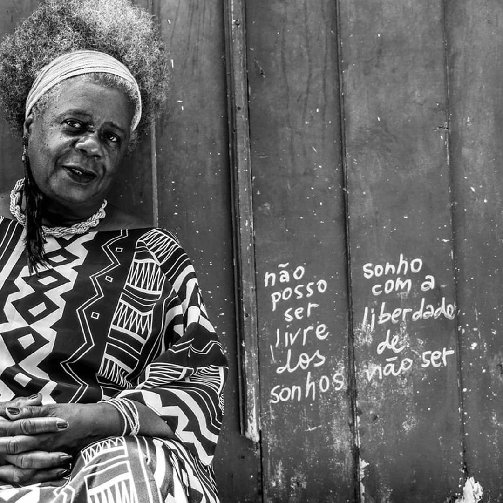

import Book from '~/components/Book.vue'

**Maria da Conceição Evaristo de Brito** nasceu em Belo Horizonte, em 1946. De origem humilde, migrou para o Rio de Janeiro na década de 1970. Sempre foi ativa nos movimentos de valorização da cultura negra e estreou na literatura em 1990, quando passou a publicar seus contos e poemas na série Cadernos Negros ([fonte](http://www.letras.ufmg.br/literafro/resenhas/ficcao/68-conceicao-evaristo-entre-becos-e-memorias-conceicao-evaristo-e-o-poder-da-ficcao)).

Eu conheci a escrita de Conceição Evaristo em 2018 quando li os contos de **_[Olhos D'Água](https://amzn.to/3oZwA5Q)_**, publicado em 2014, e alguns deles tem me acompanhado nesses dois anos.

<book title="Olhos d’água" author="Conceição Evaristo" link="https://amzn.to/3oZwA5Q">

</book>

O conto que dá nome ao livro é dos mais marcantes. Contado em primeira pessoa, a autora coloca uma dúvida que passou a incomodá-la: Qual a cor dos olhos de minha mãe?

> “Uma noite, há anos, acordei bruscamente e uma estranha pergunta explodiu de minha boca. De que cor eram os olhos de minha mãe? Atordoada custei reconhecer o quarto da nova casa em que estava morando e não conseguia me lembrar como havia chegado até ali. E a insistente pergunta, martelando, martelando... De que cor eram os olhos de minha mãe? Aquela indagação havia surgido há dias, há meses, posso dizer. Entre um afazer e outro, eu me pegava pensando de que cor seriam os olhos de minha mãe. E o que a princípio tinha sido um mero pensamento interrogativo, naquela noite se transformou em uma dolorosa pergunta carregada de um tom acusatório. Então, eu não sabia de que cor eram os olhos de minha mãe?”

Na busca da cor dos olhos de sua mãe, ela vai rememorando fatos de sua infância e da infância de sua mãe, misturadas na pobreza e na fome.

> “Eu me lembrava também de algumas histórias da infância de minha mãe. Ela havia nascido em um lugar perdido no interior de Minas. Ali, as crianças andavam nuas até bem grandinhas. As meninas, assim que os seios começavam a brotar, ganhavam roupas antes dos meninos. Às vezes, as histórias da infância de minha mãe confundiam-se com as de minha própria infância.”

Atormentada pela dúvida, ela retorna a sua cidade natal, procurando recuperar o rosto de sua mãe, encontrar fotos e registros que não tinha.

> “E quando, após longos dias de viagem para chegar à minha terra, pude contemplar extasiada os olhos de minha mãe, sabem o que vi? Sabem o que vi?
>   
> Vi só lágrimas e lágrimas. Entretanto, ela sorria feliz. Mas, eram tantas lágrimas, que eu me perguntei se minha mãe tinha olhos ou rios caudalosos sobre a face? E só então compreendi. Minha mãe trazia, serenamente em si, aguas, correntezas. Por isso, prantos e prantos a enfeitar o seu rosto. A cor dos olhos de minha mãe era cor de olhos d’água.”

É assim, com essa força, onde o dolorido vira poesia, Conceição Evaristo e sua escrita não linear, como fluxos de memória, constrói seus textos.

---

Essa mesma forma encontrei essa semana no seu livro **_[Becos da Memória](https://amzn.to/3l5fzVB)_**, com certeza uma das melhores leituras que fiz este ano de 2020, quiçá de minha vida de leitora até agora.

<book title="Becos da memória" author="Conceição Evaristo" link="https://amzn.to/3l5fzVB">

</book>

Este romance iniciado em 1980 tem sua primeira edição em 2006, conta o drama dos moradores de uma favela prestes a ser demolida. Sob a ameaça de despejo – “o plano de desfavelamento [...] aborrecia e confundia a todos.” –, vidas e sonhos, experiências e saberes, são postos em risco.

A trama se desenvolve sob o olhar de uma menina de 13 anos, a narradora Maria-Nova, que vive todo o processo e se torna porta-voz das alegrias e sofrimentos dos demais. As histórias, tecidas sem linearidade, vão surgindo a partir de um universo fraturado – a comunidade surpreendida pelo processo de remoção.

> “Dava a impressão de que nem eles sabiam direito por que estavam erradicando a favela. Diziam que era para construir um hospital ou uma companhia de gás, um grande clube, talvez.”

As vidas nesta favela vão sendo contadas na forma de uma colcha de retalhos - retalhos de vidas sendo costurados por meio do olhar atento às encruzilhadas do ontem com o hoje.

> “...a recordação daquele mundo me traz lágrimas aos olhos. Como éramos pobres! Miseráveis talvez! [...] escrevo como uma homenagem póstuma [...] Homens, mulheres, crianças que se amontoaram dentro de mim, como amontoados eram os barracos de minha favela.”

No decorrer do texto surgem outros narradores, como Vó Rita, velha parteira que “dorme embolada com a Outra” e “era boa, muito boa. Hoje, quando penso em Vó Rita, é como se pensasse no mistério e na plenitude da vida.”

Bondade, de cujo pas­sado pouco se sabia, mas que “conhecia todas as misérias e grandezas da favela [...]. Com Jeito, ele acabava “entrando no coração de todos” e ganhando “o apelido que merecia.”

Cida-Cidoca, a prostituta “do rabo de ouro”:

> “Cidinha-Cidoca que pouco ou nada falava ultimamente,resolveu falar. E sua fala era uma resolução de morte. Ela dizia que iria morrer. Morrer como, por quê, e de quê, perguntaram para ela. A moça respondia que ia morrer de não viver. E para todos, ela apenas confirmava a loucura. Morrer de não viver...”

Meu narrador preferido, o Tio Totó, nasceu durante o período de vigência da Lei do Ventre Livre, mas que, mesmo não sendo escravo, carregava consigo os dramas de seus antepassados.

> “A vida passou e passou trazendo dores.”

Labutando na roça, teve que se mudar muitas vezes na vida. Numa dessas ocasiões, foi obrigado a deixar a fazenda em que trabalhava, pois as terras haviam sido vendidas. Reuniu mulher e filha e decidiu partir.

> “Havia o rio para atravessar, uma canoa improvisada de tronco de árvore. Não dava para esperar mais do lado de cá. [...] Totó alcançou só a outra banda do rio. Uma banda de sua vida havia ficado do lado de lá.”

O leitor de hoje encontra uma favela diferente das atuais, pois embora marcada pela miséria, ainda não conhece a violência do tráfico.

A menina curiosa, Maria Nova retém na memória e em pequenos escritos, os diversos acontecimentos para, um dia, fazê-los chegar ao universo da escrita a fim de nomear o que a sociedade insiste em não ver. Sua fala recupera a história daqueles que não tiveram voz, com suas experiências e ensinamentos.

> “Ela haveria de recontá-las um dia, ainda não se sabia como. Era muita coisa para se guardar dentro de um só peito.”

Com muita poesia e sem perder a ternura jamais, a escritora revolve a contrapelo a trajetória dos que saíram da senzala para habitar os becos de nossa modernidade.

Ao final da leitura, eu me sentia como uma vizinha dessas pessoas, cujos sentimentos eu conhecia tão bem. Inevitável não lembrar de passagens do livro “com olhos rasos d’agua” como diria minha avó. Uma autora a ter um lugar de destaque em nossas vidas.

Para quem se interessar, [há um lindo vídeo feito pelo Itaú Cultural](https://www.youtube.com/watch?v=-DEVLDHaRtQ), onde Conceição Evaristo retorna a Belo Horizonte, no lugar de sua antiga favela e mostra todo o seu estranhamento com a terra tão conhecida e agora não reconhecida.

Assim prossigo, enfrentado as faltas dessa enorme quarentena, lendo sempre e de alguma forma construindo pequenos retalhos desse tempo tão excepcional.

Fiquem bem, e em casa se possível 🙏

Até a próxima!
