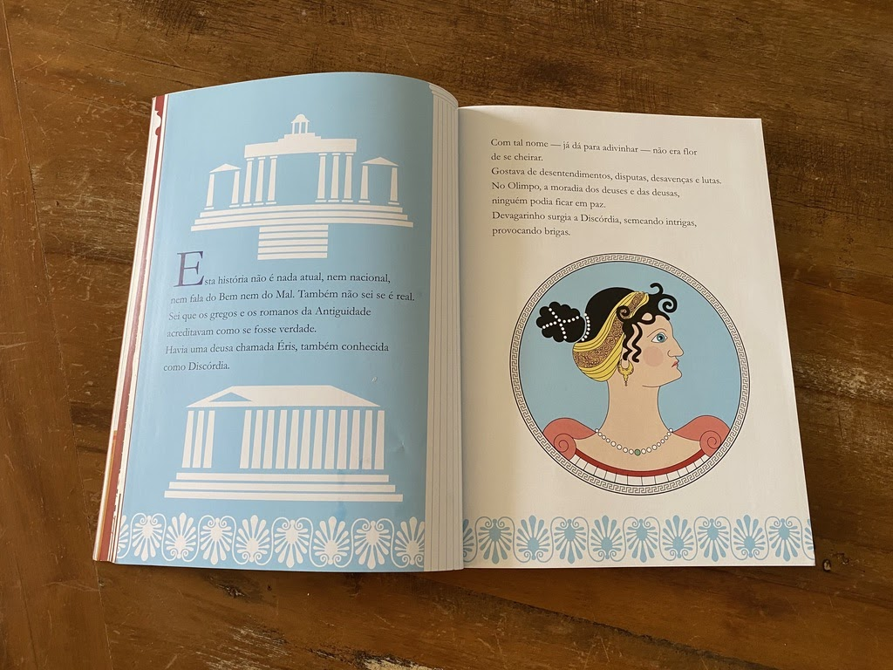
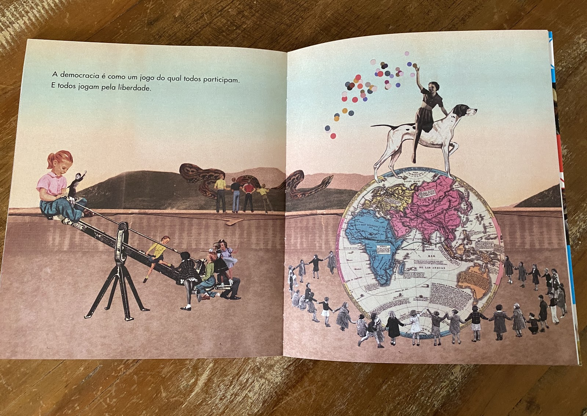
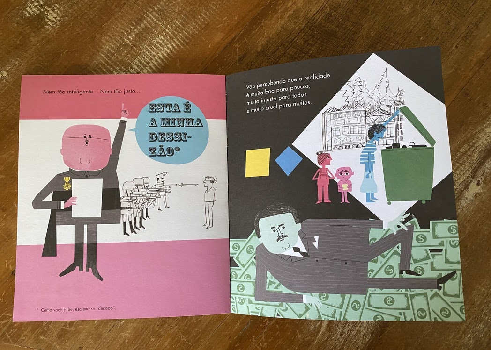
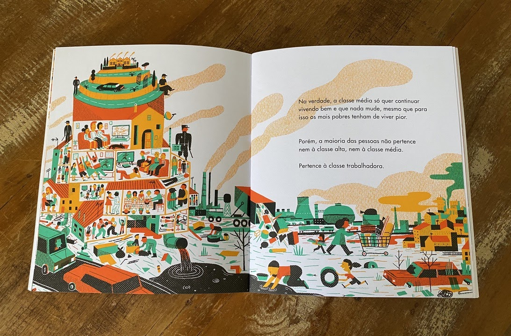
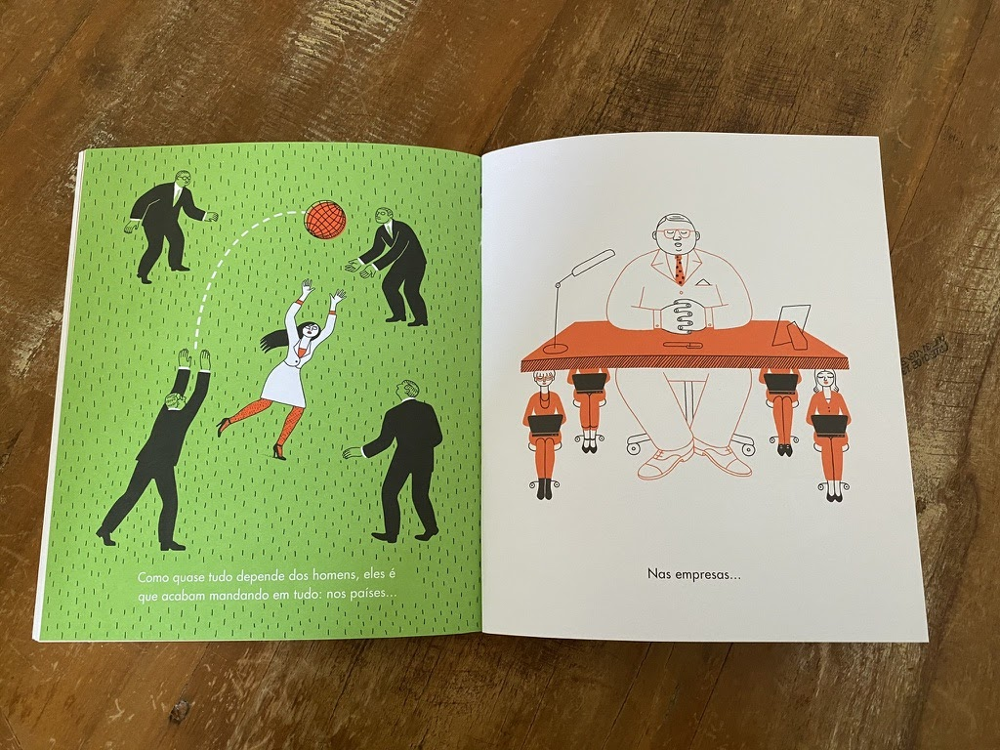

import Book from '~/components/Book.vue'

Uma querida prima sempre diz: “O meu dia perfeito sempre tem criança perto!” - e não há o que discordar!

No início dessa longa quarentena, eu avó de três, me vi distante de dias perfeitos, pois tivemos que nos isolar por completo. Me senti meio manca, e queria sentir os meus netos presentes de todas as formas possíveis.

Minha relação com meus netos sempre foi intermediada por muitos livros e muitas histórias a serem lidas e contadas. Para manter esse vínculo, e impossibilitada de ler para eles sentados ao meu redor, comecei a fazer leituras gravadas, com direito a efeitos especiais tanto de voz como sonoros. Afinal, manter a atenção de pequenos ouvindo uma leitura não é tarefa das mais simples.

Nesse processo, indicado por uma amiga, li para eles uma linda e triste história de amizade entre uma raposa - PAX - e um menino - PETER.

<book title="Pax" author="Sara Pennypacker" link="https://amzn.to/30R9TX4">

</book>

A cada trecho que enviava para eles, obtia os mais diversos retornos. Afinal, são de idades diferentes e o que chama a atenção em um livro é muito variado. Esse livro foi uma boa escolha, pois falava do distanciamento de amigos, da relação de pessoas com animais, distanciamento entre familiares, etc. Enfim, coisas que estavam vivenciando em seu “novo” cotidiano.

Felizmente, em um novo estágio da pandemia, agora tenho a sorte novamente de tê-los por perto, claro ainda com todos os cuidados possíveis. Em um processo de rodízio de netos, sempre tenho um aqui comigo. E quando que aqui chegam para uma temporada, os livros a serem lidos ou relidos os acompanham. Vou falar brevemente de alguns que estão aqui no momento.

<book title="Presentes de gregos" author="Elenice Machado de Almeida" link="https://amzn.to/36Qka9D">

</book>

**_[Presentes de gregos](https://amzn.to/36Qka9D)_**, de Elenice Machado de Almeida, é dos mais divertidos que li nos últimos tempos. Todos sabemos da importância da mitologia grega no imaginário ocidental, e a autora Elenice Machado consegue traduzir isso numa linguagem leve e de forma muito divertida. Super indico para tornar os dias atuais mais leves. E as ilustrações do Mario Cafiero, enriquecem o texto magnificamente. As crianças se dedicam a elas com bastante atenção.

> “Herói era o que não faltava na Grécia antiga. Havia para todos os gostos. Tinha Hércules, o forçudo. Tinha Aquiles, o invulnerável. Tinha o corajoso Teseu e muitos e muitos outros. Mas, o mais astuto e inteligente de todos era Ulisses, que sempre vencia os inimigos usando a esperteza.”

Está aqui comigo uma série de quatro livros, sobre os quais eu já devo ter falado nas redes, e que a todo momento meus netos pedem para reler:

<book title="A ditadura é assim" author="Equipo Plantel" link="https://amzn.to/3jOYmij">

</book>

<book title="A democracia pode ser assim" author="Equipo Plantel" link="https://amzn.to/3iJGMLn">

</book>

<book title="As mulheres e os homens" author="Equipo Plantel" link="https://amzn.to/33LOUH7">

</book>

<book title="O que são classes sociais?" author="Equipo Plantel" link="https://amzn.to/3lzVJRU">

</book>

Da leitura e das diversas releituras desses pequenos livros temos tido conversas incríveis, pois impossível para eles não tentar entender palavras de seu cotidiano como democracia, ditadura, feminismo, etc.

Essa coleção tem sido muito importante nisso, pois ricamente ilustrada e muito precisa, nos tem ajudado entender junto aos pequenos a sociedade atual e seus dilemas.

> “A democracia e como um jogo do qual todos participam. E todos jogam pela liberdade.”

> “O ditador tem muito orgulho do país DELE. Porque ele acha que o país é DELE.”

> “Todas as pessoas são iguais. Mas existem coisas que as tornam desiguais - a força, o poder, o dinheiro e a cultura.”

> “Nem os homens foram feitos para mandar…, nem as mulheres nasceram para obedecer. Porque as mulheres e os homens sao pessoas iguais com sexo diferente.”

Isadora, minha pré-adolescente de 12 anos. está num embate na escola para mudar o regulamento arcaico de que “meninas não podem usar shorts porque com isso distraem os meninos”. Diz que a solução será quando eles crescerem:

> “Vovó você vai ver quando a gente crescer e for decidir as regras. Tudo vai ser diferente!”

Tomara ela tenha razão. Tenho certeza que os livros sempre terão um papel fundamental para que isso aconteça. Daí minha campanha anual - **“Nesse dia da criança, dê livros de presente!”**

Que todos tenham um dia da criança perfeito. Se possível fiquem bem, fiquem em casa! 🙏

Até a próxima!
