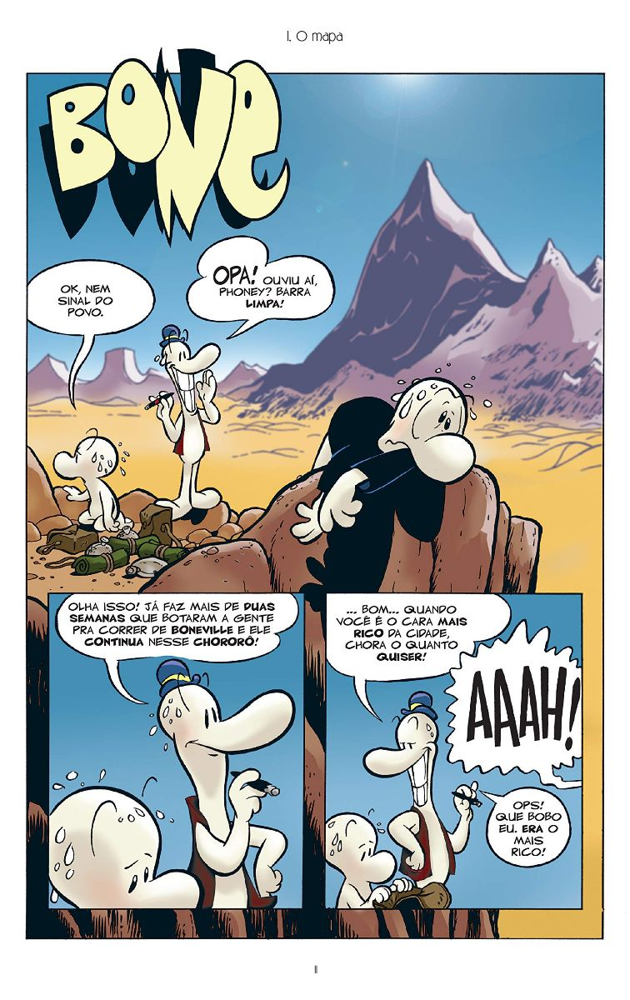
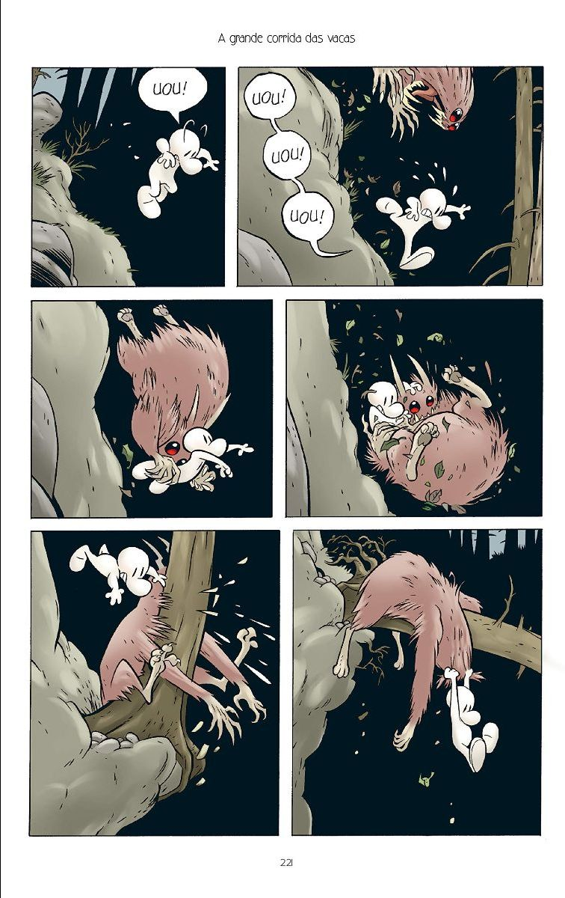
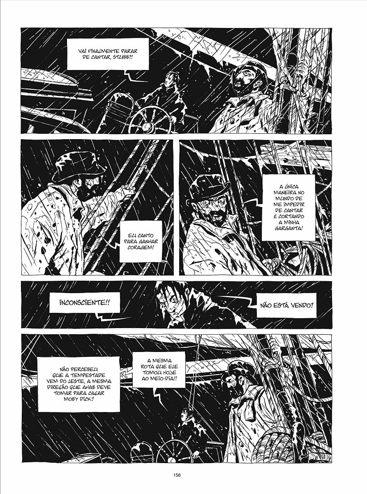
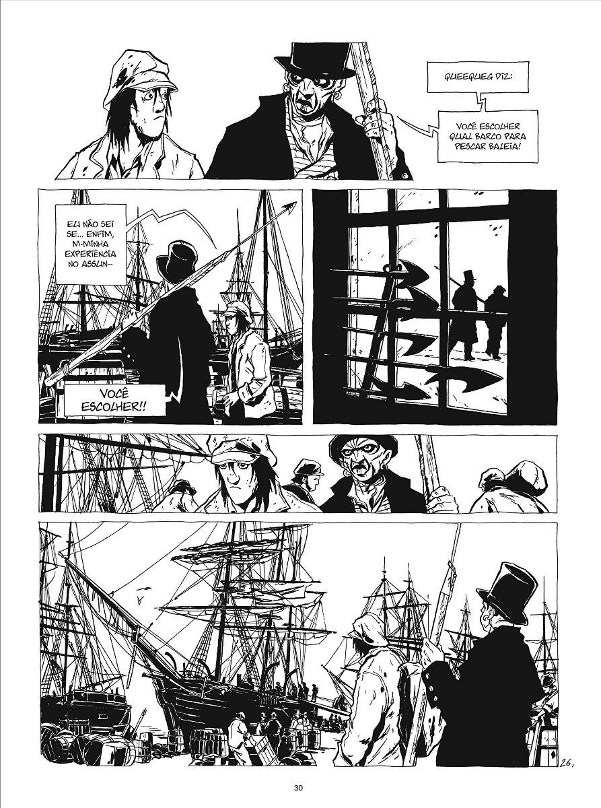

import Book from '~/components/Book.vue'

Sou avó de três encantos: **Isadora** de 11, **Felipe** de 8, e **João** de 5. Como me diz uma querida amiga, netos são a sobremesas da vida, e que sobremesa especial.

Com o nascimento da Isadora comecei minha pequena biblioteca infantil, agora "infanto-juvenil," depois de onze anos de leituras. Se bem que essas classificações podem ser relativas. Livro, quando é bom, encanta dos 0 aos 99!

Foi assim que me tornei a avó-que-tinha-livros e que sempre tinha um livro novo para ler. Livros sem palavras, livros com letras enormes, livros coloridos e chamativos, os interativos. Cheguei a ter um enorme tapete com figuras colantes onde montava histórias junto com Isadora.

Com a chegada do Felipe, livros de princesas foram acompanhados de livros de heróis, dinossauros, cobras, e dragões. O João, quando chegou, já encontrou uma grande biblioteca onde ele escolhia o que queria que fosse lido.

Para a alegria dessa avó que acredita no poder dos livros, Isadora ganhou, em seu primeiro ano escolar, o prêmio da escola de “revelação em leitura.” Babei tudo que podia.

Os eletrônicos inevitavelmente entraram na vida dos pequenos e empurraram os livros para o segundo plano, quase virando uma obrigação. Mas insistimos sempre. Um livro antes de dormir virou um ritual que se perpetua até hoje.

Mas não me acalmei. Fiz mil tentativas para achar livros que os levasse a ter prazer. Me lembrei que os meus filhos pequenos liam gibis de toda espécie; parti então para o universo das histórias em quadrinhos.

Me apaixonei pelo que encontrei. Histórias incríveis, lindamente contadas e ilustradas. Hoje vou contar sobre duas, em cinco volumes, que me conquistaram e também a meus netos.

<book title="Bone 1: O vale ou equinócio vernal" author="Jeff Smith" link="https://amzn.to/2Y5ANaW">

</book>

**_Bone_** é um premiado quadrinho que o autor, **Jeff Smith**, começou a escrever em torno dos 10 anos de idade. Publicado originalmente na forma de gibis em preto e branco, no seu aniversário de 20 anos ganhou uma versão colorida que foi publicada recentemente no Brasil, em três volumes.

Uma aventura fantástica! Muito humor, ação e suspense, que nos faz lembrar a saga do Senhor dos Anéis. Difícil descrever esse personagem, que se parece com o Gasparzinho em sua forma, mas que é o representante de um povo onde o dinheiro não tem valia (tudo se compra na base de troca de produtos ou trabalho) e apaixonado por uma garota chamada Espinho e pelo Moby Dick, o clássico de Melville.

Eu li num fôlego só, assim como meus dois netos leitores. Primeiro a Isa, que adorou e devorou os três volumes. Depois Felipe, que por enquanto leu apenas o primeiro volume, fazendo uma leitura compartilhada com o irmão João que ainda não lê. É muita alegria, ver Felipe lendo e explicando em voz alta para João passagens interessantes do livro.

E qual não foi minha surpresa ao ver Felipe pegar na minha estante o **_Moby Dick_**. Minha edição é uma de capa dura da [COSAC/NAIFY](https://amzn.to/37WOSvW) , super completa e enorme. A carinha dele ao pegar o livro foi ao mesmo tempo de encanto por eu ter o livro e de desânimo pela dificuldade até em segurar.

Sem mais delongas, lá fui eu atrás de uma versão mais palatável para meu pequeno leitor que queria saber porque Bone gostava tanto desse livro. Encontrei a versão em quadrinhos lindíssima e muito bem adaptada, pelo artista francês **Christophe Chabouté**. A alegria dele ao receber o livro foi indescritível.

<book title="Herman Melville Moby Dick" author="Christophe Chabouté" link="https://amzn.to/2R4vBTs">

</book>

De imediato começou a ler, sempre compartilhando com João, que do lado ficava esperando o que ia acontecer. Os dois uma manhã me aparecem inconformados de que a Moby Dick seria “jantada” e, claro, com muita satisfação, viram que não era bem assim. Foi lindo de ver.

Moby Dick é uma famosa história de amor ao mar e de sobrevivência que não precisa de muitos comentários. Além dos quadrinhos e da edição da COSAC/NAIFY, vale ver o mais recente volume lançado no Brasil, uma [linda edição pela Editora 34](https://amzn.to/2r4shgs) .

Em resumo, encontrei um caminho de conquista dos pequenos para esse meu universo de paixão. A Isadora, esse ano, ganhou novamente o prêmio de melhor leitora da turma. E o Felipe ganhou seu primeiro prêmio de leitor revelação da turma!

Da minha estante desceu novamente o original Moby Dick. Felipe quer conhecer a "história verdadeira" e faz planos de terminar ate o final das férias.

E a vovó aqui só babando....
