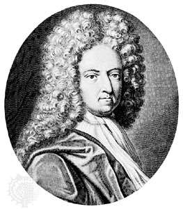
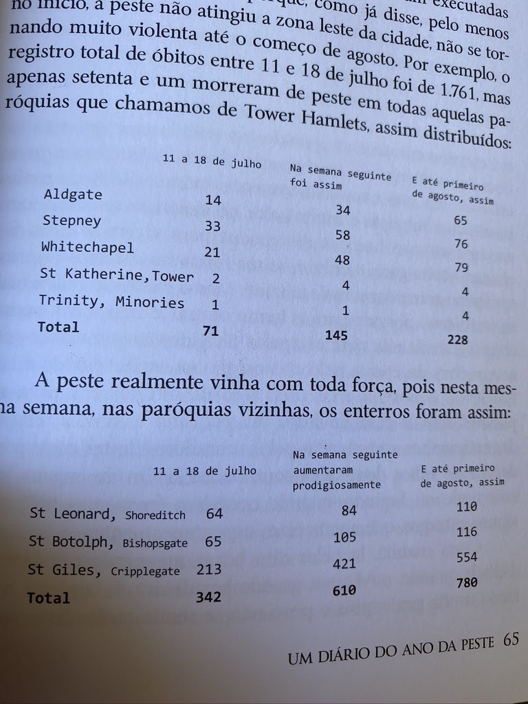
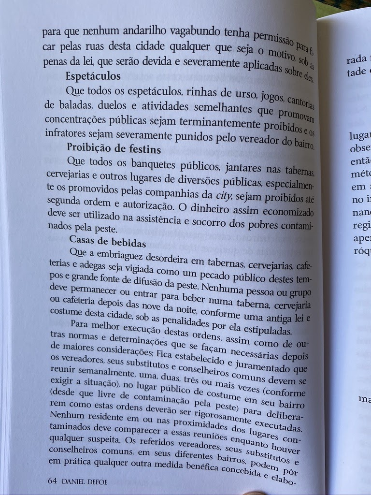
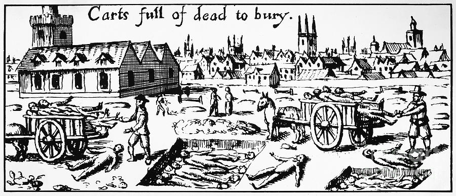
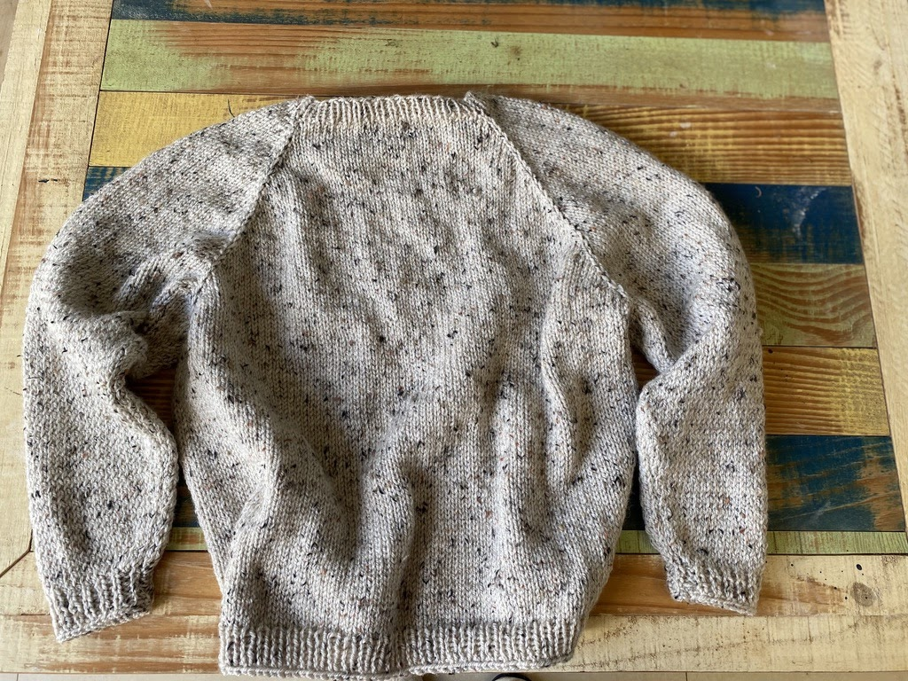

import Book from '~/components/Book.vue'

Daniel Defoe é um escritor inglês nascido em 1660, que viveu boa parte da sua vida na metade do século XVIII. Se tornou romancista depois dos 40 anos quando lançou seu primeiro e mais conhecido romance _[Robinson Crusoé](https://amzn.to/2C044gp)_.

Apresentado como o primeiro grande jornalista inglês, Daniel Defoe foi também panfletista, comerciante e por fim romancista.

> “Escritor prolífico e versátil, produziu uns quinhentos livros sobre uma ampla variedade de temas, inclusive política, geografia, crime, religião, economia, matrimônio, psicologia e superstição.
  

> Gostava muito de representar papéis e se disfarçar, aptidão a que recorreu com grande efeito na qualidade de agente secreto, e, ao escrever, costumava adotar pseudônimos ou outra personalidade a fim de obter impacto retórico.
  

> Seu primeiro panfleto político conhecido (contra Jaime II) foi publicado em 1688, e seu muito vendido poema satírico The True-Born Englishman apareceu em 1701. Dois anos depois, Defoe foi preso por causa de The Shortest Way with the Dissenters, uma sátira a respeito do extremismo da High Church (Igreja Alta), encarcerado na prisão de Newgate e submetido ao pelourinho. Voltou-se para a ficção relativamente tarde na vida e, em 1719, publicou sua grande obra imaginativa Robinson Crusoe.”
  

> [Companhia das Letras](https://www.companhiadasletras.com.br/autor.php?codigo=01040)

Conhecendo esse lado politizado de Daniel Defoe, ajuda em muito a entender o tom de seu livro ***[Um Diário do Ano da Peste](https://amzn.to/2YZNQwR)***, publicado em 1722.

<book title="Um Diário do Ano da Peste" author="Daniel Defoe" link="https://amzn.to/2YZNQwR">

</book>

Daniel Defoe pesquisou extensamente  a peste bubônica que devassou Londres no verão de 1665, utilizando dados reais de sua pesquisa e  envolvendo-os em fatos e personagens ficcionais que tornam a narrativa deliciosa (se é que se pode dizer isso sobre uma descrição de tantos horrores).

> “Um Diário do Ano da Peste (A Journal of the Plague Year) é um livro muito enganador escrito por Daniel Defoe (1660-1731), escritor e jornalista ....
  

> Até Gabriel García Márquez, que não é exatamente um tolo, quando se encantou pela obra, caiu no conto de que era uma reportagem da lavra do grande jornalista que o inglês também era. Sua perspectiva alterou-se muito ao ser informado de que Defoe tinha entre quatro e cinco anos de idade quando ocorreu a peste bubônica londrina. O autor descreve a peste como um repórter gonzo que, espicaçado pela curiosidade, vive de rua em rua cada drama, apesar do receio de contrair a doença.
  

> Como Defoe conversa com famílias que contam seus dramas em detalhes, é óbvio que se trata de um relato parcialmente ficcional. Defoe também era um ficcionista de mão cheia e estilo bastante original: num ambiente em que os escritores eram cheios de floreios e de citações à mitologia, ele era o escritor simples e direto…”
  

> [Milton Ribeiro](https://miltonribeiro.sul21.com.br/tag/um-diario-do-ano-da-peste/)

O livro é recheado de tabelas com números de mortes e transcrições literais dos avisos e recomendações sanitárias dos governantes. 

Além disso, temos descrições das valas comuns abertas para enterrar as pilhas de mortos recolhidos pelas ruas da cidade, detalhes dos mais descabidos e grosseiros procedimentos médicos, as superstições, simpatias, benzeduras, talismãs, poções milagrosas e o vasto instrumental terapêutico vindo tanto da sabedoria popular quanto da bruxaria. Ainda registra os mais diversos níveis de sofrimento, da morte horrenda de mães grávidas contaminadas e a execução de 40 mil cães e 20 mil gatos a fim de conter a transmissão da doença. Um horror sem precedentes.

No livro, todo o esforço sanitário descrito é para que o contato com os doentes fosse minimizado a fim de se evitar a transmissão da peste. Casas eram fechadas com doentes dentro. Também eram tomados cuidados extremos com a água.

Quando lemos este livro nos dias de hoje, quando tudo se conhece sobre a peste bubônica, sentimos uma grande angústia, por notar que todos os esforços e recomendações eram em vão. Os contemporâneos do escritor ignoravam como a peste bubônica era disseminada: contaminação dava-se de rato para homem por meio da pulga. O incrível é que Defoe faz referências ao grande número de ratos, mas não chega a apontá-los como um potencial problema.

Inevitável pensar nos recados que esse livro nos dá neste nosso ano de 2020, para mim o ano da peste.

> “Quando essa peste de 2020 surgiu na China, já dava para perceber o tamanho da desgraça que traria ao mundo, mas não nas proporções que hoje se vê na mídia escandalosa, ideológica e histérica. Durante vinte e quatro horas ela torna o terror da peste muito mais horrível do que já é. Tudo nos faz crer que estamos diante de uma praga medieval, divorciada de um mundo que se diz informatizado, tecnológico e de acentuado avanço medicinal. Uma grande balela!
  

> Estamos todos confinados. O medo é nosso companheiro e o pânico nosso irmão. Na televisão as cenas destacadas são dignas do livro de Defoe: tenebrosos caminhões do exército italiano, enfileirados, levando centenas de corpos insepultos das vítimas direto para o crematório porque já não dá para enterrar toda essa gente. O repórter dramatiza, emposta a voz e procura causar o arrepio na espinha do telespectador. Os idosos vão às lágrimas, provavelmente já se imaginando a bordo daquele comboio dos infernos. É a mídia da peste e do terror, trazendo angústia e pânico aos nossos corações. Não há boas notícias e sim a esperança que aquilo acabe em breve.”
  

> [Armando de Souza Santana Júnior](https://www.revistaideias.com.br/2020/04/07/o-ano-da-peste/)

Tantas as similaridades entre a realidade do século XXI com o que aconteceu há três séculos que me assombrou, pois acredito que  deveríamos ter outras ações e outra qualidade no trato dessa enfermidade.  No Brasil, imagino que por nossa incapacidade cultural, está difícil enxergar o fim do túnel. Temos  visto brotar em quantidade industrial líderes apedeutas, o que nos dá a sensação que a  proliferação dessa espécie é nossa maior dificuldade no enfrentamento do vírus, e não há confinamento que nos ajude a exterminá-los.

Esse ano pestilento certamente passará, como passaram os anos da peste negra e da gripe espanhola. Mas depois da leitura deste livro de Defoe, ficou evidenciado que os sentimentos e reações coletivas pouco mudaram com o passar dos séculos. As epidemias certamente são outras, mas os povos continuam os mesmos.

> “Esse é um ano que certamente ficará marcado na minha memória como o ano da peste. Será o ano em que sentiremos na carne toda a irracionalidade dos homens frente a um inimigo incontrolável e invisível. O vírus que nos assola sem ter pena dos velhos e certamente dos pobres, até parece uma praga bíblica, enviada para punir severamente uma humanidade desprovida de fé e voltada exclusivamente ao sucesso material. Fosse eu um carola, estaria recluso em um mosteiro em fervorosas orações. Como não sou, estou inseguro e em quarentena em minha morada.”
  

> [Armando de Souza Santana Júnior](https://www.revistaideias.com.br/2020/04/07/o-ano-da-peste/)

Poderia enumerar diversos trechos do livro que me conduziram a esse sentimento de similaridade:

> “(...) embora a Providência parecesse orientar minha conduta noutro sentido, mesmo assim sou de opinião que - e devo deixar isso como uma prescrição - o melhor remédio contra a peste é fugir dela. Sei que nos encorajava dizer que Deus seria capaz de nos proteger em meio ao perigo e capaz de nos atingir quando nos considerássemos fora de perigo. Isso reteve na cidade milhares de pessoas cujas carcaças terminaram às carradas nas grandes covas e eu acredito que, se fugissem do perigo, teriam se salvado (...)
  

> Se esse aspecto fundamental for devidamente considerado pelo povo em qualquer circunstância futura como esta ou de natureza semelhante, estou convencido que o levará a providências muito distintas daquelas tomadas em 1665 pela administração pública ou quaisquer outras que ouvi dizer que tomaram no exterior. Em poucas palavras, pensariam em separar as pessoas em grupos menores, deslocando-as em tempo, umas afastadas das outras, não permitindo o contágio, que realmente é o perigo dos grandes grupos coletivos que tenham um corpo de um milhão de pessoas (...) ”

Mas o que me ficou martelando e muito depois da leitura foram algumas observações finais, para mim muito desalentadoras:

> “(....) Mas devo admitir que, do povo em geral, pode-se dizer o que foi dito dos filhos de Israel depois de libertados do cativeiro do faraó, quando cruzaram o mar Vermelho, olharam para trás e viram os egípcios sendo engolidos pelas águas: ou seja, cantaram em Seu louvor, mas logo esqueceram Suas obras. Aqui, nao posso ir adiante. Serei considerado um censor e talvez injusto se entrar na desagradável tarefa de refletir, por qualquer que seja o motivo, sobre a ingratidão e o retorno a todas as formas de perversidade entre nós, das quais eu muito fui testemunha ocular. (...)”

Mas do que adianta pensar no que será? Não há como prever o quando….

Um aprendizado desses inúmeros (mais de uma centena!) de dias de quarentena é que a única opção que tenho é focar no presente. Não tenho como fazer planos. Tenho que procurar o bom no aqui e agora, nas mínimas coisas tenho que me ver feliz. E tenho me visto feliz nas conversas diárias com meus netos, no Certificado (com louvor!) de um curso de Hortas em Pequenos Espaços e com o meu último grande feito - uma blusa de lã linda de viver totalmente sem costura, produto de uma delícia de curso de tricô.

Minha primeira top down

Tenho certeza que somos seres altamente contagiantes (sem trocadilho com o vírus circulante) e que me esforçar para sentir alegria no meio de tanta adversidade faz um bem enorme a todos que me rodeiam.

Quero ser testemunha ocular do dito “novo normal” e então adaptar o poeminha quase infantil com o qual Defoe termina o livro:

> “Terrivel peste esteve em Londres
> No ano de sessenta e cinco
> Cem mil almas levou consigo
> Mesmo assim, estou vivo! ”

Até a próxima! E, se você tem esse privilégio como opção, fique em casa!
