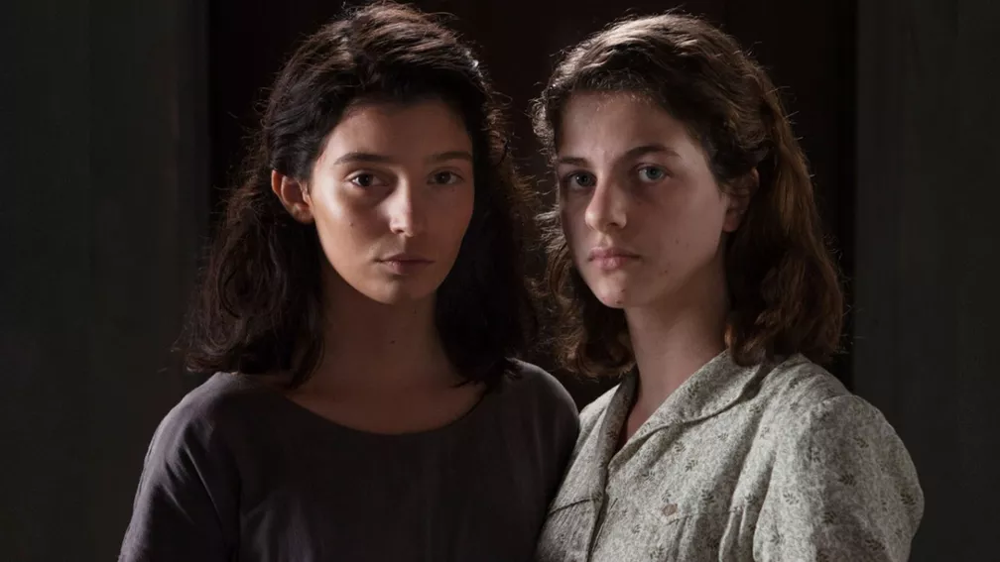

import Book from '~/components/Book.vue'

Comecei a ouvir falar de Elena Ferrante, escritora italiana, por conta da polêmica envolvendo sua identidade. Não sabia nada da autora, só que seu nome era inventado e sabia da enorme curiosidade despertada sobre a pessoa por trás de um nome, inventado para se “apagar”.

Em tempos de redes sociais onde o valor de uma pessoa é medido em termos do número de seus seguidores, uma pessoa “escondida” é algo que causa muito alvoroço.

<book title="A Amiga Genial: Tetralogia" author="Elena Ferrante" link="https://amzn.to/2LFug5e">

</book>

Discussões à parte sobre quem é ou não é Elena Ferrante, e o problema ético em retirar alguém à força de seu esconderijo, acabei me interessando pela obra que estava fazendo muito sucesso. De princípio, o nome do livro. “A amiga genial” não me interessou muito, confesso. Contudo, a maioria das pessoas que costumo confiar no gosto, já tinham lido e falavam muito bem.

Descobri que se tratava de uma quadrilogia - quadrilogia napolitana que tem a cidade de Nápoles quase como um personagem. Para não sofrer com a ansiedade de esperar o próximo livro, quando tive a oportunidade de ter os quatro livros, foram de imediato para o topo da minha pilha de leitura.

Comecei o **_[A amiga genial](https://amzn.to/2LFug5e)_** com medo de uma história cheia de frivolidades e acabei encantada com as amigas Lenu e Lila. O livro é narrado por Lenu, que decide contar a história da amiga como uma forma de contrariá-la e fazer um registro dessa pessoa extraordinária. Ela começa, então, pelo começo: a infância em que se tornaram amigas.

Lenu vai contando histórias de forma não linear e, aos poucos, a gente vai percebendo que contar a história de Lila é contar a própria história da narradora. As duas possuem uma amizade estranha, formada por laços que misturam bons e maus sentimentos recíprocos. É essa relação que as impulsiona a viver, como uma prestação de contas a fazer. Principalmente Lenu, uma garota que se preocupa em agradar às opiniões e tem em Lila alguém dos mais elevados padrões, razão pela qual tenta se provar à altura. Lila é descrita por Lenu como uma criatura selvagem, dotada de uma inteligência absurda e uma capacidade de fazer o mal.

Os demais volumes da tetralogia avançam pela vida das personagens e terminam com elas já na idade madura. Não tem nenhum pieguismo ou frivolidade. Longe disso.
Resumindo, a quadrilogia napolitana de Elena Ferrante não é apenas o relato de amizade difícil e permanente entre duas mulheres marcadas pelo lugar de onde vieram e para onde desejavam ir, mas também uma reflexão sobre a sociedade, sobre as desigualdades sociais, sobre o valor que atribuímos aos estudos como forma de distinção, sobre o papel do Estado, sobre a importância da mobilização social, sobre questões de gênero.

A recente adaptação para uma série homônima não deixa nada a desejar e super vale a pena acompanhar

---

Enfim, terminar a quadrilogia me deixou um certo vazio, um enorme quero mais. Daí sai devorando tudo da Elena Ferrante que aparecia por aqui.

E de todos, o meu favorito, até agora, é o **_[Dias de Abandono](https://amzn.to/3jDajby)_**, aqui publicado em 2016, mas originalmente publicado em 2002.

> “Uma tarde de abril, logo após o almoço, meu marido me comunicou que queria me deixar.”

Essa é a frase de abertura deste livro, com pouco mais de 180 páginas onde cada página é um nocaute.

<book title="Dias de abandono" author="Elena Ferrante" link="https://amzn.to/3jDajby">

</book>

Depois de quinze anos de casamento, Mario anuncia a Olga que quer se separar. Não é uma decisão da qual a esposa participe, ela sequer havia se dado conta de que o casamento ia mal. Daí seguimos a protagonista nos meses subsequentes a sua separação. Primeiro, tudo seca, desmorona. Aos poucos, no entanto, a vida se impõe e encontra uma nova ordem. Mas estou me adiantando: é justamente entre as estações do ano, da primavera ao outono, que a história acontece.

Fabiana Secches, [em sua resenha sobre o livro](https://www.modefica.com.br/uma-historia-sobre-os-dias-de-abandono/#.YCPp7y2cbfY):

“Olga se concentra em narrar, com riqueza de detalhes, a experiência-limite que teria vivenciado quando tudo em sua vida mudou de lugar. Mario se apaixonou por outra mulher, dezoito anos mais jovem. Que posição Olga passaria a ocupar nessa nova configuração? Ela não é mais a esposa, deixou de trabalhar para acompanhá-lo, para cuidar dos filhos. Agora, não tem a que se apegar: as crianças carregam traços do marido, são como as cinzas de um casamento que não existe mais. Tem dificuldade de encontrar um espaço para acomodá-las: são seus, mas também dele. Ressente-se da maternidade, que lhe cobra afazeres diários em meio aos dias tortuosos de luto.

Mas é a essa realidade que parece se apegar quando se afasta de si, quando a loucura a espreita e lhe rouba o centro. Passear com o cachorro, lavar a roupa, separar as peças brancas das coloridas: o mundo externo lhe oferece algum conforto, uma ordem que lhe prende à vida. O mundo interno parece em chamas: Olga já não sabe quem é, o que quer, por que faz o que faz. Escapa de si, é invadida por outra. Tem a impressão de ver seus contornos borrados, dissolvidos. Ferrante emprega sua habilidade como escritora para nos transmitir a vertigem narrada por Olga, e a transformação dessa jornada em uma história escrita.”

Dias de Abandono me comoveu muito. Uma história de perda e sofrimento, de dissolução, mas também de retorno e recuperação. Olga se descobre uma mulher forte e não mais condicionada a ter força somente com um emprego ou um novo amor. Ela se liberta, e sente que tem uma força que ninguém ou nenhuma situação pode lhe tirar.

Olga descobre que pode sobreviver ao absurdo sem repetir o destino da “pobre coitada” abandonada.

> “Aquela noite, quando Mário foi embora, voltei a ler as páginas em que Anna Karenina está próxima de morrer, folheei aquelas páginas que falavam de mulheres quebradas. Lia e no entanto sentia-me segura, eu não era mais como aquelas senhoras das páginas, não a sentia como uma voragem que me sugava. Me dei conta de que tinha até sepultado em algum lugar a mulher abandonada da minha infância napolitana, meu coração já não batia mais em seu peito, os tubos das veias romperam-se. A pobre coitada voltou a ser como uma foto antiga, passado petrificado, sem sangue.”

---

Com esse livro, Elena Ferrante me conquistou por total e tudo que publica segue direto para o topo da minha pilha. E assim o fiz com o mais recente livro **_[A vida mentirosa dos adultos](https://amzn.to/3aRpFW7)_**.

<book title="A Vida Mentirosa dos Adultos" author="Elena Ferrante" link="https://amzn.to/3aRpFW7">

</book>

> “Mentiras, mentiras, os adultos as proíbem , porém dizem tantas.”

A escrita continua das mais atraentes. Mas neste livro, Ferrante reuniu personagens com tantas falhas, que não consegui me apegar a nenhum. Fiquei só com uma vontade louca de conhecer Nápoles, tão forte estruturalmente na narrativa.

Dessa vez, a voz é de Giovanna, em sua passagem da infância para a adolescência. Uma garota de classe média que questiona seu passado, sua beleza, suas amizades e sua família depois de entreouvir uma inesperada declaração de seu pai.

> “Foi assim que, aos doze anos, soube pela voz do meu pai, sufocada pelo esforço de mantê-la baixa, que eu estava ficando igual à sua irmã, uma mulher na qual – eu o ouvira dizer desde sempre – feiura e maldade coincidiam perfeitamente.”

A partir da afirmação de que está cada vez mais parecida com a tia, Giovanna decide procurar a tia Vittoria, até então uma parente com quem seus pais mantinham uma relação afastada e pouco amigável, por motivos nunca explicados.

Com essa decisão, a menina descobre uma outra Nápoles, no qual o dialeto é o idioma corrente, as ruas são sujas, os prédios estão caindo aos pedaços. A dicotomia entre seu conhecimento anterior da cidade e seus horizontes agora expandidos também se reflete em outros aspectos da sua existência.

À medida que envelhece, Giovanna precisa encarar que sentimentos confusos e incongruentes cabem em um mesmo ser humano. O feio e o belo, o bom e o mau, a verdade e a mentira, o desejo e o recato, a inteligência e a burrice, tudo convive em cada um de nós.

Usando como símbolo uma pulseira de ouro, que passa por vários braços ao longo da narrativa, Ferrante tenta evidenciar como são frágeis as “mentiras” sobre as quais erigimos nossas vidas cotidianas. Vidas que antes pareciam tão límpidas quanto o italiano culto se mostram poluídas, e muitas ou por enganações, traições e outras sujeiras que escondemos até de nós mesmos.

O interessante é ver numa história tão humanamente possível, o quanto é frágil nossa existência. Como um grande quebra-cabeça, qualquer breve movimento, como uma simples frase em uma discussão de casal, pode desarrumar tudo de forma irreversível.

Esse livro, para mim, está longe de Ferrante na sua melhor forma. Cenários e temas de livros anteriores se repetem, sendo inevitável a comparação. Mas a literatura de Ferrante tem múltiplas portas de entrada, e por qualquer uma irá com certeza conquistar muitos leitores.
