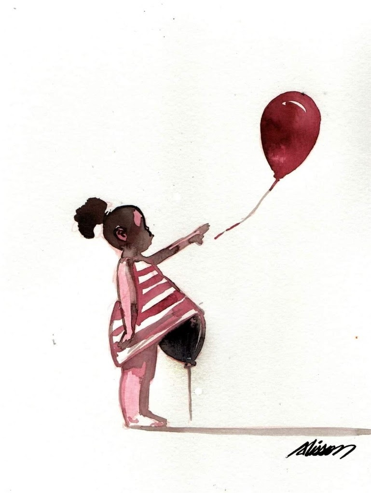

import Book from '~/components/Book.vue'

Tenho vivido muito cansada. Temos que concordar que o Brasil não tem nos dado descanso há um bom tempo.

Fatos horríveis acontecem diariamente relacionados à corrupção, assassinatos, violências desnecessárias, mentiras, etc. Tudo isso além da média de 1000 mortes diárias pelo COVID, que não nos abandona.

Certamente, eu como cada um de vocês leitores não conseguem fazer leituras cujo olhar seja contaminado por essa realidade dolorosa. Tento fazer leituras leves, descompromissadas, mas acabo, muitas vezes, abandonando. Sinto a necessidade de ler coisas que neste momento eu sinto que valem a pena, que me ajudem a entender o Brasil que para mim tem se tornado a cada dia mais desconhecido.

De todos os últimos acontecimentos, o que mais me deixou derrubada foi o da gravidez de uma menina de 10 anos, [que vinha sendo estuprada pelo tio desde os 6](https://www1.folha.uol.com.br/cotidiano/2020/08/justica-autoriza-aborto-em-menina-de-10-anos-gravida-apos-estupro-no-espirito-santo.shtml). E daí a enxurrada de casos, e a triste realidade de que, no Brasil temos 4 meninas de até 14 anos estupradas a cada hora. Fico pensando no fardo que essas crianças terão que carregar pela vida. Qual destino será a elas destinado? O presente, tristemente, foi definido no nascimento.

Eu tinha terminado de ler um livro de estréia de uma autora indiana, Amita Trasi, que traz um relato contundente que se passa na Índia contemporânea.

<book title="Todas as cores do céu" author="Amita Trasi" link="https://amzn.to/2YJmAC4">

</book>

Falar em Índia logo nos vem à mente o malfadado sistema de castas, extinto por lei, mas não ainda culturalmente.

Em 1950 o sistema de castas foi abolido na Índia, entretanto, essa mudança não alterou em nada a realidade de muitos indianos. No livro, Mukta é uma criança de 10 anos que já nasceu com seu destino traçado por ser uma descendente de Devadasis. Apesar da prática ser ilegal desde 1988, famílias muito pobres ainda oferecem suas filhas com oito, nove, dez anos, a deusa Yellamma. Essas meninas são proibidas de casar e dedicam a vida a dar prazer aos homens da comunidade, sendo chamadas de prostitutas do templo.

O livro retrata a amizade improvável, que por motivos diversos, acontece  entre Mukta e Tara, sendo Tara de casta superior, uma Brahmin. Mas essa amizade não impede que Mukta siga seu destino, marcado desde seu nascimento.

E o livro, cheio de histórias, idas e vindas, e muitos relatos, prende a atenção, mesmo tratando temas difíceis como estupro,  aborto, escravidão, prostituição infantil, e tráfico de crianças.

> “… há cerca de dez novas crianças desaparecidas na Índia e mais de setenta por cento delas nunca é encontrada.”

Terminamos a leitura com aquele alívio de privilegiado, até que o caso da menina do Espírito Santo, que mencionei acima, nos derruba totalmente.

Precisei então fazer um retorno ao Brasil de 50 anos atrás,  via a  releitura, de um livro que me marcou profundamente quando o li há muitos anos. Cenas vivas na minha mente, que eu precisava revisitar.

<book title="Tereza Batista cansada de guerra" author="Jorge Amado" link="https://amzn.to/2EFnngB">

</book>

Como sabemos, Jorge Amado sempre esteve preocupado em retratar aquilo que via e ouvia nas ruas de sua terra natal, Bahia, mais especificamente o sul do Estado. Elegia seus personagens para dizer aquilo que entendia e refletia sobre a sociedade da qual fazia parte ativamente e de maneira apaixonada. O escritor participou de movimentos políticos atuando inclusive como deputado pelo Partido Comunista, motivo pelo qual foi exilado. Expunha em seu texto a causa pela qual lutava, retratando sempre o operário, o trabalhador, a prostituta; transformando os romances em denúncia, buscando a voz do povo.

As personagens femininas singulares são marca registrada das obras de Jorge Amado. Há, em cada uma delas, uma mística e uma força próprias de uma construção que envolve questões religiosas, sociais, raciais e de gênero. Tereza Batista é mais uma dessas personagens. A meu ver, a mais completa em todas as facetas.

Não cabe aqui falar em detalhe das mais de 500 páginas desse livro imperdível, e vou me ater a alguns aspectos, relevantes ao contexto desse texto.

“Peste, fome e guerra, morte e amor, a vida de Tereza Batista é uma história de cordel”, adianta a epígrafe da obra.

Contado como um cordel, em suas cinco partes, o livro de Jorge Amado é muito amplo no trato de nossas mazelas eternas.   Aborda epidemias, política, prostituição, comércio de meninas, estupro, racismo, …  dentre tantos outros temas contundentes. E devo confessar que esses tantos aspectos, agora me chamaram ainda mais a atenção dada a similaridade com nosso noticiario diario.

> “Criadagem e costureira, essa gente trabalhava praticamente pela comida, quase de graça”
>   
> “...como manter a sociedade constituída e conter o povo, de todas as pragas a pior? Imagine, meu velho, essa gente com saúde e sabendo ler, que perigo medonho!”
>   
> “Para ele política era ofício torpe, próprio para gente de baixa qualidade, de mesquinhos apetites e espinhaço mole, sempre às ordens e a serviço dos homens realmente > poderosos, dos legítimos senhores do país.”
>   
> “Quem não sabe, fique sabendo de uma vez para sempre: puta não tem direito algum, puta é para dar gozo aos homens, receber a paga tabelada e se acabou. Fora disso, > apanha. Do cafetão, do gigolô, do tira, do guarda, do soldado, do delinqüente e da autoridade. Do vício e da virtude, renegada. Por tolice apanha, dá com os costados na > cadeia, quem quiser pode lhe escarrar na cara. Impunemente.”
>   
> “O indomável advogado dos oprimidos por acaso tomou conhecimento da existência de milhões de mulheres que não pertencem a nenhuma classe, por todas elas repudiadas, > postas à margem da luta e da vida, marcadas a ferro e fogo?”

Apesar da preciosidade da forma como é contada, a história de Teresa Batista não é nada bonita. Aos doze anos, e por uma irrisória quantia, foi vendida pelos tios a Justiniano Duarte da Rosa. O capitão Justo, um dos maiores monstros da literatura,  era conhecido na região, para além dos roubos e das corrupções, pelos assédios e estupros. A maioria de suas vítimas eram adolescentes que mal tinham tido a primeira relação sexual.

> “Não que Tereza houvesse lhe dado tamanha despesa, até ajudava nos afazeres de casa e do roçado. Mas quanto custou muito ou pouco, a comida, a roupa, o bê-á-bá e as contas, os cadernos para escola, quem lhe deu tudo isso foi tia Felipa, irmã de sua mãe Marieta, morta no desastre da marinete, vai para cinco anos. Agora, quando surgem os pretendentes, é justo, seja ela Felipa, a cobrar e a receber.”
>   
> “Talvez um pouco verde de vez ainda, se amadurecesse mais um ou dois anos, estaria no ponto. Assim tão menina, não há como negar, é malvadeza entregá-la ao capitão, mais louca seria Felipa se resolvesse esperar ou se opor. Esperar para vê-la na cama ou nos matos com um moleque qualquer? Se opor para Justiniano levá-la a força, na violência e de graça? Afinal Tereza em breve dias completaria treze anos. Pouco mais tinha Felipa quando Porciano lhe fez a festa e na mesma semana caíram em cima os quatro irmãos dele e o pai e como se não bastasse, lambuzou-a o avô o velho Etelvino, já com cheiro de defunto. Nem por isso morrerá ou ficará aleijada. Não lhe faltou sequer casamento, com benção de padre. Também vocação de corno igual a de Rosalvo não conhecia na redondeza. Tão chifrudo como cachaceiro”

E aí, temos novamente delimitado o destino de Teresa, ao destino que teve sua tia. Algo que nos faz lembrar o sistema de castas indiano...

Tereza Batista carrega em suas costas as experiências de meninas e mulheres brasileiras vítimas das mesmas violências e condicionadas a um futuro de escolhas limitadas. Mulheres que são sexualizadas desde pequenas, vítimas da pobreza, impedidas de ter acesso à educação. Tereza é um grito desesperado de denúncia na obra de Jorge Amado.

Este livro mobiliza importantes questões de gênero, questões específicas de uma época e região e questões atemporais da sociedade brasileira. O olhar crítico durante a leitura é imprescindível para pensar nelas. Cinquenta anos nos separam dessa obra e relatos semelhantes nos assombram. Precisamos de um grito de guerra, pois Teresas temos às pencas.

Este post teve origem de uma longa conversa que tive com minha filha sobre esse tema. Dizia a ela que estava perdendo noites de sono, inconformada em como não vemos mudanças significativas em nossa sociedade. O fosso social cada vez mais profundo e intransponível. Lamentava com ela, o quanto me sinto impotente presente a essa realidade. Aí ela me disse: “Mãe, escreve tudo isso. Eu já quero ler esses livros, e se mais gente tomar essa consciência pela sua escrita, já é algo feito.”

Então, está ai manifesta minha indignação, e tomara minha filha esteja certa. Não aceito a frase de um dos personagens como fato -

> “São os tempos modernos, cunhado, mas não se apoquente: mudam os títulos — coronel é doutor, capataz é gerente, fazenda é empresa — , o resto não muda, riqueza é riqueza, pobreza é pobreza com fartum de desgraça.”

Nunca!

Se possível fiquem bem, fiquem em casa! Até a próxima!
