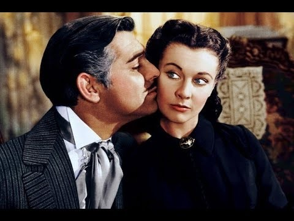
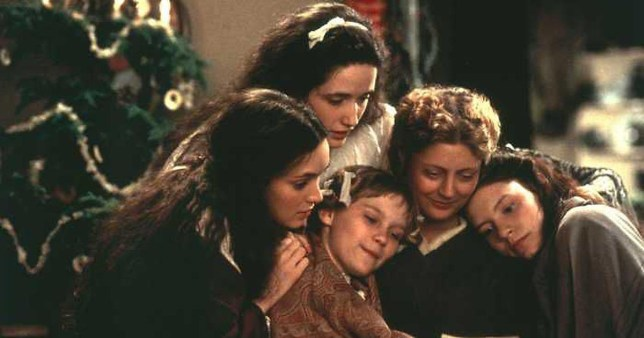
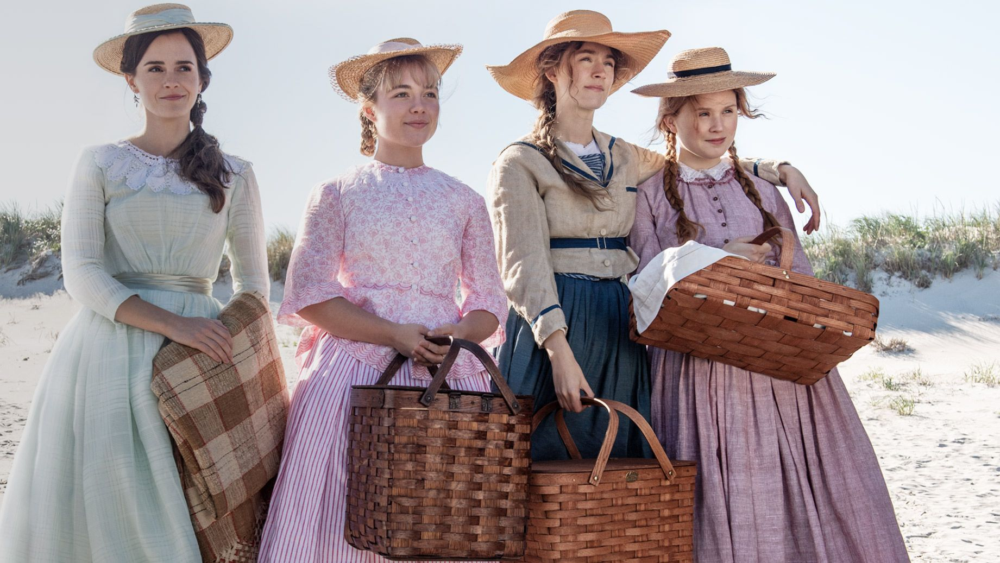
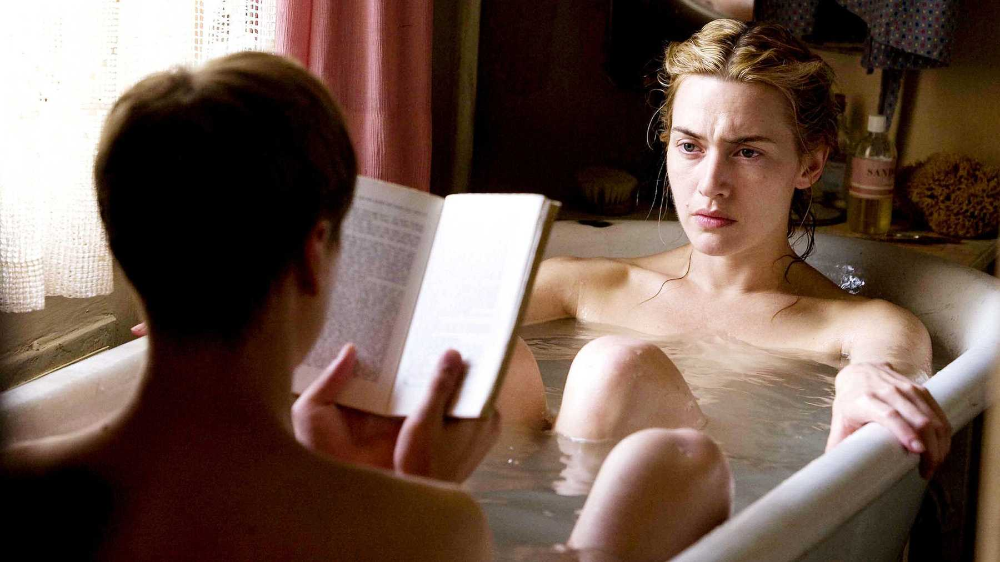
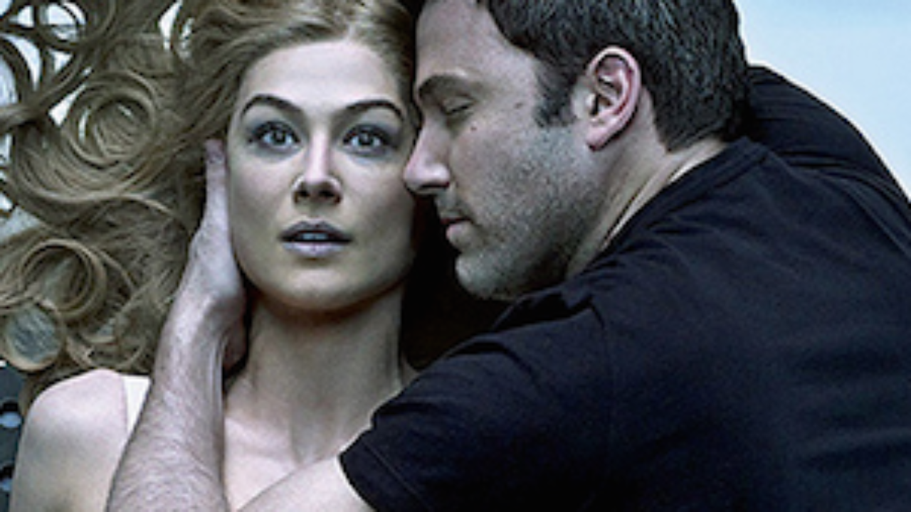

import Book from '~/components/Book.vue'

Em dia de Oscar não tem como não pensar em filmes e sua relação com livros.

Temos os livros que são adaptados para o cinema e também os filmes que nos motivam a fazer leituras: ou do livro que os originou, ou de temas que ele trata.

Enfim, dois componentes da nossa cultura que se permeiam muito. Sem dúvida, difícil encontrar algum leitor que não seja também um bom apreciador da sétima arte, o cinema.

O senso comum é que o filme nunca é tão bom quanto o livro, mas nem sempre isso acontece. Eu acredito que são formas diferentes de se contar uma mesma história. A do cinema é mais árdua, pois precisa dar cara e cores a um texto que, se já lido pelo espectador, certamente, já tem por este suas próprias cores e formas.

Quando li [E o vento levou](https://amzn.to/2SvAeF5) depois do filme,  para mim não tinha outra feição para Scarlet O’Hara que não fosse a de Vivien Leigh e ninguém melhor que Clark Gable  para ser o Rhett Butler. E todos os cenários se encaixavam com perfeição. Se me pergunto qual foi melhor, o livro ou o filme, eu digo que gostei muito dos dois e ter visto o filme antes em nada afetou o quanto gostei do livro. E, vale lembrar que este filme ganhou seis Oscars. Um grande livro, um grande filme!

<book title="E o vento levou" author="Margaret Mitchell" link="https://amzn.to/2SvAeF5">

</book>

_Clark Gable and Vivien Leigh no clássico de 1939_

Nesse ano temos como super indicado um filme que também é a adaptação de um grande livro: **Adoráveis Mulheres**, inspirado no livro **[Mulherzinhas](https://amzn.to/377J1SV)**, de **Louisa May Alcott** - que li há muitos anos.

<book title="Mulherzinhas" author="Louisa May Alcott" link="https://amzn.to/377J1SV">
</a>
</book>

Essa foi outra leitura feita depois de ver a versão de 1994. De novo não teve jeito: Jo para mim é a Winona Ryder, Laurie o Christian Bale. E na leitura que fiz, o tom abolicionista e feminista do livro foi muito bem retratado nessa adaptação. Além, é claro, do papel de relevo da Mãezinha (Susan Sarandon). Na minha visão uma adaptação perfeita e bem fiel ao livro.

_O elenco na adaptação de 1994: Winona Rider, Kirsten Dunst, Trini Alvarado, Susan Sarandon, and Claire Danes_

Mas a versão de 2019 chega com surpresas. Já não tão mais fiel ao texto original, para mim principalmente com relação ao tratamento periférico que é dado a mãe (Laura Dern), mas um belíssimo filme.

Me causou estranhamento essa adaptação. O que foi bom, pois agora com olhos de 2020 iniciei uma releitura do livro, o que certamente não faria. Vamos ver como em tempos tão atentos ao feminismo, encaro um livro escrito há 150 anos.

_Emma Watson, Florence Pugh, Saoirse Ronan, e Eliza Scanlen na adaptação mais recente_

Sempre que me perguntam de um filme que julguei melhor que o livro, o primeiro que me vem à mente é **[O Leitor](https://amzn.to/2HdkqS1)**, de **Bernhard Schlink**, um jurista e escritor alemão. Eu li esse livro em 2009 e me encantei. Apesar de ser uma leitura difícil, é uma das mais lindas histórias de amor que já li.

Michael Berg, um adolescente nos anos 60, é iniciado no amor por Hanna Schmitz, uma mulher madura, bela, sensual e autoritária. Ele tem 15 anos, ela 36. Os seus encontros decorrem como um ritual: primeiro banham-se, depois ele lê, ela escuta, e finalmente fazem amor.

Este período de felicidade incerta tem um fim abrupto quando Hanna desaparece de repente da vida de Michael.

> “O prazer com que tinha chegado ia-se embora com a leitura. Ler uma peça assim, de modo que os diferentes personagens se tornem reconhecíveis, únicos e vivos, exige certa concentração. Embaixo do chuveiro, o prazer voltava a crescer. Ler em voz alta, tomar uma chuveirada, amar e ficar um pouco mais juntos – este tornou-se o ritual dos nossos encontros.”

A linguagem do autor ao falar do amor dos dois é poética e cheia de metáforas e analogias. O livro é incrível, e vai além do amor de um jovem por uma mulher madura. Mostra o poder da leitura, pois Hanna não muito afeita ao universo das letras é levada, via as leituras que Michael faz,  a ver o mundo sob outra perspectiva.

Este é para mim o poder da leitura, ver tudo que nos rodeia com um novo olhar.

<book title="O Leitor" author="Bernhard Schlink" link="https://amzn.to/2HdkqS1">

</book>

O filme, que vi depois, intensifica muito o impacto que causa o livro. Lançado em 2008, foi indicado a quatro categorias do Oscar. No filme, Hanna é representada por Kate Winslet (vencedora do prêmio de melhor atriz no Oscar, única categoria que o filme venceu).

O filme trouxe ainda o alemão David Kross, representando Michael quando jovem, e Ralph Fiennes na sua fase madura. Esse conjunto de atores e a fiel e brilhante adaptação tornam o prazer de ver o filme, a meu ver,  melhor do que o de ler o livro. Certamente, quem começar pelo filme irá correndo ler o livro e vice-versa.

_David Kross e Kate Winslet na adaptação de O Leitor, em 2008_

Muitos outros filmes, que julgo serem belas adaptações de livros, eu poderia citar e teríamos aqui um texto imenso.

Vou então apenas citar mais um que acho excelente:  **[Garota Exemplar](https://amzn.to/2UDP53c)**, uma adaptação do livro homônimo de **Gillian Flynn**. O livro tem diversas nuances e além do suspense policial, nos fala sobre comportamento humano, vaidade, manipulação e egocentrismo.

<book title="Garota Examplar" author="Gillian Flynn" link="https://amzn.to/2UDP53c">

</book>

O filme não deixa nada a desejar ao abordar todas essas facetas do livro. Temos, como no livro, o mote principal que é o suspense que envolve o desaparecimento da esposa de Nick Dunne (representado por Ben Affleck) e apresenta fielmente como a mente humana pode ser sórdida e criativa ao mesmo tempo.

Traz do livro também os desgastes acometidos pela necessidade de manter acesa a chama do casamento. Vi o filme depois de ler o livro e, de novo, considero que o filme deu ao enredo uma intensidade, para mim, mais potente que a da leitura.

_Rosamund Pike e Ben Affleck na adaptação de Garota Exemplar_

Termino por aqui, tentada a escrever mais páginas e páginas sobre esse tema, e revelar aqui essa minha outra faceta: sou também uma “devoradora de filmes”

Bom domingo! Bom Oscar para todos que gostam. Eu adoro e tenho aqui separadas minhas apostas… Nunca acerto muito porque não vou pelo racional e sim pelo emoção que os filmes me proporcionaram. Mas não desisto de torcer!
