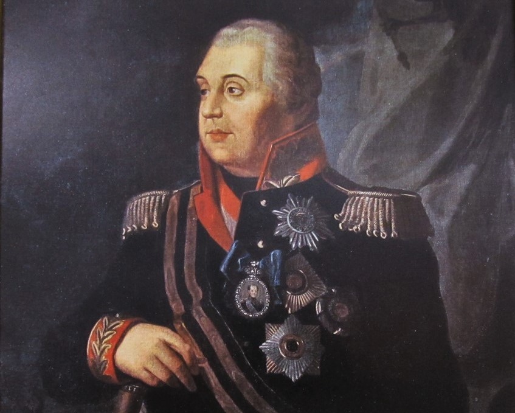
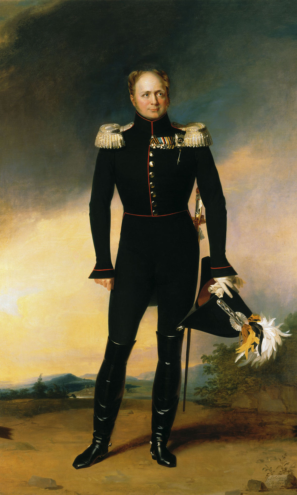

import Book from '~/components/Book.vue'

Segundo meu onipresente companheiro de leituras, amigo sempre à mão, meu "Dicionário Houaiss da Língua Portuguesa" - ele próprio um deles - "calhamaço" significa: "livro ou caderno volumoso, muito grosso, com grande número de páginas."

Minha companheira neste blog, e querida irmã, denunciou-me em publicação recente como afeito a calhamaços! Bastou-me reflexão ligeira e: não é que tem razão!! Não havia me dado conta, mas minhas escolhas geralmente recaem sobre livros gordos. 

As razões nunca passarão de ilações, e elas sempre serão revestidas de infância, como soe ser. 

Seria ler como comer pipocas!? Potes grandes e repletos, elas comidas, lentamente, uma a uma para que restem sempre muitas ainda a serem degustadas. Pipocas como páginas, temos que fazê-las durar, pois o prazer que delas emana não pode terminar ligeiro.

<book title="Guerra e Paz" author="Liev Tolstói" link="https://amzn.to/3fc5qpi">

</book>

Bem, falemos então de calhamaços. E é impossível falar deles sem começar por [Guerra e Paz](https://amzn.to/3fc5qpi) de Liev Tolstói, este extraordinário escritor russo, este pote imenso de pipocas crocantes e sem um piruá sequer ao final.

Em releitura recente, tomei contato com esta obra gigante ainda com 16 anos de idade. Daqueles livros que nossa mãe "inadvertidamente" deixava ao acaso pela casa, sabedora do olhar curioso do filho. E, com prazer indisfarçável, comemorava em silêncio o sucesso de seu ardil. Devorei.Hoje, décadas depois, o reli. E queria ter feito naquela edição que foi dela, toda impregnada de sua presença, em tempos de ausência nada fácil. Perdeu-se. Sabe-se lá em qual das tantas mudanças, ou foi-se com ela como nosso eterno elo, com o qual me acenará no porvir.

---

Uma obra de peso, em todo sentido que se possa dar ao termo, "Guerra e Paz" é considerada a obra-prima de Liev Tolstói. Particularmente, agradaram-me mais seus enredos menos épicos e mais intimistas, nos quais o agudo crítico social expressa-se mais vivamente (Como em "Anna Kariénina", 1878, já comentado neste blog).

Tolstói usa personagens reais e também os cria, os contextualiza e nos narra a história tal qual acontecida. Mais que um romance, um documento histórico. 

Publicado em 1865 em edição original com 1225 páginas, teve seu primeiro lançamento no Brasil em 1942, então traduzido do francês, e em 2002, em tradução direta do original russo, pela Cosac Naify.

Alocado temporalmente entre 1805 e 1820, narra a sociedade russa à época das guerras napoleônicas na Europa e especialmente na Rússia. 

"Guerra e Paz", apesar de ter sido escrito quase totalmente em língua russa, tem partes significativas escritas em francês, função da flagrante e descarada francofilia da aristocracia russa da época, princípio do século XIX.

A narrativa toda acontece entre São Petersburgo e Moscou em torno de  três famílias e seus diversos representantes. Mais especificamente, por três personalidades que poderíamos eleger como os protagonistas de todo enredo.

Então vejamos, em resumo ousado e todo meu:

Pierre Bezukhov, rapaz pobre, desprovido de beleza física, inteligente e inquieto, questionador de verdades existencialmente significativas, sempre curioso às verdades além muros. Herda uma fortuna e passa a frequentar a aristocracia russa de quem era crítico distante e repleto de conceitos avessos a ela. Durante toda trama, pena para preservar valores independentes, influenciar e buscar ser um homem melhor e mais justo. 

André Bolkonski, embora nascido e vivido na nobreza oca, um rapaz por natureza lindo e frágil, repleto de questões e conflitos filosóficos, morais e religiosos. Vive uma relação de conflitos e sintonias com Pierre Bezukhov.

Em busca de respostas no Exército ou no isolamento em sua fazenda no campo, vive em busca de um norte que o ilumine e oriente.

Em encontro quase convulsivo com seu amigo Pierre Bezukhov, pergunta: "E neste mundo de guerras, interesses e desamor, qual o papel de Deus?" 

(Pouco atual? Mais, impossível.)

General Kutuzov, retirado da vida real, não belicista, de menor prestígio na elite fardada que, pela sensibilidade do Czar Alexandre I, comanda as ações do mal preparado exército russo. Perturbado em busca de uma razão para a guerra, jamais viu sentido na invasão de Napoleão à Rússia, como na perseguição cruel do exército russo à sua  retirada, derrotado e em fuga. 

General Kutov

Alexandre I

---

Personagem histórico real, foi incompreendido em suas decisões de  guerra como  Comandante em Chefe. Morreu no anonimato; oficialmente como um covarde aos olhos de seus pares, mas um herói diante de seu povo.

Em "Guerra e Paz", diferente de "Anna Kariénina", as personagens femininas ocupam papel de secundariedade.

Assim, a bela Hélena Kuraguin, que fez da beleza física sua única crença virtuosa, transitou por corações e cortes, sonhando alto, mas destinada à coadjuvancia.

Natasha Rostova, sonhadora reclusa em seus sonhos, de autoestima cambiante, a espera de um homem que fizesse dela uma mulher e lhe desse significado. Não foi além de dar sentido a eles. 

Entre pesquisas cuidadosas e redação esmerada, Liev Tolstói levou cinco anos preparando sua grande obra. Quando publicada na íntegra em 1865, já um terço dela havia sido dado à público em capítulos. 

Tolstói não gostou.

Os veteranos da campanha contra Napoleão, também não; sentiram-se mal retratados, injustiçados quanto a valentia e estratégia. Mas o povo amou. Tolstói reescreveu o desfecho, pois odiou seu "final feliz"! 

Mas sua primeira versão da campanha de 1812 tornou-se o maior sucesso literário em língua russa.

Uma obra extensa, mas cuja leitura apaixonante a torna curta. Haveria espaço para mais "pipocas" a satisfazer a vontade crescente delas.

---

> “Não existe grandeza onde faltam a simplicidade, o bem, a justiça.”
> — Leon Tolstói

---

Calhamaço ou não, escrever um livro não passa somente pela vontade de fazê-lo. Há que se deixar habitar por uma ideia e permitir crescer em você. Quase roubá-lo de si. Alimentar-se de seu ser e, sem pedir licença ou agradecer, ir-se ao nascer e tornar seu autor uma mera ferramenta, uma barriga de aluguel que pare filhos que não são seus.

---

> PARIR UM LIVRO 
>  
> Filho pensado, desejado. 
> Filho concebido e gestado. 
> Filho parido e apresentado. 
> Das dores aos louvores. 
> Dos &aacute;is, dos amores, 
> Do branco e das cores, 
> Ao filho que vai 
> Cumprir seu destino, 
> Ainda menino, 
> Para longe do pai. 
> O livro &eacute; o fim, rouba-me a entranha 
> E se finge de mim. 
> Mal ganha a vida, 
> Ainda crua a ferida, 
> Se faz, solta-se, 
> E vai cumprir seu enfim. 
>  
> &mdash; Paulo M&aacute;rcio V Rocha 

---

Reservemos outros calhamaços para um outro momento. Afinal, mesmo para as pipocas de nossas infâncias, repletas do maior encanto e significado arquetípico, há limites.

Até o próximo.

Protejam-se, pois o SARSCOV2 é inimigo ardiloso.

Paulo Márcio  
👴avô, 📝 poeta, e 📚 leitor voraz
