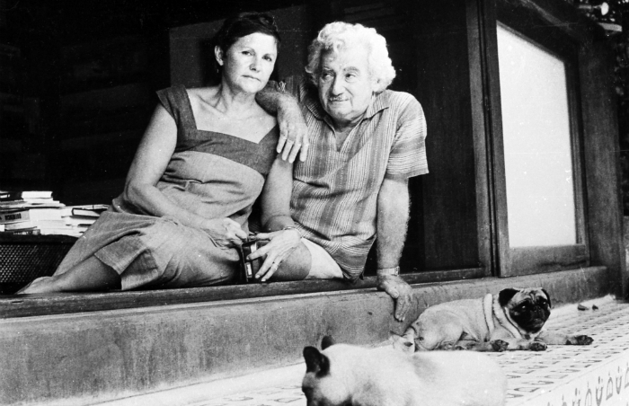
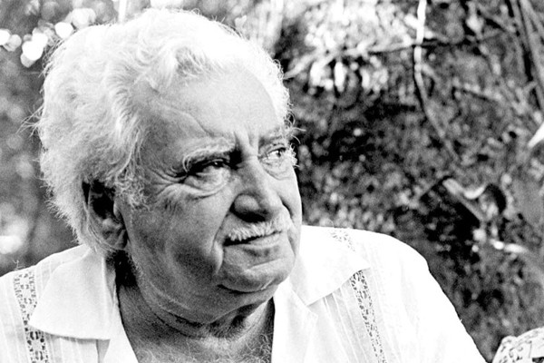
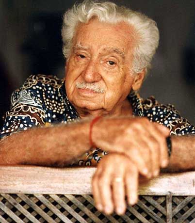

import Book from '~/components/Book.vue'

_por Paulo Márcio_

Há temas cantados e decantados no universo dos livros. Não por serem encantados, mas por falarem de perto e ecoarem forte nas vidas de quem produz e nas vidas de quem consome literatura. Entre eles, o desequilíbrio econômico, a prevenção racial e a divisão de classes, preponderam. A distância que situa os indivíduos, os valores que os hierarquizam e a sedimentada crença que os diferencia, tem escrito, não só bons livros, mas a própria história da humanidade.

Questão atemporal, tem-se imposto e firmado a ponto de tornar-se natural, até mesmo imperceptível. Quase consagrado culturalmente e legitimado por crenças religiosas, passou a ser natural,  como vinagre sobre o alface ou sal sobre o bife.

Haverá crueldade maior do que incorporar valores discriminadores e sectarismos indecentes ao os transformar em bom dias, ou como vais, ou beijos entre pessoas que não têm o menor interesse em saber ou qualquer sentimento verdadeiro a expressar?

Meras atitudes reflexas, como quem reage ao outro como reagiria a um cisco no olho.

Tornam-se necessárias vozes e seus alaridos a nos despertar. Uma chamada geral à consciência pessoal e coletiva de que algo incorreto e inadmissível ocorre.

A literatura em suas múltiplas formas presta-se a esta ferramenta. Escancara aos nossos olhos o problema e incita à reflexão e atitude.

Entre muitos escritores, verdadeiros arautos da igualdade social, destaco um em especial: **Jorge Amado**.

Desde muito moço, suas publicações são denúncias das injustiças e desigualdades e, ao mesmo tempo, revelações surpreendentes de riqueza cultural e diversidade social.

Ele desvenda e compromete.

Destacarei duas de suas obras. Pioneiras e emblemáticas de um novo momento literário, de uma resposta comprometida com a necessidade por mudanças: **_Jubiabá_** e **_Mar Morto_**.

<book title="Jubiabá" author="por Jorge Amado" link="https://amzn.to/3900Kz1">

</book>

Embora o livro seja denominado **Jubiabá**, a história não gira em torno dele. O centro da trama é **Antônio Balduíno**.

Nosso herói, um negro forte, nascido órfão no morro do Capa-negro, em Salvador, e q se torna sucessivamente menino de rua, malandro, sambista, lutador de boxe, trabalhador nas plantações de fumo, artista de circo e estivador. Criado no morro, enfeitiçado e temeroso da cidade grande que acontecia lá embaixo.

Jorge Amado nos conduzirá por sua incrível capacidade de conduzir.

Baldo, como era chamado, já inicia sua cruzada desbancando a supremacia ariana ao surrar um marinheiro europeu, metido a campeão.Vira rei, mas termina a noite nos braços de uma mulher dama em seu botequim preferido, bebendo com seus iguais.

Como flui o texto de Jorge Amado! Lê-lo é um misto de delícias: ironia, romance, humor fino, humor escrachado. Revolta, anarquismo, ativismo social e indignação cultural. Do negro ao branco e, de volta, ao negro, um crítico agudo de qualquer forma de racismo e discriminação.

Tão jovem ainda quando escreveu este livro, 22 anos, e tão repleto de talentos.

Jubiabá, seu mentor espiritual e grande amigo, com cuja debilidade física contrastava. De aparência franzina, mas com o grande poder de uma voz sempre presente e de ações solidárias, lícitas ou não. Um orientador, um pai que nunca teve, um cúmplice e um amigo fiel.

Antônio Balduíno, sentindo-se livre e importante, vagando com a turma de mulambos a quem chefiava, pelas ruas de Salvador. Mal dava-se conta do quanto era escravo, do quanto escrevia a mesma página da mesma história, já tantas vezes escrita.

O que na verdade soa diferente é como Jorge Amado narra sua epopeia. No excerto abaixo, uma "simples" descrição de uma viela onde Baldo viveu por alguns anos:

> "Velha rua de casas sujas e de sobrados de cor indefinida. Vinha numa reta, sem desvios. Os passeios das casas é que eram desencontrados, uns altos, outros baixos, alguns avançando para o centro da rua, outros medrosos de se afastarem da porta. Rua mal calçada de pedras desarrumadas, plantada de capim.
>   
> O silêncio e o sossego desciam de tudo e subiam de tudo. Vinham do mar distante, dos montes lá atrás, das casas sem luz, das luzes mesmas dos raros postes, das pessoas, baixavam do ar sobre a gente e envolviam a rua e as criaturas. Parecia que a noite chegava mais cedo para a travessa Zumbi dos Palmares que para o resto da cidade.
>   
> Nem o mar que batia nas pedras, ao longe, acordava o sono da rua, que seria uma velha solteirona à espera do noivo que partira para as capitais distantes e se perdera na confusão dos homens apressados. A rua era triste. Uma travessa agonizante."

Quanta maturidade lírica e poética num escritor de 22 anos! O acompanhou por toda sua profícua carreira.

Em "Capitães da Areia", como em "Jubiabá", Jorge Amado dá voz e significado aos invisíveis. Crianças que tornam-se adultos precoces pela necessidade de sobreviverem. Considerados efeitos colaterais da sociedade em evolução. Vistos como preguiçosos que não se esforçaram o suficiente. Sim, há muita semelhança entre Pedro Bala e Antônio Balduíno.

Mas como ser fiel à história de um povo sem considerar todos os seus personagens?

A pobreza afeta crianças e adolescentes e Jorge Amado é comprometido em denunciar a crueldade que representa o abandono completo deles, que geram novos abandonos e que se perpetuam até os dias de hoje.

Há um Pedro Bala ou um Antônio Balduíno, tentando sobreviver na rua de baixo de nossas casas. Aquela mesma rua que evitamos passar.

A relação de Antônio  Balduíno com a natureza que o cerca e com as pessoas em seu redor, é descrita de forma sempre presente em todo o livro. É de um lirismo e poesia que leio incansavelmente, e releio, e releio..., e me encanto. Um homem rude, ainda jovem, maltratado pela vida, um sobrevivente de todos os dias. Mas um herói de seu particular universo de belezas, sonhos e promessas da natureza, da qual é parte indivisível e na qual crê, sem duvidar jamais. É mais que amor, é identidade. Afinal, ele é o mar que vive em terra.

Baldo ou Jubiabá? Questionamento interessante.

Mas pergunto, sobre Baldo: nos momentos mais felizes, quem está presente em suas reflexões? E nos mais aflitivos? Jogado sobre a areia ao lado de uma mulata exausta e contemplando as estrelas, quem surge em sua mente? Fugindo, quase morto de fome e sede, quem o socorre em pensamentos? Embriagado ou sóbrio, quem nunca lhe nega guarida? Quem jamais faz juízo de valor sobre ele? Em quem ele confia acima de qualquer dúvida? Uma só resposta: Jubiabá.

O seu Deus nagô, "o que tem a força junto à oxalá". O pai Jubiabá, "que sabe tudo dele, que só ele sabe".

E se levarmos em conta a importância fundamental do misticismo religioso na construção dos personagens de Jorge Amado, e teria que ser assim, chego a conclusão que, este livro só poderia ter um título:  "Jubiabá".

E mais uma vez, em um capítulo de nome "Saveiro", Jorge Amado faz algo inusitado: nos apresenta, dentro da história, o personagem central de seu futuro livro, que publicaria no ano seguinte. Guma, mestre saveiro, será o herói de "Mar Morto".

Outro aspecto desta obra que me desperta reflexões: seria uma abordagem chauvinista de coisificação da mulher? Transformadas em objetos de satisfação para machos machucados pela vida? Acredito que não. Até o contrário.

Há uma passagem, vivida por um personagem casual, Ricardo, trabalhador nas plantações de fumo, na qual se masturba imaginando  situações românticas com uma atriz, nua em um "poster", na parede sobre sua cama. Jorge Amado narra esta cena de uma forma idílica e delicada, e muito linda. Acima de tudo, como uma grande homenagem à mulher, transformada pela fantasia do matuto de mãos grossas, em sua rainha, a que faz dele um homem invejado. Termina assim:

> "Acorde quem quiser, porque ele não está fazendo nada de mais, está amando uma mulher bonita, de seios duros e de ventre redondo. A sua mão é uma mulher."

E assim, outras tantas situações de caráter aparentemente machista, mas que em sua essência, consideradas todas as circunstâncias, na verdade, não o são.

Até porque, Zélia Gattai, sua grande companheira e revisora exigente, não deixaria passar. rsss… Uma exploração machista da mulher?

Tenho que aceitar o questionamento. Mas, contextualizado, não seria também uma resposta à expectativa da mulher quanto ao comportamento do homem? Calma! Não justifica.  Mas explica em boa parte. Homens desarmados e mulheres desamadas, sentindo-se assim, ambos, como poderiam agir de outra forma?

A cultura, a consciência crítica, a coragem e o tempo estão fazendo mudar tais pressupostos. Coube ao escritor escancarar absurdos, chocar e comprometer. Tirar homens e mulheres da condição de vítimas, para cúmplices. O que os torna responsáveis, diante de si, por mudanças. E estão em curso, para graça de todos. A miséria moral, pessoal e econômica, conduzindo as pessoas ao sofrimento, ao embuste e ao desespero. A desesperança prevalecendo sobre o anseio e a crença em uma vida melhor.  A morte surgindo como a alternativa restante. A vida transformada, literalmente, num circo mambembe. Um desenho chocante de Jorge Amado sobre a realidade da maioria da população de nosso sofrido e explorado Brasil.

Então, novas ocorrências em sua vida, como cuidar do filho branco de seu primeiro e grande amor e, envolver-se em um movimento grevista por melhores salários para sua vida miserável e de seus parceiros de desdita, o transformam. Antônio Balduíno deixa de ser um errante existencial e passa a ter um propósito na vida: amar e cuidar do filho de Lindinalva.  Sobreviver feito um herói sem causa, dia após dia, é substituído por um propósito, um sentido, uma razão de ser e fazer a vida acontecer. É quando começa a perceber em si, virtudes, competências e méritos para ser admirado e amado. Para sonhar com um futuro além do próximo trago ou da próxima mulata.

> "Ele agora sabe porque luta. E vai assim depressa para avisar todos os negros que estão na macumba do pai Jubiabá. Vai avisar a todos...Ele não compreende porque Jubiabá ainda não lhe ensinara a greve, Jubiabá que sabia tudo.."

O negro Balduíno questionando a  ignorância e o misticismo religioso mantendo a todos acomodados na vida medíocre e alienada, acreditando ser este o seu destino traçado, no qual não havia espaço, sequer, para sonhar.

Se considerarmos que Jorge Amado escreveu "Jubiabá" ainda com 22 anos, já com a consciência social e capacidade literária reveladas nele, podemos entender porque é considerado um dos maiores e mais importantes escritores em língua portuguesa.

Como bem frisou Antônio  Dimas em seu posfácio ("Da Praça ao Palanque") para esta obra de Jorge Amado, publicada em 1935, juntamente com um conjunto de outros romances brasileiros, geralmente de escritores nordestinos, a que a crítica literária chamou "Romance de 30".

Mudava-se então, e finalmente, o eixo da produção literária da Europa para o Brasil.

Continua dizendo Antônio Dimas: "Em 1928 saiu ["A Bagaceira"](https://amzn.to/2YQ7JJd), de José Américo de Almeida.  Em 1942, ["Fogo Morto"](https://amzn.to/2Xh2otW), de José Lins do Rego. E entre eles, ["O Quinze"](https://amzn.to/395sVMU) (1930), de Raquel de Queiroz; ["Caetés"](https://amzn.to/3z21vlL) (1933), ["São Bernardo"](https://amzn.to/3hpLgsU) (1934), ["Vidas Secas"](https://amzn.to/3z4YDEE) (1938), de Graciliano  Ramos. Jorge Amado contribuiu com ["O País do Carnaval"](https://amzn.to/3jZMa0N)(1931), ["Cacau"](https://amzn.to/3Ee3uaG) (1933), ["Mar Morto"](https://amzn.to/397ljtj) (1936), ["Capitães da Areia"](https://amzn.to/3hsyidI) (1937).

Estes anos "puseram de ponta-cabeça a maneira de encarar o Brasil, que deixou de ser um sonho eufórico para se converter em realidade analítica, aberta para ser escarafunchada."

Não há muito mais a acrescentar ao resumo sobre a história de Antônio Balduíno, desde sua alienação assumida, fruto de absoluta exclusão existencial, até seu encontro com valores que o fizeram significar e pertencer a um contexto social e político. Que o fizeram perceber a religião também como ferramenta de aceitação resignada e comboiagem calada. De sua caminhada para muito além dos limites de seu encantamento distante com o mar e as estrelas, ou suas paixões de macho sedutor e habilidoso amante, todas elas tão solitárias.

Além de ter inscrito de forma inédita e definitiva as coisas do Brasil, através da literatura.

Não de todos os brasis, não. O cartão de visitas é a Bahia de Todos-os-Santos, a Bahia de São Salvador. De um Brasil sendo novamente descoberto a partir dela. Não pelas caravelas de Cabral, mas pelos nossos escritores que, muito além da riqueza de nossa língua portuguesa do Brasil, revelou ao mundo o nosso país. Novos Caminhas, agora, nossos Caminhas.

E mais importante ainda: o revelou para nós, brasileiros.

Jorge Amado é um de seus maiores arautos.

<book title="Mar Morto" author="por Jorge Amado" link="https://amzn.to/2YQK7UM">

</book>

> "Mar Morto foi o primeiro livro de Jorge Amado que li.
>   
> Li e adorei a história de amor passada no mar da Bahia, um romance de fazer sonhar, cheio de poesia. Eu estava longe de imaginar que um dia conheceria o autor, que por ele me apaixonaria, que seria por ele amada e que, juntos, viveríamos 56 anos de puro e verdadeiro amor. Eu, Lívia, nós braços de meu Guma, Jorge, com direito a brisa do mar e moqueca de siri-mole.
>   
> Mar Morto foi o abre-alas, assim que terminei de ler fui em busca dos outros. A leitura de cada livro me emocionava, mas este, o primeiro, nunca perdeu seu lugar de preferido."
>   
> — Zélia Gattai Amado

Um livro especial no conjunto da obra amadiana. Um romance de amor, uma tragédia anunciada, um enlevo mítico, vida, morte e inconstância.

Existências presas à beira do mar, ao lado do cais, sobre as areias e, sobretudo, sobre as ondas incertas do mar. Não do oceano longínquo, mas do mar azul e verde da costa da Bahia. Mar que acolhe, encanta, gratifica e sepulta.

O amor de Gumercindo, Guma, e Lívia; de Esmeralda e Rufino; de Maria Clara e Manuel. Gente do mar e não da terra.Realmente, um enlevo só! Jorge, aos 23 anos, é pura sensibilidade, lirismo e comunhão com a natureza. Falando do amor:

> "Os homens e mulheres, eles se amam, confundem os corpos sobre o mar e sob a lua."

Falando de crenças, que são a própria vida:

> "...porque a mãe d'água é loira e tem cabelos compridos e anda nua debaixo das ondas, vestida somente com os cabelos que a gente vê quando a lua passa sobre o mar."
>   
> ..."assim, Guma, olha o bojo de prata das águas e ouve a música do negro que convida para a morte. Ele diz que é doce morrer no mar, porque irão encontrar a mãe d'água que é a mulher mais bonita do mundo todo."

Falando da morte:

> "Lívia ficou triste. Nunca mais Judith amará. Nunca mais virá amar, no mar, na hora em que a lua brilha. Para ela a noite não será mais para o amor, será para as lágrimas."

Trechos sem fim, de inspiração também sem fim. Iemanjá, a mãe d'água e dona do mar. O homem salgado do mar e curtido de sol a chama... Janaína!

> "... a ternura destes olhos de mar, desejosos de amor, ternos olhos de mulher. Guma olhou esses olhos e compreendeu. Por isso as mãos de Rosa Palmeirão alisam o seu cabelo, seus lábios sorriem e seu corpo estremece."

Jorge Amado! Sem nada tirar e nada acrescentar. Guma, um herói sendo construído desde o princípio da narrativa. Herói por uma noite, lenda nas areias do cais para sempre. Enfrenta a tempestade e conduz o grande navio à segurança do porto. Conhecia os caminhos.  Torci e vibrei com ele, como quando lia meus ídolos nos gibis da infância.

Mas fadado à fatalidade, ao sacrifício anunciado no mar, antecipa sua dor ao trair Lívia e ao amigo Rufino. Desrespeita a lei do cais, ofende sua ascendência e sela seu destino. Não há mais como evitar a morte. Mergulha em espera diária pelo desfecho inexorável,  agora como punição e não mais desdita. Com isto, deixa de ser o herói do cais e desloca para Lívia a função heróica, e a conduz com dignidade. De mulher da terra a mulher do mar, por força do amor e da tradição a ser cumprida.

> "Iemanjá, que é dona do cais, dos saveiros, da vida deles todos, tem cinco nomes, cinco nomes doces que todo o mundo sabe.
>   
> Ela se chama Iemanjá, sempre foi chamada assim, esse é seu verdadeiro nome. No entanto os canoeiros amam chamá-la de dona Janaína, e os pretos que são seus filhos mais diletos, que dançam para ela e mais que todos a temem, a chamam Inaê, com devoção, ou fazem suas súplicas à Princesa de Aiocá, rainha destas terras misteriosas que se escondem na linha azul que as separa de outras terras. Porém, as mulheres do cais, que são simples e valentes, Rosa Palmeirão, as mulheres da vida, as mulheres casadas, as moças que esperam noivos, a tratam de dona Maria, que Maria é um nome bonito, é mesmo o mais bonito de todos, o mais venerado, e assim dão a Iemanjá como um presente, como se lhe levassem uma caixa de sabonetes..."
>   
> — Jorge Amado

Destaquei este excerto pois, pela minha forma de ver, tornam indivisos e desnecessários os limites conceituais entre crenças, espiritualidade, religião, misticismo ou seitas, e os trazem para dentro do indivíduo, os simplificam e transformam em fé, em sentido, em presença cotidiana, em razão de existir, em vida. Não é  fé com propósitos terrenos. Transformam cada gesto, cada pensamento e cada intenção em atitude de reconhecimento e exaltação ao Criador. Não cultuam o mar, a areia, o sol ou as estrelas, mas o que eles representam. Não se segregam, mas ampliam-se, misturando-se à obra de Deus. Vivem em função Dele, para Ele e em direção a Ele como propósito maior.

É a forma como vejo e sinto. Guma erra, frauda valores e enfrenta sua consciência.  Ana Lívia e mortifica-se. Mas para construir e garantir para si uma identidade familiar, uma referência, uma história, um abc. Seu pai morreu no mar e sua mãe tornou-se mulher dama, embrenhada pelos descaminhos do mundo. Criado pelo tio Francisco, só sabia de si que era um homem do mar, prometido a Janaína. Mas queria mais que isso, mais que virar estrela no céu. Queria uma família.

Jorge Amado conduziu a história sem estabelecer nenhum juízo de valor. Deixou ao encargo de cada personagem a consciência sobre seus atos. Uma história tantas vezes contada, mas que, pela pena do baiano genial, ganha nuances de primeira vez.

Guma não é um canalha, tampouco um herói. Apenas  um homem do mar tendo que fazer maus acordos com a vida.  Como julgar e condenar alguém a quem só restou sobreviver, mesmo que a custa de seus valores, sua ética e orgulho. Consumido por sua própria consciência, a cada momento do que restou de sua vida miserável. Coberto de vergonha e culpa, só fez esperar que Janaína ainda o quisesse e o levasse. E ela, Janaína, o fez: levou Guma, que morreu salvando vidas à custa de sua própria. E é o que fez também enquanto viveu, cuidou e preservou vidas, sem medir custas. Fez o que nasceu para fazer. Para ser como o mar: "Um doce amigo".

E para encerrar, vou valer-me da sensibilidade de Ana Maria Machado, em seu posfácio "A Invenção da Bahia".

> "A música que se ouve no velho forte ao luar, o estribilho que atravessa todo o livro, é de Caymmi: "É doce morrer no mar." O coro grego desta tragédia amadiana, anunciando o que há de vir, é outro verso do então jovem Dorival, começando sua carreira de glórias: "Nas ondas verdes do mar ele se foi a afogar."
>   
> Juntos, Caymmi e Amado inauguram uma mitologia. Iriam convidar o mundo inteiro, anunciar as delícias de sua terra, explicar o que é que a baiana tem, lançar moda seguida por tantos outros, chamar a atenção para cenários e criações que depois conquistariam o país e atrairiam turistas do mundo inteiro.
>   
> De certo modo, tudo começou neste livro, uma obra que, ao lado de "Jubiabá" e "Capitães da Areia", assinala o momento do nascimento dessa imagem solar da Bahia no imaginário nacional. "Mar Morto" nos traz esses retratos primordiais, como instantâneos, em todo seu frescor, e nos devolve a densidade do ineditismo de que então se revestiam."

E é isso!  Jorge Amado e uma nova temática da Literatura Brasileira.

Ainda, antes de encerrar, versos:

> O Jangadeiro 
> (Adriano Espínola)
>   
> Jangadas amarelas, azuis, brancas, 
> logo invadem o verde mar bravio, 
> o mesmo que Iracema, em arrepio, 
> sentiu banhar de sonho as suas ancas. 
> Que importa a lenda, ao longe, na história, 
> se elas cruzam, ligeiras, nesse instante, 
> o horizonte esticado da memória, 
> tornando o que se vê mito incessante? 
> As velas vão e voltam, incontidas, 
> sobre as ondas (do tempo). O jangadeiro 
> repete antigos gestos de outras vidas 
> feitas de sal e sonho verdadeiro. 
> Qual Ulisses, buscando, repentino, 
> a sua ilha, o seu rosto e o seu destino.
>   
> (Os cem melhores poemas brasileiros do século)

Até um próximo encontro.

Paulo Márcio
