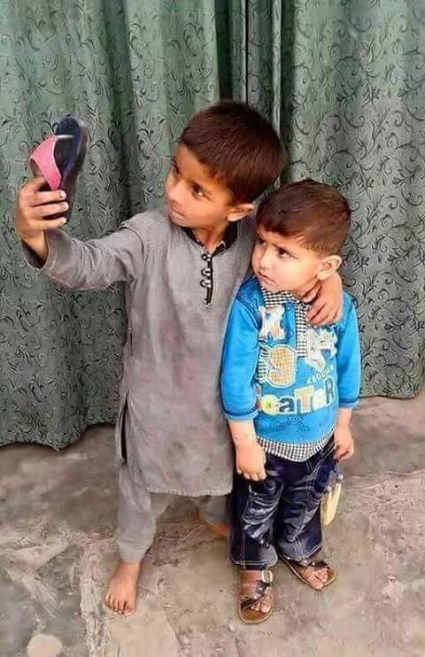
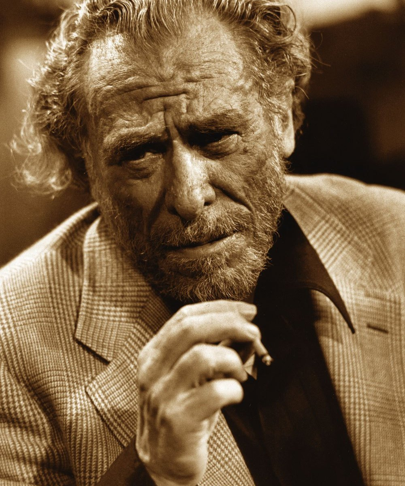
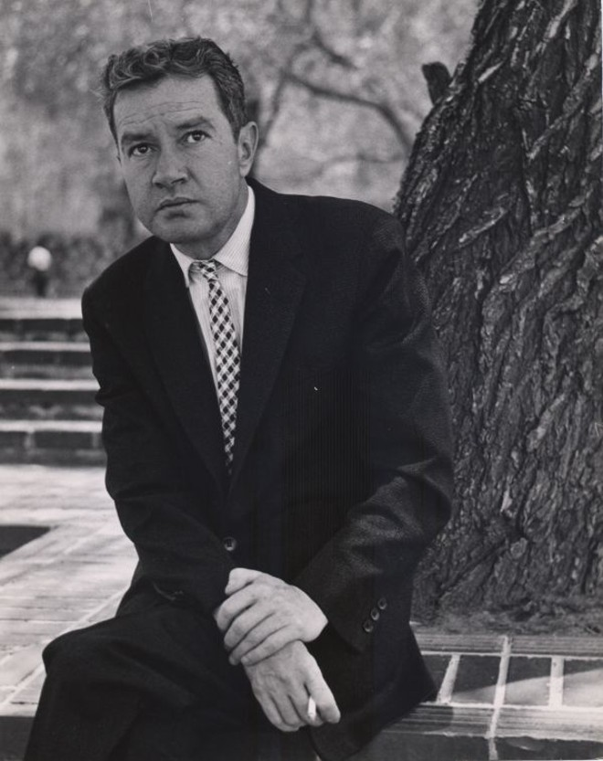
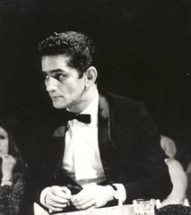

import Book from '~/components/Book.vue'

Mais uma vez, uma postagem do meu mano querido! Nossa parceria está selada e em breve migraremos para uma plataforma conjunta. Alegrias que o amor à literatura nos proporcionam.

---

> Não há a quem creditar a foto. Como não há a quem creditar as crianças. A foto tornou-se domínio de todos. As crianças, domínio de ninguém. Infelizes anônimas > que, desde seu anonimato, tocam poucos...muito poucos corações.
>   
> É uma linda foto, sob céu indiferente! Quem a flagrou não exigiu outra coisa que não fosse a flagrar. E esperar que algo se fizesse a partir dela. Um tsunami > devastador ou somente a solitária viagem sua.
>   
> Aquiete-se, não se cobre por elas: as crianças e seus chinelos repletos de magia. Na Síria, como de resto, por aí, no seu mundo sem bombas e sem pólvora. Aí, > dentro de sua sala ou no íntimo privado de si mesmo. Ela lhe invade sem pedir licença e se instala para além de sua retina.
>   
> Sem qualquer pieguice ou jargão cansado; sem cheques polpudos ou hipócritas com fundos fartos, olhe em seu derredor: você nada tem a ver com a infância usurpada?
>   
> Apenas devolva à elas o que delas foi roubado. Ou lhes dê o que nunca tiveram. E não atreva-se a compensá-las com celular e rede wifi. Elas não os querem. Só > querem o seu olhar, só esperam existir, apenas anseiam importar.
>   
> —Paulo Márcio Vieira da Rocha

---

Render-se às palavras combinadas em textos preenchidos de significados. Fazê-las ecoar em corações outros e diversos. Criar definições, exibir conceitos; propor acordos e estabelecer elos. Dar sonoridade e fazê-las rimar. Antecipar sem prometer, revelar sem mostrar e mostrar sem revelar. Chicotear e acarinhar; morder e beijar. Tudo a um só tempo e em boa medida, como merece o leitor. Bons escritores o fazem. Mas há quem não o faça, mesmo sendo bons.

Eu, leitor, não gosto do bom que não o faz:

<book title="Mulheres" author="Charles Bukowski" link="https://amzn.to/3cZywWI">

</book>

Quis conhecer um escritor. Em busca, não aleatória, pois nunca o é, esbarro com Charles Bukowisk. Por que não? Sempre me agradei de novidades que, por minha natural curiosidade, acabariam em meu colo.

Quem é? Escritor americano, filho da ocupação do exército aliado à Alemanha derrotada. Concebido como ratificação do poder do conquistador sobre a conquistada. Enredo comum em 1945. Cresceu em meio a pobreza de Los Angeles, já então na América pós guerra. Hábitos decadentes, drogas, álcool, depravação de valores e sexomaníaco. Solitário e em busca de referências afetivas, mas sem a menor direção a seguir, transitou pela vida até aos 73 anos, quando morreu por complicações do alcoolismo.

Este o pano de fundo do que li dele. **_[Mulheres](https://amzn.to/3cZywWI)_** (1978), o terceiro de seus seis romances publicados. Conhecido na América como "Velho Safado", publicou muito (mais de 45 livros de poesia e prosa). Mas, pelo que senti, basta ler um, para conhecer todos. Assim como em **_[Mulheres](https://amzn.to/3cZywWI)_**, basta ler um capítulo para conhecer os 104 que nos espera.

Não gostei. Mas como experiência literária, foi muito válido. Como saber se não nos entregarmos a conhecer?

Confessadamente uma obra autobiográfica, restou difícil para mim apreciar vivências e leituras de quem encara a vida, por suas próprias palavras, assim:

> "O mundo e as relações humanas acontecem dentro de uma cloaca."

Há quem goste, afinal é um autor inscrito na poesia e prosa da cultura americana.

Eu não gostei.

Resta a você pôr-se a conhecer: **_[Mulheres](https://amzn.to/3cZywWI)_** de Charles Bukowisk.

---

<book title="Pedro P&aacute;ramo" author="Juan Rulfo" link="https://amzn.to/3c95ULo">

</book>

Como opinar? Não sou um crítico literário (sem estofo para tanto), resta-me falar como um leitor (que julgo ser o estofo suficiente).

Há muito queria conhecer sua obra, Juan Rulfo, o mais aclamado autor da literatura mexicana.

"Há que se ler Rulfo", dizia para mim.

Li. E não gostei! Confesso. Mesmo expondo-me ao  inculto senso. Que fazer?! Momento pessoal, distanciamento social, pandemia? Sei lá? Estes fatores que, nós, viciados em livros, conhecemos bem, ou nos indulgenciamos com eles! Importa menos.

> "Como leitor voraz, 
> Que a leitura seja deleite. 
> Necessário se faz." 
> — PM

Um terceto, parido por mim, agora, sobre o joelho, mas que resume minha relação com os livros. Sempre vou até o final, mas, por vezes,  só como respeito ao autor!

Não entendi o que quis Rulfo. Renovar? Renovou. Criou o Realismo Fantástico. E, quando o fez, dividiu opiniões. E na minha humilde, me pergunto: como alguém que escreve coisas assim:

> "...Era cedo. O mar corria e baixava em ondas. Soltava-se da sua espuma e ia embora, limpo, com sua água verde em ondas caladas."

Ou, ainda mais, pérolas literárias como estas:

> "...Havia uma lua grande no meio do mundo. Eu perdia meus olhos olhando você. Os raios da lua filtrando-se sobre a sua cara. Não me cansava de ver essa aparição que era você. Suave, esfregada de lua;..."

Como, com tamanha sensibilidade e capacidade de expressão, escreve uma história  tão confusa? Tão emaranhada? Como se a ânsia por inovar superasse seu talento por escrever.

Não gosto da ansiosa contagem regressiva ao final de um livro que estou lendo. Mas não pude evitar a ânsia pela última página. Desculpe-me, Rulfo, mas fiquei aquém.

---

> S A U D A D E
>   
> Em meio a tempos arrevesados, onde a grande novidade transformou-se em inusitada rotina de cores sem cores, de brilhos opacos e modorrento ócio. Há poucos dias, iniciou-se meu segundo septuagésimo ano de todos os meus anos.
>   
> Não melhores, não piores. Anos apurados! Como apuradas eram as caldas dos figos doces que braços gordos apuravam no tacho de cobre. Quanto mais tempo de fervura, mais refinada a sutileza açucarada. E se há algo que mais se multiplica, é o tempo para multiplicar.
>   
> E a música me navega e ocupa de reminiscências. Versos e mais versos me empurram para recônditos inauditos. De sons que jamais ouvi soar ou nunca me escutei falar. Ou revisitei novidades e fatos que remontam décadas.
>   
> Versos me provocam. Clarice me provoca:
>   
> "Sinto saudades de coisas que tive e de outras que não tive, mas quis muito ter! Sinto saudades de coisas que nem sei se existiram." (Clarice Lispector)
>   
> Como é possível sentir saudade de coisas que não tive? Que sequer sei se existiram?
>   
> A natureza se ressente mais de algo necessário que não ocorre, do que aos erros ocorridos. É nosso instinto, é aquela insatisfação que não definimos bem, mas a identificamos. Não entendemos, mas sabemos dela:
>   
> "Naquela mesa tá faltando ele, e a saudade dele tá doendo em mim..." (Sérgio Bittencourt)
>   
> Esta mesa nunca existiu! E ela nunca doeu tanto. Na verdade, sempre existiu entre mim e meu pai. Só não pode ter existência real. Eu era criança e não sabia. Só hoje sei a grande falta que me fez, levado pelos devaneios dos versos. Mais difícil inda é saber que: para ele também.
>   
> — Paulo Márcio

---

> "Não existe grandeza onde faltam a simplicidade, o bem, a justiça."
>   
> — Leon Tolstói em "Guerra e Paz"

Lembrem-se: distanciamento social não é o mesmo que distanciamento afetivo. Podem até ser antônimos.

Até a próxima.

**Paulo Márcio** 
👴avô, 📝 poeta, e 📚 leitor voraz
