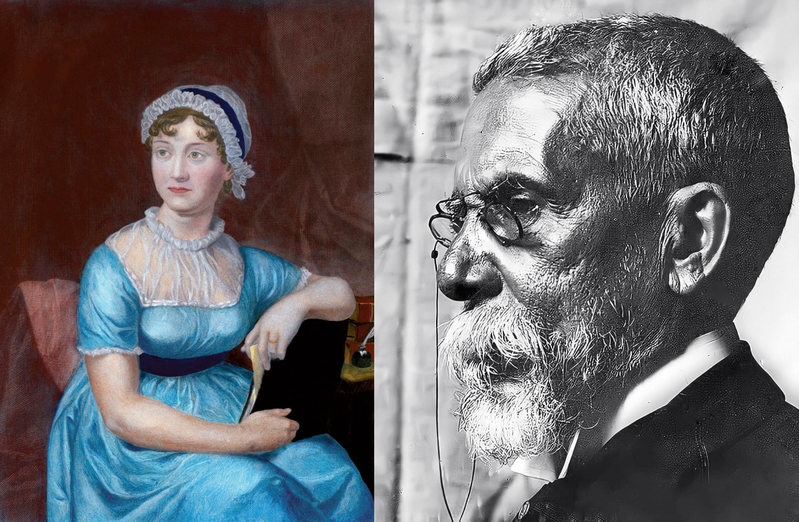

import Book from '~/components/Book.vue'

Ontem o Brasil atingiu a triste marca de 140.000 mil mortes por COVID, e como toda noite de sexta com muito calor, bares lotados e a cidade cheirando a churrasco com reunião de amigos. Risadas, muita música, …. até altas horas.

Quando a realidade bate assim forte e te deixa mais que surpresa, bom voltar ao passado e ler (ou reler) livros que te encantaram. E assim transcorreu minha noite de sexta, entre **Jane Austen** e **Machado de Assis**.

Comecei com um pequeno romance de Machado de Assis que ainda não havia lido.

<book title="A mão e a luva" author="Machado de Assis" link="https://amzn.to/336a7et">

</book>

Uma história folhetinesca e por bem romântica, daquelas onde se fica sabendo que um dia se falou “amar-lhe-ei para sempre”. E sim, se tem a mocinha linda chamada Guiomar, e seus três pretendentes - Estevão, o romântico, Jorge o calculista e Luís o ambicioso - e o enredo gira ao redor da decisão de Guiomar.

Há muito que não lia Machado de Assis, e claro que sua heroína no caso não é dada a desmaios, tão frequentes na literatura romântica. Pelo contrário, queria ela sim alguém para amar, mas que viesse em rica embalagem e lhe oferecesse um futuro brilhante.

> “Guiomar amava deveras. Mas até que ponto era involuntário aquele sentimento? Era-o até o ponto de lhe não desbotar à nossa heroína a castidade do coração, de lhe não diminuirmos a força de suas faculdades afetivas. Até aí só; daí por diante entrava a fria eleição do espírito. Eu não a quero dar como uma alma que a paixão desatina e cega, nem fazê-la morrer de um amor silencioso e tímido. Nada disso era, nem faria. Sua natureza exigia e amava essas flores do coração, mas não havia esperar que as fosse colher em sítios agrestes e nus, nem nos ramos do arbusto modesto plantado em frente de janela rústica. Ela queria-as belas e viçosas, mas em vaso de Sèvres, posto sobre móvel raro, entre duas janelas urbanas, flanqueado o dito vaso e as ditas flores pelas cortinas de caxemira, que deviam arrastar as pontas na alcatifa do chão.”

Uma pequena jóia esse romance, e como foi bom reencontrar Machado de Assis.

De Machado parti para ler outro texto inédito para mim, Amor e Amizade & outras histórias de Jane Austen.

<book title="Amor e amizade & outras histórias" author="Jane Austen" link="https://amzn.to/3mXXbiS">

</book>

Certamente, já li quase tudo de Jane Austen. Nunca aceitei caracterizar a leitura de Austen como uma leitura para “mulherzinha”. Suas heroínas sofrem de desmaios, alguns ironicamente descritos, mas com certeza “desmaios” mais frequentes vemos entre seus personagens masculinos, muitas vezes rejeitados por suas “escolhidas”.

> “Jane Austen não foi inflamada ou inspirada, ou sequer levada a ser um gênio; ela simplesmente era um gênio. Seu fogo, o que ela tinha de fogo, começou com ela mesma; como o fogo do primeiro homem que esfregou um graveto seco em outro.” 
> — Prefácio de G. K. Chesterton

**_[Amor e Amizade & outras histórias](https://amzn.to/3mXXbiS)_** contém as narrativas epistolares “Amor e Amizade”, “As três irmãs” e “Uma coletânea de cartas”. Na primeira história, acompanhamos as desventuras de Laura, narradas por ela mesma, que ironizam o comportamento feminino clichê da época, regados a muitos desmaios, chiliques e arroubos inconsequentes, descritos com a ironia que bem cabe a Austen.

> “Enlouqueça com a frequência que quiser; mas não desmaie.” 
> — em Amor e Amizade

“As três irmãs” fala sobre um pedido de casamento nada romântico e muito divertido, em que o noivo  (muito feio mas com uma desejável fortuna) propõe casamento à irmã mais velha Mary. No entanto não se importaria em se casar com qualquer outra das irmãs mais jovens. O casamento visa primordialmente firmar laços com determinada família. Mary tem horror ao pretenso noivo, mas ao mesmo tempo não quer perder a oportunidade de um casamento “vantajoso” e sua decorrente ascensão social.

A história que fecha o livro, “Uma coletânea de cartas”, brinca com a ideia de amor à primeira vista, exaustivamente tratada em romances como algo natural e até corriqueiro.

> “A felicidade perfeita não é patrimônio dos mortais, e ninguém tem o direito de esperar uma felicidade ininterrupta.” 
> — em Uma coletânea de Cartas

Percebe-se claramente uma escrita a ser refinada, mas notei nos personagens presentes neste pequeno livro sementes do que viriam a ser os grandes personagens de Austen. Claro, também seu tratamento ácido e crítico a toda a hipocrisia da aristocracia inglesa, mostrando o pior lado deles.

Esse foi meu breve e rico hiato ao mundo real e a estranheza que tem me causado. Há de surgir autores como Machado e Austen, que junto aos historiadores no futuro trarão alguma luz a esse obscurantismo atual.

Se possível fiquem bem, fiquem em casa! 🙏

Até a próxima!
