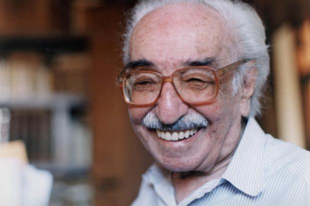

import Book from '~/components/Book.vue'

Eu conheci o poeta Manoel de Barros pelas mãos de meu irmão Paulo Marcio. Ele presenteou minha neta mais velha Isadora, hoje com 13 anos, com dois livros.

<book title="Arranjos para assobio" author="Manoel de Barros" link="https://amzn.to/2QJX3HW">

</book>

<book title="O meu quintal é maior do que o mundo" author="Manoel de Barros" link="https://amzn.to/32EKoZq">

</book>

Ela muito pequena, e como todas as crianças pequenas adorava poesia. Nesses poemas de Manoel de Barros ela foi apresentada para a palavra arrebol. E até hoje, faz parte do nosso vocabulário particular. Vira e mexe ela me liga e fala “ vovó veja hoje tem arrebol”, quando vê um lindo pôr de sol. Quando estamos na praia sempre é programa ir ver o arrebol. Acho que é a palavra mais bonita que conhece. E é linda mesmo como tudo o mais de Manoel de Barros, que tem tudo a ver com meu irmão em gostos e saudades, como podemos ver nessa nova linda edição do Heloiche Lê escrita por ele.

---

> &quot;Menino do Mato&quot; 
> Manoel de Barros  
> Eu nasci num rec&ocirc;ndito pedacinho do interior de S&atilde;o Paulo. 
> Ainda o trago em meu cora&ccedil;&atilde;o; hoje, como ent&atilde;o, indecifrado. 
> Menino solto, cal&ccedil;a curta, p&eacute;s no ch&atilde;o e cabe&ccedil;a na lua. Palmilhei cada cent&iacute;metro daquelas paragens em busca de encantamentos. E fui preenchido deles, sob > o sol generoso que somente l&aacute; bate.   
> Mais amigo de bichos e de plantas que de gentes. Nunca estive solit&aacute;rio em minhas andan&ccedil;as, pois bichos emplumados, alados, andantes ou rastejantes, &aacute;rvores, frutas, > flores e muita imagina&ccedil;&atilde;o foram companheiros onipresentes. E o sol, a chuva e a brisa que sempre sopra no meu para&iacute;so de sonhos e lembran&ccedil;as vivas.   
> A&iacute;, um dia, mudei-me para a cidade grande. Grande?! P&otilde;e grande! &Eacute; t&atilde;o grande quanto distante.   
> Sem sol, sem grama; sem arrebol, sem lama. Sem caracol, sem rama; sem girassol, sem panorama.   
> Chegando em bol&eacute;ia de caminh&atilde;o, gato no colo e susto no cora&ccedil;&atilde;o, pensava no meu distante ch&atilde;o.   
> O tempo passou ligeiro e fui me acomodando.

Foi quando conheci e encantei-me:  li **_[Menino do Mato](https://amzn.to/3tKYYdO)_** de Manoel de Barros.

Descobri Bernardo, um menino como eu. De palavras e pensamentos estranhos, mas, ao mesmo tempo, me pareceram familiares.

<book title="Menino do Mato" author="Manoel de Barros" link="https://amzn.to/3tKYYdO">

</book>

Manoel de Barros, já exibindo ser "diferente", escreveu 'O primeiro poema' em sua última página.

E dizia ele:

> &quot;O menino foi andando na beira do rio 
> e achou uma voz sem boca. 
> A voz era azul. 
> Dif&iacute;cil foi achar a boca que falasse azul. 
> Tinha um &iacute;ndio terena que diz que falava azul. 
> Mas ele morava longe. 
> Era na beira de um rio que era longe. 
> Mas o &iacute;ndio s&oacute; aparecia de tarde. 
> O menino achou o &iacute;ndio e a boca era bem normal. 
> S&oacute; que o &iacute;ndio usava um apito de chamar perdiz que dava um canto azul. 
> Era que a perdiz atendia ao chamado pela cor e n&atilde;o pelo canto. 
> A perdiz atendia pelo azul.&quot;

Mostrava-se  diferente, inusitado, lá no meio do mato. Que olhar era aquele? Eu sentia isso. Também me estranhava por lá! Uma sintonia estranha, mas que produzia bom som, boa harmonia. E eu poderia ser igualmente diferente em meio a cidade grande, pois trazia o mato em mim.

Assim tentei me traduzir:

> SEM COR  
> L&aacute; em meu para&iacute;so eu sempre fui o diferente. 
> O que fazia tudo diferente. 
> O que estudava diferente. 
> O que tinha o professor diferente. 
> O que tirava a nota diferente. 
> O que vestia diferente. 
> O dono da bike diferente. 
> O filho da m&atilde;e diferente. 
> O filho do pai &#39;tubar&atilde;o&#39;, diferente. 
> O que morava na casa diferente. 
> O que olhava o horizonte diferente. 
> O que ca&ccedil;ava o passarinho diferente. 
> O que olhava para a menina diferente. 
> O que o pai examinava diferente. 
> O que a m&atilde;e chorava diferente. 
> O que o irm&atilde;o era estranho, diferente. 
> O que o amigo era pobre, diferente. 
> O que almo&ccedil;ava na hora diferente. 
> O que apanhava diferente. 
> O que volitava quieto, diferente. 
> O que despertava sentimento diferente. 
> O que se rebelava, ousava diferente. 
> O que entrava no time por caminho diferente. 
> O que permanecia no time por ser diferente. 
> O que colhia o fruto diferente. 
> O que dava o presente diferente. 
> O que achava a chuva diferente. 
> O que achava o barro da rua diferente. 
> Para quem a po&ccedil;a d&#39;&aacute;gua era diferente. 
> Que olhava o c&eacute;u, s&oacute; seu, diferente. 
> Para quem o arco-&iacute;ris brilhava diferente. 
> Que dividia a cana cortada para o burro no coxo, e era diferente. 
> Para quem o sol faltava na noite, diferente. 
> Para quem a noite era escura para as estrelas de luz diferente. 
> Para quem sonhava a saia voando da menina do sonho diferente. 
> Com quem as margaridas-do-campo falavam uma l&iacute;ngua diferente. 
> Como quem sentiu-se eternamente diferente, 
> Mas que desejou tanto o sem cor diferente. 
> Com a cor permitida por cada momento; 
> E t&atilde;o igual a cor de todas as cores de todos os momentos. 
> Como a cor que n&atilde;o me fizesse diferente. 
> O colorido que sempre desejou ser incolor.  &mdash; PM

E continuei lendo Manoel de Barros, sem nunca parar,  cada vez mais conquistado por ele:

<book title="Memórias inventadas" author="Manoel de Barros" link="https://amzn.to/32CCCPP">

</book>

De **_[O Guardador de Águas](https://amzn.to/32Cl3PZ)_** (1989), separei um pequeno excerto, muito expressivo em seu enlevo:

> "Desde o começo do mundo água e chão se amam e se entram amorosamente e se fecundam. Nascem peixes para habitar os rios. E nascem pássaros para habitar as árvores. As águas ainda ajudam na formação dos caracóis e das suas lesmas. As águas são a epifania da criação."

Os Filólogos buscaram classificar Manoel de Barros em alguma escola literária. Um Modernista de 45? Ou pós Modernista? Um poeta Pau-brasil? Ou um Antropofagista de Oswald de Andrade?

Ele importou-se menos com isso. Apenas fez a poesia que seu coração de eterna criança determinou.

Viveu servindo-se e dando-se a servir à sua cativa plateia natural e inspiração constante. Em sua fazenda no Pantanal do Mato Grosso, escreveu versos e prosa até os seus 98 anos (1916-2014).

Poetou, Manoel de Barros, em **_[Menino do Mato](https://amzn.to/3sI9gKD)_**:

> &quot;Eu queria fazer parte das &aacute;rvores como os p&aacute;ssaros fazem. 
> Eu queria fazer parte do orvalho como as pedras fazem. 
> Eu s&oacute; n&atilde;o queria significar. 
> Porque significar limita a imagina&ccedil;&atilde;o. 
> E com pouca imagina&ccedil;&atilde;o eu n&atilde;o poderia fazer parte de uma &aacute;rvore. 
> Como os p&aacute;ssaros fazem.&quot;

Jamais identifiquei-me tanto com um poeta como o fiz com Manoel de Barros! Eu o entendo e o sinto como a um intérprete autorizado de meus meandros.

Ninguém sabe mais da essencialidade humana do que as crianças, os velhos e os poetas. Manoel de Barros os resume a todos, e a um só tempo.

Em humilde e atrevida reverência, escrevi:

> MOLEQUE SEM BREQUE  
> Sou pequeno, inda menino; 
> Ermo, sob o sol do vilarejo. 
> Caminho solto, sem destino, 
> Sem pejo, sem pressa, sem desejo.  
> Ou&ccedil;o o canto, vejo o grilo. 
> Sinto o vento, toco o mato. 
> N&atilde;o sou isso, nem aquilo, 
> S&oacute; o murm&uacute;rio do regato.  
> Cresci, hoje sou grande. 
> J&aacute; n&atilde;o posso o que podia; 
> H&aacute; t&atilde;o pouco que me encante, 
> Onde est&aacute; minha alforria?  
> Qual &eacute; mesmo o meu nome, 
> Ou por que fa&ccedil;o o que fa&ccedil;o? 
> O cotidiano me assome, 
> Do que fui, sou s&oacute; um tra&ccedil;o.  
> Ou voltar a ser menino, 
> Ou regalar-me com o adulto. 
> N&atilde;o h&aacute; mais o sol a pino, 
> Nem da vida tenho indulto.  
> Meu para&iacute;so paira longe, 
> S&oacute; est&aacute; dentro de mim. 
> Nem herege e nem monge, 
> Cada tempo tem seu fim.  
> N&atilde;o o sol do vilarejo, 
> Nem o cru da sua aus&ecirc;ncia. 
> A vida n&atilde;o &eacute; bocejo, 
> Nem castigo, nem clem&ecirc;ncia.  &mdash; PM

---

> PARA&Iacute;SO  
> S&atilde;o margaridas do campo, 
> Coroadas por um arrebol. 
> Nelas, meu tempo estampo: 
> Cal&ccedil;a curta, p&eacute; no ch&atilde;o e futebol.  
> Inda padecia o tempo do sarampo. 
> Da cristaleira, do alpendre e do anzol. 
> Do anil quarado para o melhor branco, 
> E pro xixi da noite, o urinol.  
> E o tempo se vai, baita trampo! 
> O sem camisa!? Hoje, cachecol! 
> Troquei o ataque pelo meio-campo, 
> E o passo esperto, pelo caracol.  
> As margaridas ainda s&atilde;o do campo, 
> O c&eacute;u da cidade, carece do sol. 
> Restam, a luz do pirilampo 
> E a embotada lembran&ccedil;a do cerol!  &mdash; PM

---

Ainda de Manoel de Barros, de sua mais pura sensibilidade:

> "No gorgeio dos pássaros tem um perfume do sol."

Até o próximo.

Protejam-se. Usem máscaras, distanciamento e álcool nas mãos e braços. O SARSCOV2 mata.

Paulo Márcio  
👴avô, 📝 poeta, e 📚 leitor voraz
