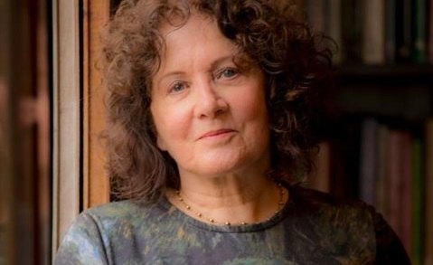
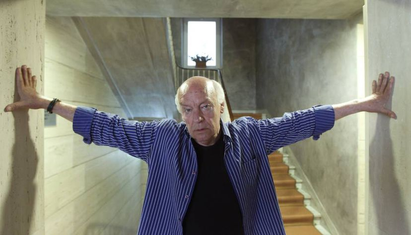
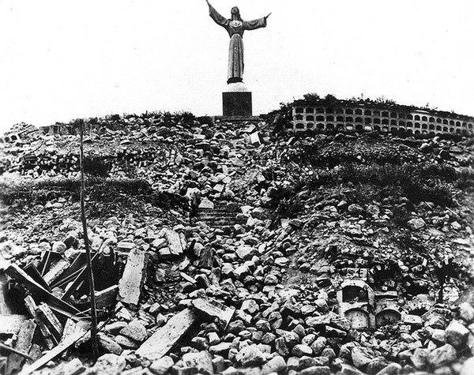
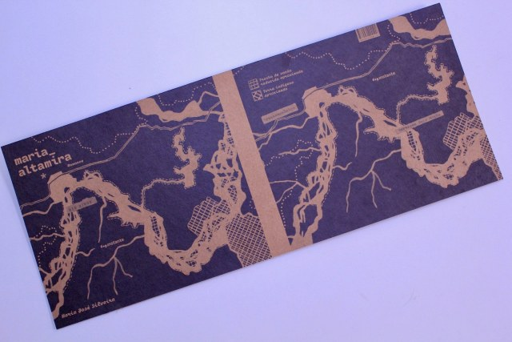

import Book from '~/components/Book.vue'

> “A primeira condição para modificar a realidade consiste em conhecê-la.” 
> — Eduardo Galeano

Um dos meus maiores prazeres é descobrir novos autores, e quando encontro um que me fala direto ao coração fico me perguntando - como ainda não tinha lido nada dele.

Foi assim com **Maria José Silveira**. Ouvi falar dela em uma das inúmeras entrevistas que vi do Itamar Vieira Junior, autor do _[Torto Arado](https://amzn.to/3dME878)_, sobre o qual [escrevi no início desse ano](https://heloiche.com/posts/os-melhores-livros-de-2020/).

Eu fui estudante na época da ditadura do Brasil. Tínhamos, como em todas as ditaduras, muitos livros que eram proibidos e que, quando encontrados, eram lidos com muita avidez. Um desses livros é o _[As Veias Abertas da América Latina](https://amzn.to/3a2ik6B)_, do escritor uruguaio Eduardo Galeano, falecido em 2015.

No livro, o escritor fez uma análise da história da América Latina sob o ponto de vista da exploração econômica e da dominação política, desde a colonização europeia até a contemporaneidade da época em que foi lançado, em 1971. Isso em um período contextualizado pela Guerra Fria (1945-1991), e pelo início de um ciclo de regimes ditatoriais nos países latino-americanos.

A publicação de Galeano, identificada como sendo uma obra revolucionária e de esquerda, foi banida na Argentina, Chile, Brasil e no Uruguai, durante as ditaduras militares nesses países. Eduardo Galeano chegou a ser preso em solo uruguaio, e depois obrigado a se exilar, primeiramente na Argentina, e depois, na Espanha.

Nunca mais reli esse livro do Galeano, mesmo sendo uma leitora assídua de seus livros.

Mas, ao ler **_[Maria Altamira](https://amzn.to/3s1FAaI)_**, fui atrás de meu exemplar velhinho que ainda tenho na estante. Folheei, revi meus destaques, mas não fui além ainda.

> “Devemos tomar consciência que os direitos da natureza e os direitos humanos, são dois nomes da mesma dignidade. E qualquer contradição é artificial.” 
> — Eduardo Galeano

<book title="Maria Altamira" author="Maria José Silveira" link="https://amzn.to/3s1FAaI">

</book>

**_[Maria Altamira](https://amzn.to/3s1FAaI)_**, pode-se dizer, é um livro dedicado ao povo Yudjá de Volta Grande do Xingu e aos beiradeiros de Altamira — e começa pelo desastre. Alelí, uma das protagonistas do livro é uma peruana de dezesseis anos que perde toda a família, inclusive uma filha pequena de três anos, em um deslizamento de terra em Ancash, no Peru, em 1970. A partir daí empreende uma viagem sem rumo por países da América do Sul. Seu percurso é emocionante e, tal qual a trajetória dos lugares por onde passeia, é um acúmulo de tristezas.

> “Uma história começa em qualquer lugar e em qualquer momento. Há sempre algo que entrelaça de tal maneira as histórias do mundo e as de cada um de nós que o começo depende apenas do ponto de vista pelo qual você escolhe ver e desembaralhar os nós, as malhas, os vazios.”

No Brasil, vive por um tempo junto ao povo indígena Yudjá, às margens do rio Xingu, onde assiste os efeitos infelizes dos projetos de construção da barragem do Belo Monte, em 2011. Em Altamira ( Pará) nasce Maria Altamira, filha de Aleli e Manuel, um indigena da etnia Juruna, que luta pela preservação da floresta e a sobrevivência de seu povo, mas é assassinado antes do nascimento de sua filha.

Sua vivência junto aos Yudjá e os acontecimentos trágicos que ganham forma nesse período de início da construção de Belo Monte, dão a certeza a Aleli, de que uma espécie de maldição a acompanha aonde quer que vá. O medo, então, impele Alelí a deixar para trás sua filha recém nascida.

A partir desse evento, o livro irá se dividir em dois núcleos narrativos, mãe e filha - Aleli, fugindo de si mesma e da sina trágica que julga carregar, e Maria Altamira, tentando entender suas origens e de alguma forma vingar a morte do pai.

Maria Altamira, em busca de oportunidade de estudo, muda-se para São Paulo e passa a viver em um prédio ocupado na capital paulista, onde encontra mais pobreza.  Embora geograficamente afastado do Xingu e seus conflitos, o foco narrativo não se distancia tanto, mantendo-se sobre a luta pelo direito a território e moradia digna. Maria José Silveira faz essa ligação com maestria, e torna Maria Altamira uma mulher munida de muita coragem e determinação para retornar ao Pará, onde a barragem deixou de ser projeto e tornou-se realidade concreta e cruel sobre os povos ribeirinhos.

Maria José Silveira, neste seu livro, não escreve nada que seja desnecessário. Sua linguagem é limpa e direta, e não carrega (?) nem nenhum teor sentencioso, possibilitando ao leitor tirar suas próprias conclusões.

Não se pode deixar de lado que junto com essa rica narrativa tem-se a belíssima edição da Instante, que concebeu a capa como um roteiro cartográfico acompanhando as marchas das protagonistas.

Aleli, a meu ver, entra para o rol dos personagens femininos inesquecíveis da nossa literatura, como _[Ana Terra](https://amzn.to/321WVpL)_ do livro homônimo de Erico Verissimo, Bibiana e Belonisia do _[Torto Arado](https://amzn.to/3mAoPmb)_, Sinha Vitória de _Vidas Secas_, Jucundina do _[Seara Vermelha](https://amzn.to/3mA5H7Q)_… . e Maria José Silveira uma autora a ser lida e relida.

---

Concluindo, mais um livro que no decorrer da leitura me perguntei onde estava enquanto toda essa destruição se implantava?

E terminada a leitura, a cada vez que leio um artigo de [Eliane Brum](https://brasil.elpais.com/autor/eliane-brum/), uma das jornalistas atuais que mais admiro e que que escolheu morar em Altamira, continuo me questionando onde estamos neste momento?

Não deixem de visitar [o blog de Maria Jose Silveira](https://mariajosesilveira.wordpress.com). Vejam também [um vídeo onde ela fala sobre o livro Maria Altamira](https://youtu.be/yWH7LIErmxk).

Fiquem bem, e até a próxima.
