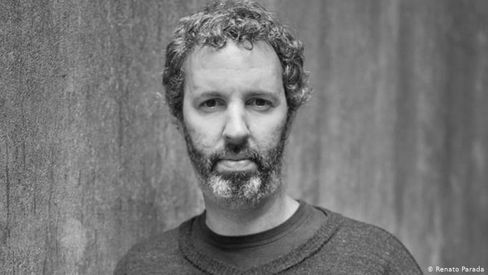

import Book from '~/components/Book.vue'

> “Tudo num livro é autobiográfico.”

Michel Laub é um jovem autor brasileiro nascido em  Porto Alegre, em 1973.

Publicou oito romances, todos pela Companhia das Letras: _[Música Anterior](https://www.amazon.com.br/M%C3%BAsica-anterior-Michel-Laub/dp/8535900934)_ (2001), _[Longe da água](https://www.amazon.com.br/Longe-%C3%A1gua-Michel-Laub/dp/8535904816)_ (2004), _[O segundo tempo](https://www.amazon.com.br/segundo-tempo-Michel-Laub/dp/8535909249)_ (2006), _[O gato diz adeus](https://www.amazon.com.br/gato-diz-adeus-Michel-Laub/dp/8535914218)_ (2009), _[Diário da queda](https://amzn.to/3qsHRuP)_ (2011),  _[A maçã envenenada](https://michellaub.wordpress.com/2013/10/27/a-maca-envenenada-entrevistas-materias-resenhas/)_ (2013), _O Tribunal da Quinta-Feira_ (2016) e _Solução de dois Estados_ (2020). 

Desses romances li três, e Michel Laub me agrada especialmente pela forma sempre inovadora e pela maneira sucinta com que trata temas múltiplos e complexos.

<book title="Diário da queda" author="Michel Laub" link="https://amzn.to/3qsHRuP">

</book>

O livro é apresentado em forma de diário, marcado por fluxos de memória e dividido em nove capítulos cujos títulos são: “Algumas coisas que sei sobre meu avô”, “Algumas coisas que sei sobre o meu pai”, “Algumas coisas que sei sobre mim”. Há ainda os capítulos intermediários que são as “Notas”. Nessas notas estão reunidas as partes excluídas, a princípio pelo autor, mas que são reaproveitadas de forma a ajudar na construção da história. Essas partes me pareceram um transbordar da história central, que não poderia ser contada, por exemplo, sem relatar fatos sobre a segunda guerra. 

Em cada um dos capítulos, tem-se parágrafos numerados com pequenos relatos, e a costura da narrativa é deixada a cargo do leitor. 

O narrador rememora sua vida de forma confessional. Em um colégio israelita na cidade de Porto Alegre, ele nos relata uma passagem que o marcou: quando João, um bolsista nao judeu foi alvo de bullying pelos amigos judeus em sua própria festa de 15 anos. Em uma brincadeira característica de Bar Mitzva, João é jogado 13 vezes ao alto por colegas, todos eles judeus, mas na última vez, combinam de não ampará-lo. 

O narrador, desde então, passa a conviver com um sentimento de culpa que o acompanhará por toda sua vida. Acaba por decidir sair do colégio e denunciar para a diretora o nome de todos que participaram daquela maldade. Seu pai, inconformado com a decisão do filho em sair do colégio e pelo fato ocorrido, dá-lhe uma surra, e a partir daí nunca mais a relação entre os dois foi a mesma.

Tem-se então, em ***[Diário da Queda](https://amzn.to/3qsHRuP)***, a trajetória de três gerações, a começar pelo  avô, que morreu quando o filho tinha 14 anos, e que portanto o narrador não conheceu. Esse avô, chegou ao Brasil em 1939 vindo de Auschwitz onde perdeu todos os seus familiares: pai, mãe, irmãos, tios, avós, namorada, incluindo seus amigos de rua. Tudo. Perdeu seu passado. Seu avô foi um dos poucos sobreviventes que conseguiu refazer sua vida ocultando tudo o que viveu e readquiriu a dignidade que lhe foi roubada. Aos poucos, ele se exclui do convívio social para, trancado em seu escritório, escrever páginas e mais páginas de verbetes para uma estranha enciclopédia. 

O pai também faz um diário, numa tentativa desesperada de adiar os efeitos do Alzheimer e o apagamento de qualquer ligação com o passado. 

O livro trata da transmissão de valores entre gerações - ancestralidade. As feridas psicológicas, os segredos não revelados e as atitudes negativas em relação ao “diferente” e ao “outro” ocorrem ao longo de três gerações – o avô, um sobrevivente do campo de concentração; o pai, um negociante bem sucedido; e o filho, o personagem que conta a história. Os traumas familiares são transmitidos de uma geração para a outra, culminando com a prática do bullying pelos rapazes judeus contra João, o rapaz não judeu da turma. Em suma, uma trama que mescla identidade judaica e memória - ou sua perda.

---

Em ***[O Tribunal da Quinta-Feira](https://amzn.to/2PPzbCj)***, Michel Laub novamente escolhe temas fortes - AIDS, julgamentos morais e a internet.

<book title="O Tribunal da Quinta-Feira" author="Michel Laub" link="https://amzn.to/2PPzbCj">

</book>

Já é clichê ficar chamando a atenção para como as relações sociais mudaram com o advento e uso massivo da internet. A forma de fazer amigos, namorar, debater, divertir-se, entre outros, não é mais a mesma de duas décadas atrás. E com isso os exageros apareceram.  Quem nunca foi criticado por um post? Quem nunca ouviu sobre casos de pessoas que tiveram sua vida revirada por algum tipo de exposição indesejada nas redes sociais? 

Essa realidade, que ainda era muito mais amena que a dos dias atuais, que Michel Laub trata no tema do Tribunal da Quinta-feira. 

De início, José Victor, o narrador, nos contará suas recordações da adolescência e início da vida adulta sob a descoberta da Aids. Em paralelo, nos fala da amizade com Walter  começada quando os dois estudavam publicidade.

Na correspondência eletrônica dos dois, a intimidade de 25 anos de conhecimento mútuo permite piadas chulas, segredos de cunho sexual e um léxico peculiar, que não teriam por que fazer sentido fora daquele âmbito restrito.

Walter é soropositivo e sua personalidade mordaz faz com que as interações entre os dois homens sejam debochadas e exageradas, numa tentativa desajeitada de lidar com o fantasma aterrorizante da doença.

> “Remetente: eu. Destinatário: Walter. Data: 31/1/2016. Trecho: Teca está viajando. Estou pensando em convidar a vítima redatora-júnior para contrair A.I.D.S. / S.I.D.A.”

Quando Teca, recentemente separada de José Victor, resolve expor trechos editados da correspondência a alguns destinatários que, dali, fazem o caso explodir nas redes sociais, o linchamento não tarda. As consequências que qualquer um hoje pode facilmente imaginar.

O alegado tribunal do título nada mais é do que o conjunto de pessoas que reagem a essas mensagens dentro da obra – conhecidos e desconhecidos de toda sorte – mas, em última instância, engloba os leitores. Sim, nós leitores somos chamados a julgar os personagens que nos são apresentados ora como vilões, ora como vítimas.

Uma leitura agradável com temas tão desconfortáveis. Frequentemente, me vi sendo colocada no lugar de alguns dos personagens. Como julgar e ser julgado por frases soltas totalmente descontextualizadas. A diferença entre o público e o privado. Quando o privado vem à tona e ganha dimensões inimagináveis dado o megafone que a internet se tornou. Em suma, hipocrisia social é o mote deste livro - “que atire a primeira pedra quem nunca ….”

> “Desculpem os presentes no tribunal, mas é impossível seguir fazendo a minha defesa sem voltar ao tema da hipocrisia. Eu não gosto de cumprir esse papel, assim como ninguém dirá que gosta, mas não há alternativa além de enfrentar aquela que iniciou a cascata de acusações.”

Em tempos de moralização digital e obsolescência quase que imediata das pessoas e de seus comportamentos, trata-se de um livro que questiona a melhor forma de lidar com um mundo que, no emaranhado virtual, escapa a qualquer tipo de controle.

---

***[Solução de dois estados](https://amzn.to/3vaZNxC)***, o último livro de Michel Laub, de novo me empurra da zona de conforto, em estilo e temas abordados.

<book title="Solução de dois estados" author="Michel Laub" link="https://amzn.to/3vaZNxC">

</book>

No livro, tem-se como voz narrativa um casal de irmãos, nada fraternos: Raquel Tommazzi uma artista performática, obesa, que estudou na Europa e usa sua arte para discutir a violência; e Alexandre Tommazzi, seu irmão, que é dono de uma rede de academias, religioso, daqueles que prezam a família e os bons costumes.

Durante uma palestra em um seminário sobre a violência, Raquel é espancada em cima do palco por um homem que tem ligação com seu irmão. Esse espancamento, que deixa nela inúmeras cicatrizes, é assistido passivamente por uma plateia de mais de 600 pessoas, que julgam ser mais uma das apresentações performáticas de Raquel. 

Esse acontecimento repercute no meio artístico, e uma cineasta europeia, Brenda, vem até o Brasil para entrevistar Raquel e Alexandre sobre esse acontecimento para um documentário. E toda a história é construída a partir de respostas de Raquel e Alexandre às perguntas de Brenda. A documentarista, às vezes, aparece falando, fazendo as perguntas para que os entrevistados falem de sua relação familiar que culminou com a agressão de Raquel. Outras vezes, podemos apenas supor quais foram suas perguntas ou comentários, enquanto os entrevistados seguem quase num monólogo (num pretenso diálogo que nunca acontece na realidade) sobre essa relação familiar.

Como nos outros livros do Laub, não temos aqui vilões e mocinhos. Sempre gorda, Raquel cresceu sofrendo bullying e ouvindo comentários sobre o corpo, e usa até hoje o apelido depreciativo que recebeu dos colegas para nomear suas obras: Vaca Mocha. Apelido que o próprio irmão ajudou a espalhar pela escola e tornar sua vida social impossível.

Alexandre, a quem Raquel chama de miliciano, deputado federal recém eleito, é uma pessoa que só pensa no dinheiro e na imagem. Todas as lembranças da família, os momentos chave de sua vida, envolvem dinheiro. A crise na empresa do pai, o início da Império (a rede de academias), a sua relação com um pastor evangélico de quem é próximo…

Ele é machista, ignorante e grosseiro ao falar. Sua vida é ditada sob a égide da meritocracia, reproduzindo o liberalismo à brasileira.  Mas ele ser dessa forma não faz com que tenhamos em Raquel uma “mocinha indefesa”. Ela é combativa, tem o objetivo de tocar e chafurdar na ferida dos outros, assim como faz com suas próprias feridas. 

Em entrevistas na época do lançamento do livro, meados de 2020, Michel Laub disse que pretendia escrever um livro sobre perdão:

> "O processo todo demorou mais do que eu esperava. Então, o que era uma história futurista (eu não tinha ideia de que o Bolsonaro iria ganhar a eleição, por exemplo) acabou virando uma espécie de romance histórico recente (que se passa num mundo pré-quarentena).
>   
> Mas as questões trazidas pelos personagens independem desses marcos (da história política do Brasil contemporâneo). Eu queria escrever sobre perdão, perguntar se é possível conciliar visões de mundo tão opostas em temas como sexo, religião, identidade, responsabilidade individual. São essas visões que dividem de fato a sociedade brasileira, isso vai além do noticiário do momento."

Para mim, de perdão o livro não traz nada. ***[Solução de dois estados](https://amzn.to/3vaZNxC)*** é sim um ótimo livro para pensar na violência, nas diferenças e na intolerância. Ele toca onde dói, ele explora e traz à tona o que há de pior nas relações humanas. 

Concluindo, gosto de ler Michel Laub pelo caráter interpretativo de seus romances. Ele nunca apresenta uma elucidação definitiva sobre os temas que aborda, pelo contrário, ele maximiza a dúvida ao propor reflexões inteligentes e necessárias. 

Até mais! Fiquem bem e em casa, se possível.