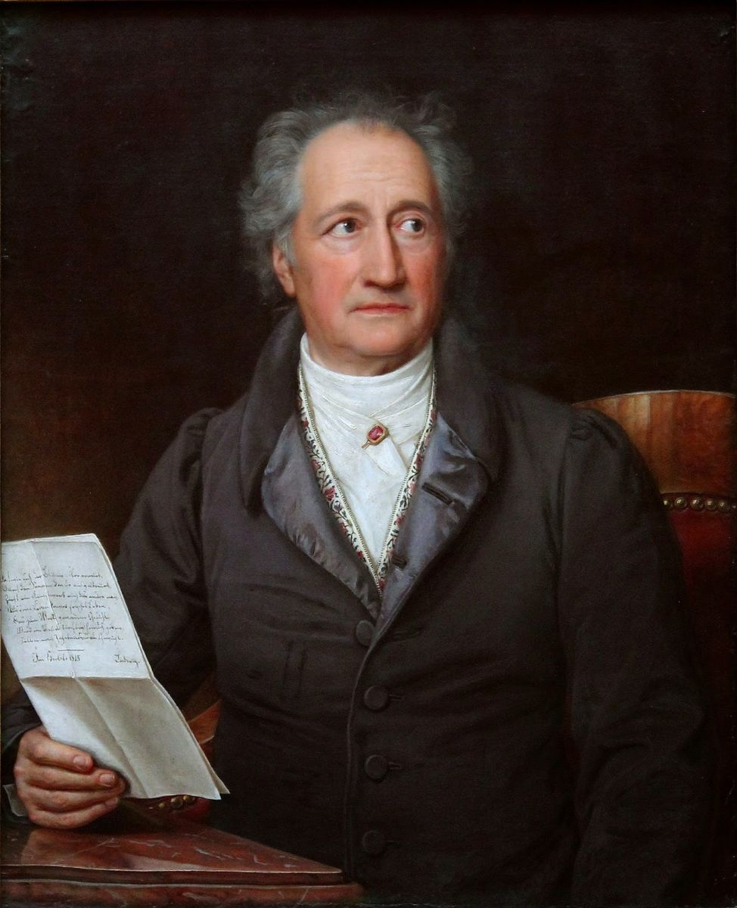

import Book from '~/components/Book.vue'

Há um juízo construído em mim sobre a personalidade dos alemães. Caracteriza-se pela fria objetividade, pelo pensamento cartesiano e pela relação óbvia entre ação e resposta, justificando a ação e legitimando a resposta. Qualquer acontecimento fora destes enquadramentos deverá ser evitado e qualificado como inferior. Inclusive, e principalmente, nas relações interpessoais.

Um conceito estereotipado e sustentado, mais por ignorância (confesso) do que por qualquer verdade outra.

A Literatura alemã, certamente, desmente esta fantasia cultural.

Vamos tratar aqui hoje de dois autores alemães: **Wolfgang Goethe** (1749-1832) e **Thomas Mann** (1875-1955). Sua importância para lançar um olhar muito diferente sobre a tal "falta de sensibilidade" como uma característica do povo alemão.

Vamos abordar, brevemente, mas suficientemente, uma obra de cada um deles:

"[Os Sofrimentos do Jovem Werther](https://amzn.to/310v7Vx)", de Goethe e "[Os Buddenbrook](https://amzn.to/3p60AO6)", de Thomas Mann.

---

<book title="Os Sofrimentos Do Jovem Werther" author="Johann Wolfgang Von Goethe" link="https://amzn.to/310v7Vx">

</book>

Há quem diga que a literatura alemã se divide em antes e depois de Werther. Ousaria dizer mais: a literatura na Europa divide-se a partir deste marco, pois, então, Goethe inaugura o romantismo e, com ele, a nova prosa moderna na Alemanha. Nada havia antes de Werther.

"[Os Sofrimentos do Jovem Werther](https://amzn.to/310v7Vx)", 1774, é um romance em cartas de amor enviadas de um amante para um amigo sobre a mulher amada, objeto de sentimento profundo, embora proibido.

Não era propriamente uma novidade narrativa. Jean-Jacques Rousseau em "[A Nova Heloísa](https://amzn.to/3xssQ1y)", 1761, já havia se utilizado deste expediente: cartas entre um professor e sua aluna, impedidos moralmente de entregarem-se um ao outro.

Também, Samuel Richardson em ["Pâmela](https://amzn.to/3nUCyq1)", 1740, valeu-se de cartas entre patrão e serva para narrar uma história de amor moral e socialmente proibido.

Mas Werther é diferente. É uma obra autobiográfica. Goethe foi de família abastada. O pai era um juiz, herdeiro de fortuna, e a mãe uma rica herdeira também. Donde podemos admitir que Werther fosse um rapaz abastado.

Vive uma paixão romântica obsessiva e unilateral. Seu objeto de amor, Carlota, percebe sua devoção à ela e, envaidecida, a usa.

Ele, um devoto cego que sofre quieto. Sofre principalmente pelas fantasias que faz de perda e abandono, o que o torna presença constante e vigília ininterrupta aos passos de sua amada.

Faz lembrar alguns personagens machadianos no auge de sua fase romântica, um século depois.

Sentimento lindo, descrito em cartas para um amigo, com palavras esculpidas, emolduradas por natureza maravilhosa, mas...um exagero.

Werther vive seu périplo de paixão quase obsessiva por Carlota. Tanto e de tal forma que, podemos questionar a verdade do sentimento que expressa.

Werther é tão espetaculoso que começa a enfeitar seu cenário com as luzes coloridas e brilhantes do suicídio "por amor"!

Mesmo na distância que se impôs, não há arrefecimento algum. Tanto se imola em dores e rejeição que rouba de Carlota o protagonismo do espetáculo e coloca a si mesmo no centro do proscênio - objetivo claro de Goethe - Ama de verdade, mas acredito que, mais a si do que a ela.

Prepara uma apoteose inesquecível para o seu romance?

Sentimentos não se dimensionam. Não se ama mais ou menos. Não se ama muito ou pouco, ama-se ou não se ama. Este, a meu ver, o entendimento amadurecido sobre sentimentos. Werther é, definitivamente, infantilizado.

Falando de sua paixão por Carlota:

> "Saltar ao pescoço. Ver passar e não tomar para si como fazem as crianças."

Ou traçando loas a si mesmo:

> "Fonte de todas as misérias e berço de todas as venturas" 
> "Homem de inesgotável sensibilidade, capaz de estreitar em si o amor do mundo inteiro."

Ou ainda mais:

> "Homem total."

Quem se pensa assim, resumo de todas as virtudes, precisa crescer. Sabe nada sobre amar e ser amado. Amor é desprendimento, é desligar-se de si e completar-se no outro. É sentimento que transita ao outro e não reside em si. Que passa por nós e se consuma e ganha significado no outro.

Werther é uma criança faminta de leite materno. Jamais o encontrará nos peitos bem desenhados de Carlota.

O Romantismo europeu, mais especificamente o alemão, pelas mãos clássicas de Goethe.

Tenho uma certa reserva com este estilo literário. Prima pelo exagero, por carregar excessivamente nas cores, pela dramatização da vida, pela obsessivação dos sentimentos. Pelo sentido possessivo nas relações de amor, pelo absoluto reducionismo da vida para nada além do que eu sinto, ignorando, inclusive e principalmente, o objeto de depositação amorosa e, por isso mesmo, pondo sob questionamento o próprio sentimento declarado. Enfim, culminando em apoteótico cenário por amor, que só faz consagrar o sentido egoísta que prevaleceu sempre.

Werther precisava mesmo de uma boa terapia. Usou os sentimentos, usou o amor para, em nome dele, justificar-se e culpabilizar terceiros por sua fantasia de pequenez.

Mas foi uma leitura que mobilizou em mim todo tipo de emoção. Da revolta até a comiseração. Mas estava inaugurado o romantismo na literatura da Europa, uma nova e moderna prosa.

---

Uma família, sua diversidade, suas intrigas, conquistas, perdas, dores e amores. Um clã. Seu retrato por quatro gerações, de 1835 a 1877, é o objeto de "[Os Buddenbrook - Decadência de uma Família](https://amzn.to/3p60AO6)" de Thomas Mann, publicado em 1901.

<book title="Os Buddenbrook: Decadência De Uma Família" author="Thomas Mann" link="https://amzn.to/3p60AO6">

</book>

O autor, um jovem ainda, 25 anos, publicava seu primeiro grande romance. Nobel de Literatura em 1929, consagrou-se entre os maiores escritores da Europa.

Como o próprio nome sugere, não é uma história com final feliz, mas um documento definitivo da cultura vigente, da burguesia europeia e  da grande dificuldade de adaptar-se à constante evolução social, política e econômica. Sua ascensão, apogeu e decadência narradas em texto perfeito que prende da primeira à última palavra.

Revela os dilemas individuais, comuns a todos.

Uma trama de intrigas, conflitos interpessoais, distorções de valores e aburguesamento vazio.Thomas Mann tem um texto simples e minucioso. Direto e sem rodeios.

Criou múltiplos personagens, mas a história flui a partir de poucos (difícil perder-se em nomes repletos de consoantes).

Destaca-se em Thomas Mann o agudo senso crítico da sociedade alemã. A exemplo do que já lemos em Victor Hugo, na França, e Tolstoi, na Rússia, satiriza fidalgos, aristocratas e curas. Põe sob lupa a falência de valores, o uso oportunista da religião como ferramenta de legitimação e manipulação; a busca inescrupulosa por poder econômico, o "comércio" de jovens em casamentos estratégicos. Enfim, um sem número de atitudes que resultam em degradação social.

A família Buddenbrook é um perturbador picadeiro desta realidade, exibida com detalhes, em sua inexorável decadência.

Thomas Mann é minucioso, sarcástico e agudo, mas sem perder o romance, a poesia e o encanto de sua narrativa.

Vejam abaixo um pequeno trecho no qual, desde a praia, olha para o mar. De uma beleza rara:

> "Com a chegada do Outono apareciam os primeiros ventos fortes. Nuvens cinzentas, leves e esfarrapadas singravam rápidas o céu. O mar turvo e revolto cobria-se de espuma por toda parte. Ondas altas e vigorosas aproximavam-se, encrespando-se numa calma inexorável que inspirava medo; caíam majestosamente, formando uma concavidade verde-escura, brilhante como metal polido, para afinal esmagarem-se fragorosamente na areia."

Antoine, Thomas e Christian, seus personagens, seguem sua cruzada pela tradição, família e propriedade. Pela preservação da aristocracia dos Buddenbrook. E, quanto mais se afundam nisso, mais distanciam-se de seus próprios sonhos e valores.

E tudo em vão. As finanças estão em franca decadência.

E segue a trama familiar dos Buddenbrook.

O enredo não muda: negócios comerciais prudentes, tímidos e sem riscos maiores, garantem certa estabilidade econômica. Os arranjos matrimoniais resultam no que só podem resultar, quando o limite entre fortunas e sentimentos fica indistinto: em fracasso. Tony Buddenbrook volta para casa de um deles, com uma mão na frente e outra atrás, uma filha ao pé e a alma partida. Thomas Buddenbrook, pondo o coração a prêmio, fatura um dote gordo e tenta convencer-se que Gerda, a dona do dote, é a mulher da sua vida. A mesma receita, fará um prato diferente? Uma história que se repete, e só faz repetir.

E o drama familiar em atos, segue seu curso. Cada ator enredado em seu enredo.

Como o pai fez com o filho, Gotthold Buddenbrook, é a vez de Thomas Buddenbrook banir da família seu irmão, Christian  Buddenbrook.

O menosprezo ao irmão é ostensivo. O desprezo como o tratava era cruel, assim como a tudo que representava.

A razão de ambos, pai e filho, ao expulsarem uma parte de si mesmos, era comum aos dois: porque eram diferentes. Não ajustavam-se à cultura da tradição e propriedade acima de qualquer outro valor. E, como corpos estranhos, tinham que ser extirpados.

Sem qualquer hesitação e friamente, sem culpa ou arrependimento, o faziam.

Curioso notar que, neste arranjo familiar, não existe o outro e não existe si mesmo. O que há é, apenas e tão somente, a tradição a ser preservada a qualquer custo. Uma "instituição" colocada acima das pessoas e, estas, doutrinadas a obedecerem cegamente como cabritos imolados em nome da causa, ou da casa dos Buddenbrook.

Thomas Mann nos apresenta esta realidade com toda crueza que a caracteriza. E com riqueza de detalhes. Um texto perfeito, sem economia ou clemência.

Ainda em busca de alguma verdade, Tony enfrenta a mãe e o irmão Thomas e termina mais um casamento. Um momento de argumentos sólidos e dignos, muito embora ainda sob forte influência de suas crenças quanto à aristocracia e o esplendor, poder e triunfo dos Buddenbrook.

Mas foi forte e honrada, rompeu contra tudo e contra todos, assumiu o risco e confrontou a sociedade para preservar a dignidade própria. Afinal, uma mulher que ouve do marido as palavras: " - Ao diabo que a carregue, filha-da-puta nojenta", não poderia fazer outra coisa. Um momento de vitória, mesmo diante de seu maior fracasso.

Thomas Buddenbrook é assolado por sua consciência ao executar negócios e auferir lucros sobre a desgraça alheia. Ou tenta dissimular diante de si mesmo sua natureza inescrupulosa, quando os fins desejados justificam os meios utilizados.

De qualquer forma, sofre a ponto de não conseguir gozar os frutos de suas negociatas. Teme o futuro e torna-se um homem de duas caras.

Thomas odeia o irmão Christian, mas, ao mesmo tempo, o inveja, pois ele não vive seus conflitos ambivalentes. É autêntico, não preocupa-se em ser admirado e vive a vida no limite possível; a aproveita em cada momento, apaziguado internamente e sem conflitos de identidade. Tudo que Thomas sequer admite desejar.

Thomas Buddenbrook herdou do pai a direção dos negócios da família e a incumbência de preservar a tradição. Obrigou-se e entregou-se ao seu destino implacável: êxito, lucro, poder, riqueza e honrarias.

O custo pessoal: abdicar de si mesmo e, sem lamúrias, fazer o que sempre soube que deveria.O resultado: irrealização, infelicidade e definitiva sensação de ter fracassado.

> "A existência de Thomas Buddenbrook já não era senão a de um ator - de um ator para quem a vida inteira, até às mínimas e mais triviais bagatelas, se tornou mera representação que, exceção feita de algumas breves horas de solidão e descanso, constantemente lhe exigia e devorava todas as forças...Este esforço ininterrupto conduzirá-lhe a existência àquele ponto em que ela se tornava artificial, consciente e constrangida, ... cada palavra, cada gesto, a mais insignificante ação chegassem a ser um trabalho de ator, penoso e exaustivo."

Uma existência onde a força nada mais é que uma exibição da mais profunda fraqueza. Deixou-se roubar de si mesmo e tentou encontrar-se onde nunca estivera.

Thomas Mann, na figura de seu personagem central, Thomas Buddenbrook, faz analogia curiosa entre os destinos da família Buddenbrook e casos de tifo, endêmicos naquele tempo:

> "aos distantes sonhos febris, ao abandono ardente do enfermo, chega o chamado da vida, em voz inconfundível e animadora...Mas se se sobressaltar de medo e antipatia ao som da voz da vida que ouvir...terá por resultado um meneio de cabeça e um gesto negativo do braço; ele se precipitará para diante no caminho que se lhe abriu para a fuga...e então, não há dúvida, terá de morrer."

Um trecho curto e significativo que resume em si a obra toda.

Ao fechar a contracapa,  cabe dizer que gostei muito. Thomas Mann, um escritor minucioso, crítico agudo sem deixar de ser romântico. Talvez não saibam, mas é filho de mãe brasileira (Júlia da Silva Bruhns Mann, descendente de alemão e negro) e pai alemão (Thomas Johann Heinrich Mann). Começou a escrever este livro em 1896 e o publicou em 1901, que lhe valeu o prêmio Nobel de Literatura em 1929.

Thomas Mann mostra quatro gerações de uma família burguesa alemã no séc XIX. Faz severa e lúcida crítica à sociedade aristocrática da época. Escancara o conflito entre verdades individuais e roteiros pré estabelecidos de vida e o quanto esta renúncia custa a cada um, vivendo a hipocrisia dos padrões sociais vigentes.

---

Dois anos de andanças em meio a vírus e incertezas. Fácil para ninguém, difícil para alguns, impossível para tantos:

> INCENSO  
> De minha trave, reduzi o sarrafo. 
> Diminu&iacute; derrotado a pretens&atilde;o. 
> Cedi &agrave; realidade, ao estafo. 
> Do ideal, a longa busca em v&atilde;o.  
> N&atilde;o se oferta o que n&atilde;o tem. 
> Dividir &eacute; gesto exigente. 
> Despender milh&atilde;o ou vint&eacute;m 
> A um distante brado clemente.  
> Se a fome me consome, 
> Como dar o de comer? 
> Pois o outro n&atilde;o tem nome, 
> Nem enxergo seu sofrer.  
> N&atilde;o h&aacute; vida numa vida s&oacute; para mim. 
> Mesmo no calor eu sinto frio. 
> N&atilde;o me aquecem a camomila, o alecrim. 
> Penso que vivo, mas agonio.  
> O que eu posso e o outro pensa, 
> H&aacute; que tenderem entre si. 
> A vida ent&atilde;o se incensa 
> E aquece no que concedi.  
> PAULO M&Aacute;RCIO

Até a próxima. Fiquem bem.

PM
