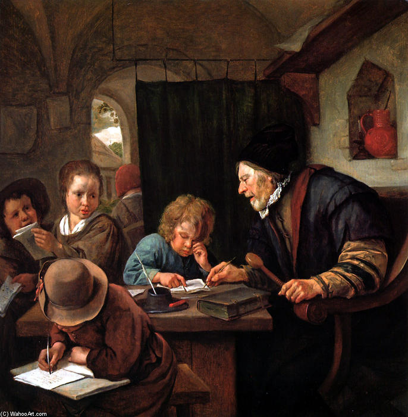
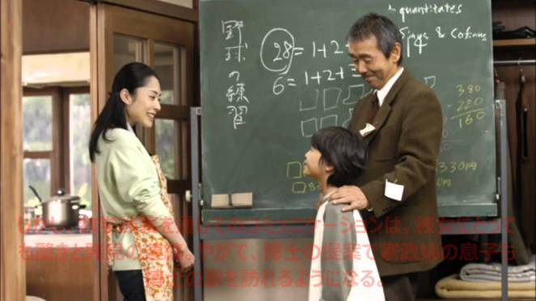

import Book from '~/components/Book.vue'

_“Professor de Escola”,  óleo sobre tela de Jan Steen (1668)_

Neste mês de outubro outro grande comemorado, além das criança, foi o professor. Me pareceu que neste ano de pandemia e quarentena, o professor foi mais notado: de alguma forma ele adentrou na casa das pessoas por meio de aulas virtuais.

Tomara tanto reconhecimento se prolongue para depois dessa fase pandêmica, pois sabemos que triste é uma sociedade que não valoriza seus professores.

Na literatura, muitos livros têm o professor como protagonista e eu, como professora, costumo elegê-los como preferidos. Na organização de minha estante, uma das prateleiras é para eles. Vou falar sobre dois especiais para mim.

<book title="Stoner" author="John Williams" link="https://amzn.to/3oubb4C">

</book>

**_[Stoner](https://amzn.to/3oubb4C)_**, romance do americano John Williams,, é um dos melhores livros que já li. Coloco esse livro na categoria  “esqueça tudo e vá ler Stoner”.

Incrível como o cotidiano de um homem comum pode ser palco de uma grande história. Stoner parte desse princípio para extrair de um enredo aparentemente banal uma literatura surpreendente.

Filho de camponeses, Stoner troca o curso de Técnicas Agrárias pelo de Literatura, ao assistir e se encantar por uma aula sobre Shakespeare. Nessa escolha, ele muda completamente sua trajetória de vida - do campo para a academia.

Na universidade, Stoner estabelece seu novo e definitivo lar. Passo a passo, ele consolida uma carreira acadêmica, sem grandes sucessos, mas também sem metas arrojadas.

A riqueza de detalhes que a experiência pessoal do escritor como professor universitário confere às descrições da rotina acadêmica e dos tipos que frequentam esse ambiente, é um dos pontos fortes do romance. As situações narradas são bastante familiares para quem, como eu,  já vivenciou uma universidade: as querelas entre os colegas de departamento, os jogos políticos por trás das promoções e admissões, a influência que um bom professor e uma boa aula pode ter nas escolhas de vida dos alunos e, finalmente, a idéia da universidade como um porto seguro, sobretudo para os “desajustados”, cuja angústia é pensar demais sobre a vida e a loucura do mundo.

Williams prende o leitor sem precisar de uma jornada surpreendente, com direito a reviravoltas, personagens complexos, ou texto sofisticado. Stoner é um “herói” que enfrenta as batalhas da vida cotidiana, como, acredito, a maioria dos professores.

> “Mas para William Stoner o futuro era uma certeza nítida é inalterável. Aos seus olhos, não era um fluxo de eventos e mudanças e potencialidade, mas um território virgem só à espera de ser explorado. Via-o como a vasta biblioteca da universidade, para a qual novas alas poderiam ser construídas, à qual livros novos poderiam ser adicionados com alguns dos velhos sendo retirados, enquanto a sua verdadeira natureza permanecia essencialmente inalterada. Imaginava o seu futuro só na instituição com a qual tinha se comprometido e a qual compreendia tão imperfeitamente. Imaginava-se mudando esse futuro, mas via o próprio futuro como o instrumento, e não como o objeto da mudança.”

Como conclui Mariane Domingos, [em sua resenha](http://www.achadoselidos.com.br/2017/07/12/resenha-stoner/):

> “... o recado que Williams nos deixa, ao preencher as páginas de um livro com a jornada de um herói tão comum, é que toda a história merece ser contada. Stoner era um fracassado na opinião dos colegas de profissão, mas corajoso e bem-sucedido aos olhos dos pais, que jamais sonharam com uma vida além do campo. Não há banalidade que resista, por fim, à diversidade de perspectivas.”

---

Temos como certo que os professores, na cultura oriental, são mais valorizados. Daí não resisti ao livro da escritora japonesa Yoko Ogawa.

<book title="A fórmula preferida do professor" author="Yoko Ogawa" link="https://amzn.to/3e2CL4d">

</book>

A narradora de **_[A Fórmula Preferida do Professor](https://amzn.to/3e2CL4d)_** é uma mulher ainda jovem, mas que com sacrifício sustenta seu filho de apenas 10 anos, sem a ajuda de um pai e com o parco salário que recebia por seu trabalho em uma agência de empregadas domésticas.

Tudo muda em sua vida quando ela é escalada pela agência para trabalhar com um dos clientes mais problemáticos, um professor aposentado por invalidez.  “Professor” foi um matemático de grande inteligência e um mestre paciente, mas cuja memória, após um acidente de trânsito, havia parado no ano de 1975. Isso o tornou incapaz de guardar qualquer lembrança do presente por mais do que 80 minutos. Por isso  tinha seu paletó sempre coberto de lembretes que o ajudavam a lembrar, inclusive, de sua enfermidade.

> “Todos os dias para ele era como um retorno ao mesmo ponto, incapaz de reter qualquer que fosse a informação, por mais importante que ela fosse. A matemática era seu único elo com o mundo e com as pessoas com os quais convivia.”

> — Eric Silva, [em sua resenha](https://conhecertudoemais.blogspot.com/2018/10/a-formula-preferida-do-professor-yoko.html)

Pelo mesmo motivo, todas as manhãs recebia a empregada como se não a conhecesse e, por sua incapacidade de lembrar-se, a recepcionava com as mesmas perguntas: Que número você calça? Qual o número do seu telefone? Perguntas cujas respostas ele sempre encontrava algum maravilhoso padrão matemático.

Estranho de início, no entanto, a vida da humilde doméstica encontra uma grande revolução quando o professor, sabendo que a empregada possuía um filho pequeno que ficava sozinho em casa até que a mãe retornasse, exige-lhe que não deixe o menino sozinho e traga-o para o trabalho quando este saísse da escola no final da manhã. É assim que o filho da narradora recebe o carinhoso apelido de Raiz (o símbolo matemático) devido sua cabeça achatada.

Mãe e filho se afeiçoam fortemente ao professor, recobrindo-o de cuidado e atenção, retribuindo assim o matemático que, sempre paciente, os ensinavam algo novo do mundo dos números e se demonstrava muito amoroso e atencioso com o menino.

> “Todas as manhãs, quando acordava e vestia seu terno, o Professor recebia o veredicto do lembrete que ele próprio escrevera, sobre sua enfermidade. E então percebia que o sonho que acreditava ser daquela noite fora na realidade o último que sonhara em uma noite longínqua, quando a sua memória ainda vivia. Era esse o momento em que ele se dava conta, devastado, de que o seu eu de ontem despencara por uma fresta do tempo ao fundo de um abismo de onde jamais seria resgatado. Aquele Professor que protegera Raiz da bola perdida já se tornara cadáver dentro dele mesmo. Todos os dias, invariavelmente, ele recebia sozinho, sentado sobre o seu leito, esse veredicto tão cruel. Como eu pudera não pensar nisso sequer uma única vez, durante todo esse tempo.”

O professor era como uma dessas pessoas esquecidas, enquanto sua mente, apesar da memória limitadíssima, ainda era capaz de apresentar de uma maneira especial as maravilhas do mundo dos números. A empregada e seu filho são os primeiros a despertarem para as necessidades do professor e para todo o valor que ele possuía. Ele desperta não apenas o lado maternal e fraterno, o desejo de cuidar, mas a curiosidade para um mundo novo e ainda inexplorado: o mundo da matemática.

Ao mesmo tempo, a autora apresenta a matemática aos seus leitores, desmistificando seu lado frio e abstrato e ressaltando sua importância, beleza e brilho.A matemática é descrita pelo olhar de um apaixonado que vê no mundo a beleza dos números, das proporções, dos números infinitos “guardados no livro de Deus”.

Um livro tocante, que emociona e mostra a essência de afeto de um professor, tanto pela matéria que ensina como às pessoas que ensina.

_Cena da adaptação homônima para o cinema em 2006, dirigida por Takashi Koizumi._

---

Dois livros com enredos completamente diferentes, que para mim mostram o professor em sua essência. Uma pessoa comum, mas que sob hipótese alguma deixa um dia de ser professor.
