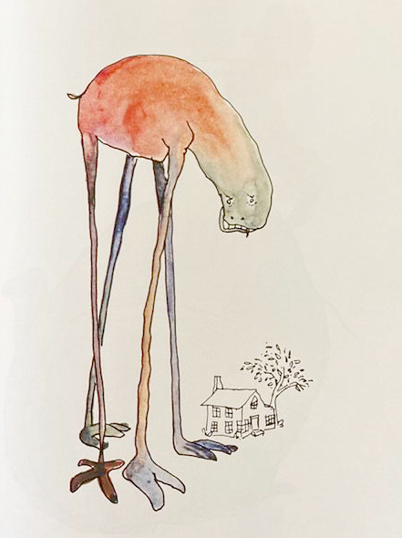
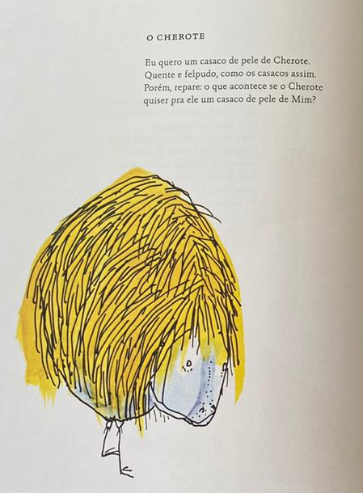
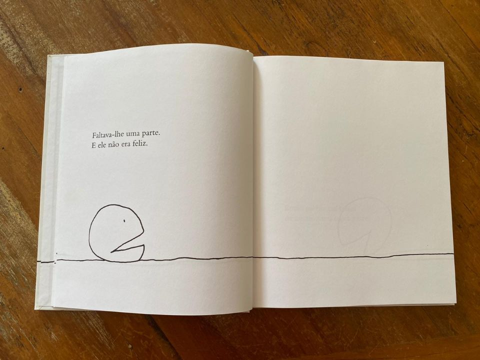
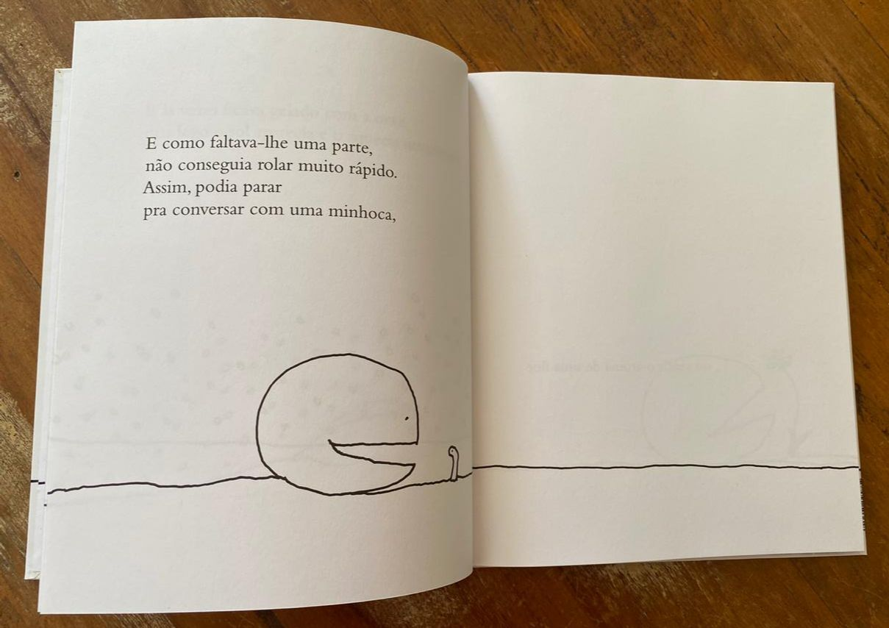
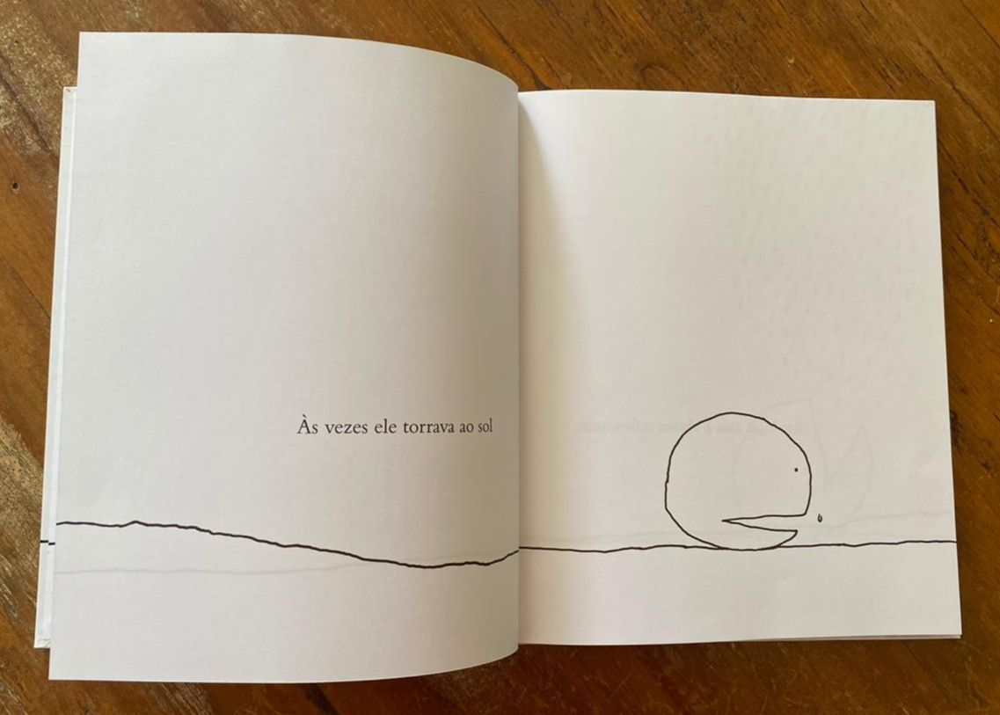
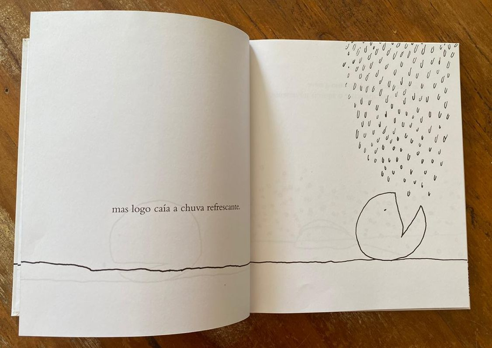
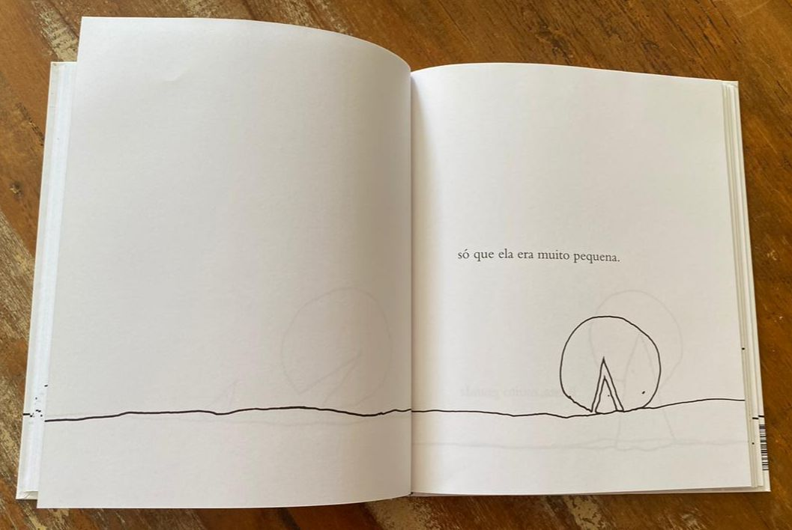
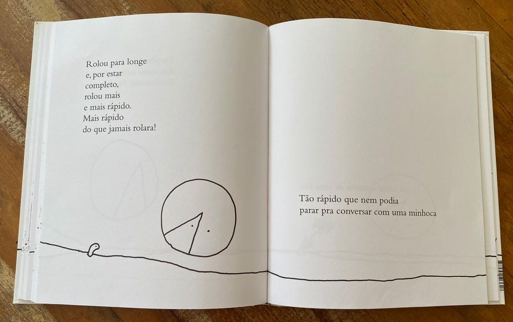
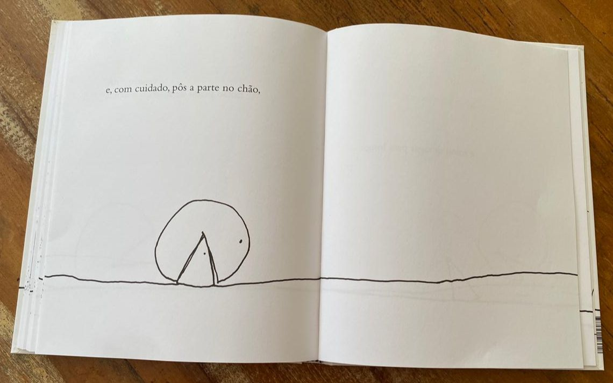
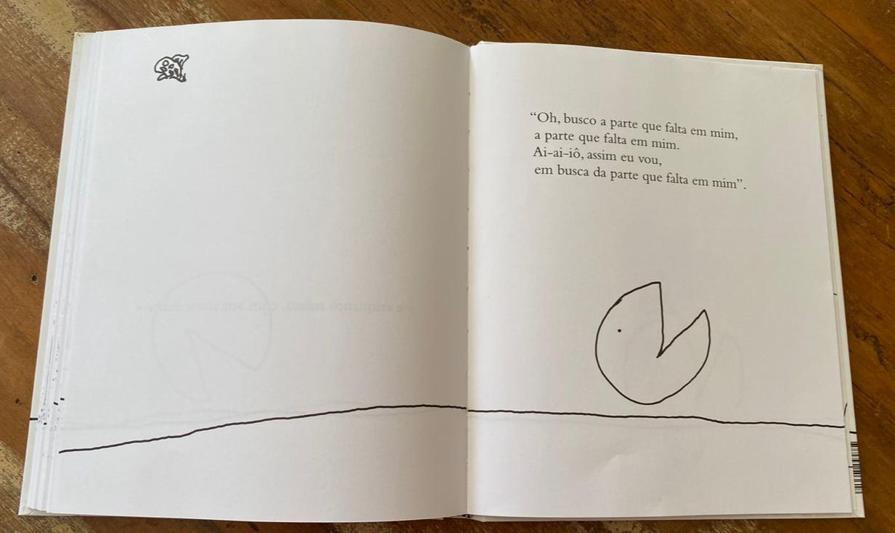

import Book from '~/components/Book.vue'

Hoje bem cedo liguei para uma das minhas melhores amigas e passamos bons minutos conversando ao telefone. Falamos muito de saudade. Ano passado estávamos juntas comemorando seu aniversário de 70 anos, com muito vinho e amigos queridos.

Combinamos então de nos encontrarmos pelo menos uma vez por ano (moramos a 1000 km uma da outra!) e também combinamos uma tatuagem que marcasse nosso encontro na vida. Assim, para espanto dos filhos, fizemos nossa primeira tatuagem, mas o encontro combinado não pôde acontecer.

Terminamos a conversa, depois de muito falar sobre o que estávamos vivendo, do medo constante, mas com a esperança de que no próximo ano estaremos juntas. Sem promessas dessa vez, pois a incerteza do momento não nos permite planos. Por enquanto, sem luz no fim do túnel!

Nos próximos dias completo 90 dias isolada em minha casa. Me sinto como o Gradiardo, do lindo livro de pequenos poemas do **[Shel Silverstein](https://youtu.be/6br91GvkBO0)**.

<book title="Fuja do Garabuja: E outros seres fantásticos" author="Shel Silverstein" link="https://amzn.to/30dVAMF">

</book>

Os pequenos poemas deste livro descrevem seres fantásticos, e um deles o *Gradiardo*.

Ao me lembrar do _Gradiardo_, folhei novamente o livro e como é bom. É interessante reler um livro. O nosso olhar muda de acordo com o momento que estamos vivendo, e dos momentos ja vividos. E como o _Agripanta_ agora se parece com esse virus que nos ronda.

Incrível, não?  Mas o meu ser preferido e mais significativo continua sendo o peludo _Cherote_:

Shel Silverstein, com essa simplicidade toda, tem pequenas jóias escritas. Todas para mim imperdíveis. Mas uma em especial, nesses meses de muitas faltas, reler agora me foi reconfortante. **_[A parte que falta](https://amzn.to/2YaEwoj)_**, acredito seja seu livro mais famoso, e tem todo o mérito para isso.

<book title="A parte que falta" author="Shel Silverstein" link="https://amzn.to/2YaEwoj">

</book>

> “Ritmada como uma canção, esta história se desenrola toda faceira diante de nossos olhos curiosos e fala sobre um ser redondo à procura de uma parte sua que estaria faltando. E você, já achou que falta algo em sua vida? Talvez um pedaço. Um caminho? Eis um mistério que nos acompanhará em todas as idades. Afinal, há um final?”  
> — Fernanda Takai, cantora e compositora brasileira

Esse ser rolante ia rolando pela vida a procura de sua parte faltante, pois só assim seria feliz.

Como faltava-lhe uma parte, ele ia rolando devagar, e tinha muito tempo para observar e admirar tudo que encontrava pelo caminho. Como cheirar uma flor, ter borboletas que pousavam sobre ele, disputar corridas com besouros e conversar com minhocas.

Neste rolar nem tudo eram flores, ele passava por muitas adversidades, que eram naturalmente superadas, e ele seguia seus dias a rolar a procura de sua parte.

E ele encontra diversas partes, algumas grandes demais, outras pequenas, outras que encaixavam mas ele não conseguia segurá-las.

Até que ele encontra uma que encaixa perfeitamente, mas ele nao ficou feliz como esperava.

Assim, esse ser rolante, prosseguiu seu caminho rolando devagar, a procura da parte que lhe faltava.

Uma lindeza só esse livro. Reconfortante, no sentido de que sempre haverá faltas a serem superadas, pois são elas que nos obrigam a rolar.  O importante é sobreviver rolando, apreciando o que se apresenta pelo caminho, que nossas partes que tanta falta estão nos fazendo serão encontradas.

Continuemos assim, em nossas gaiolas, para a encrenca em que estamos não seja maior!
