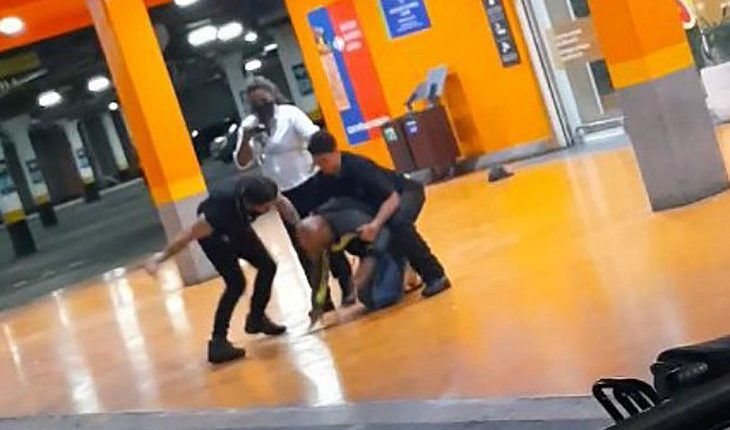
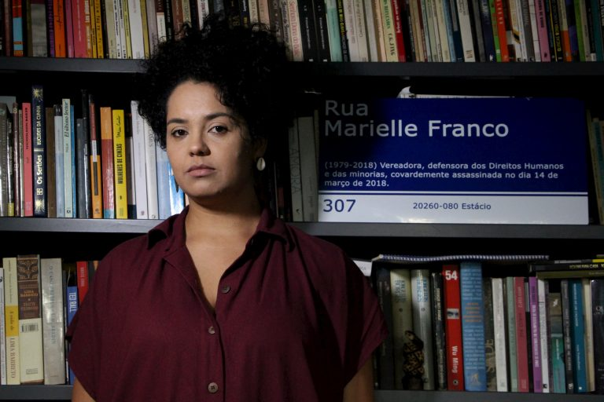
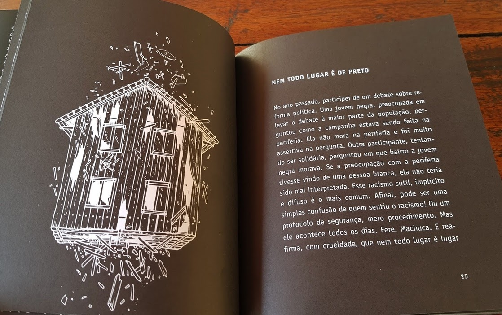
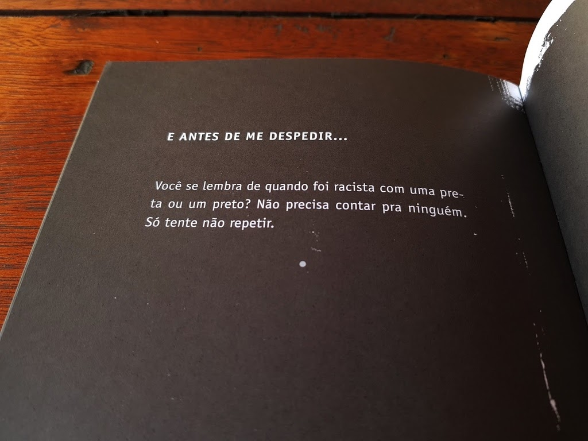

import Book from '~/components/Book.vue'

Um homem negro foi espancado e morto por dois seguranças de uma unidade do Carrefour no bairro Passo D'Areia, [em Porto Alegre](https://congressoemfoco.uol.com.br/tag/porto-alegre), na véspera do dia da Consciência Negra. Segundo relatos, João Alberto Silveira Freitas, de 40 anos, foi levado após um desentendimento para o estacionamento do hipermercado onde a agressão o levou à morte.

O homicídio foi gravado, e o vídeo corre nas redes sociais. O assunto está entre os mais comentados das redes nesta manhã, dia em que se celebra a Consciência Negra.

Escrevo hoje, dia 20, data em que se comemora o dia da consciência negra em algumas (sim, algumas somente) cidades do Brasil, e acordei com essa notícia estampada em todos os sites.

Tinha já todo um post escrito, sobre outro assunto e livros diversos. Devo confessar, que nunca me atrevo a falar de racismo e as razões são múltiplas. Primeiro, e talvez a mais importante, é o de não ser meu lugar de fala, mesmo eu sendo neta de negros, eu sou branca. Não tive no meu convivio social próximo nenhum negro. Não tive professores negros. E somente dois colegas de trabalho negros, onde um deles, o mais próximo,  sempre andava extremamente arrumado para um ambiente universitário. Uma vez perguntei a ele o porquê de estar assim sempre tão chic, sempre social  - “Helô, tem que ser assim, porque se eu me vestir à vontade como vocês, logo irão me dar um projetor para carregar. Não serei nunca o conferencista em um congresso.”

Então, já me desculpando pelo “desajeito”, vou falar sobre dois livros que li recentemente e que sempre me voltam a cabeça.

<book title="Torto arado" author="Itamar Vieira Junior" link="https://amzn.to/35OZkXy">

</book>

Esse livro de Itamar Vieira Jr. foi sem dúvida uma das melhores leituras que fiz esse ano. Bem difícil descrever toda a emoção que senti com essa leitura, que entra debaixo da pele e se funde na gente. A trama se passa na Fazenda Água Negra, no Sertão da Bahia, no início dos anos de 1960. Nela vivem trabalhadores descendentes de uma escravidão abolida muito no papel e pouco no cotidiano.

A narrativa é revezada entre as duas irmãs, Belonisia e Bibiana . É trama de desigualdade, porque os donos da terra não são os que pegam na enxada. É trama de violências, da fome, da falta, da seca, da agressão familiar, da perda, do medo.

Em volta das duas irmãs vemos a vida da família; dos pais, envolvidos em curandeirismo, misticismo e fé; da avó, perturbada por um passado secreto; dos vizinhos, com seus problemas particulares; dos trabalhadores, mantidos “quase” em regime de escravidão.

Quando adultas, as duas meninas se separam: Belonisia torna-se personagem da vida da fazenda; à Bibiana, as injustiças daquela vida parecem irresignáveis levando-a a juntar-se à luta pela emancipação e pelo direito à terra.

> Era um desejo de liberdade que crescia e ocupava quase tudo o que fazíamos. Com o passar dos anos esse desejo começou a colocar em oposição pais e filhos numa mesma casa.

Durante a leitura, me lembrava da data a que se refere o livro: décadas de 60 e 70. Para mim, outro dia. Mas, um outro Brasil, para mim um estranho Brasil que agora muito me abate.

---

Um outro livro que muito me impressionou, foi da jovem autora **Bianca Santana**.

<book title="Quando me descobri negra" author="Bianca Santana" link="https://amzn.to/2IZYu0T">

</book>

Comprado para minha neta, mas recomendado para todos os amigos, **_[Quando me descobri negra](https://amzn.to/2IZYu0T)_** é um livro lindamente ilustrado e bastante contundente.
A autora trata do embranquecimento social que os negros passam quando ascendem a posições onde não são esperados estar, na forma de uma série de relatos sobre experiências pessoais ou ouvidas de outras mulheres e homens negros no livro

> “Tenho 30 anos, mas sou negra há dez. Antes, era morena.”

Ela explora o racismo tão estrutural em nossa sociedade, que ainda teima em querer embranquecer o país, distanciando a cultura e origem africana de seus descendentes.

> “Eu sempre soube que não era branca, mas aquilo não era uma questão para mim, eu misturava com a classe social.”

A escritora lembra que começou a intuir sobre a sua identidade quando começou a dar aula para jovens e adultos.

> “Eu fui branqueada em casa, na escola, no cursinho e na universidade. É como disse Francisco Weffort: o branqueamento apaga as glórias dos negros, a memória dos líderes que poderiam sugerir caminhos diferentes daquele da humilhação cotidiana, especialmente para os pobres. Ainda em busca de identidade, afirmo com alegria que sou negra há dez anos. E agradeço ao professor do Educafro que pela primeira vez, em 21 anos, fez o convite para a reflexão profunda sobre minhas origens. O coordenador me disse que era bacana ter uma professora como os alunos e nunca tinha dito aquilo para meu colega, um homem branco.”

Atualmente, a afirmação sobre ser negra é a base de sua existência: sendo uma ativista e militante, com diversos outros livros escritos.

“Homens brancos costumam se afirmar como pessoas ou seres humanos, em volta deles existe a noção de universalidade. Mulheres brancas se apresentam como mulheres, e mulheres negras são atravessadas pelo gênero e pela raça”.

Sinto a necessidade em ler mais sobre racismo. Em ler mais sobre mulheres negras. Em ler mais autoras e autores negros. Não consigo conviver pacificamente e de forma não informada sobre essa triste face brasileira.

---

E paro por aqui esse post, quase desabafo.

Agora entrarei em recesso de final de ano. Retorno com meus pitacos e sugestões de leitura a partir da segunda quinzena de janeiro!

Bom final de ano a todos! Boas leituras e até 2021!
