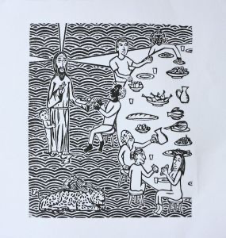
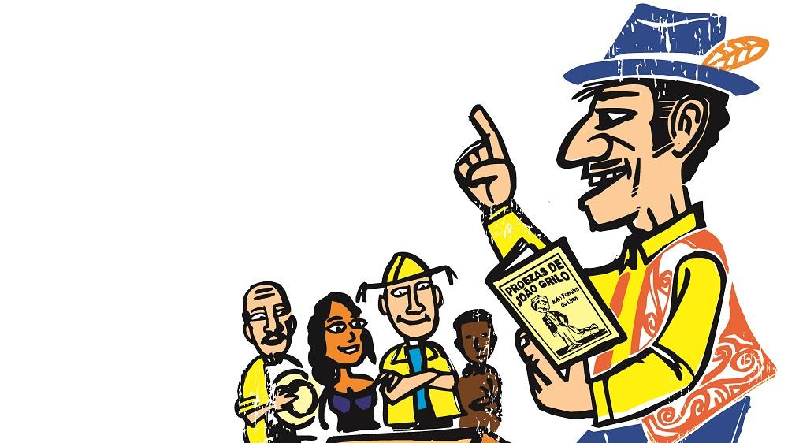

import Book from '~/components/Book.vue'

Eu um dia quis ser médica.

E, nesses tempos difíceis em que estamos vivendo, eu me pego a pensar que se tivesse seguido meu primeiro sonho profissional, certamente estaria na linha de frente, porque eu não queria somente ser médica, eu sonhava com os médicos sem fronteiras, atuando pelo mundo.

Meu pai sempre atuou na saúde pública e começou profissionalmente no interior de São Paulo, em pequenas cidades. Uma delas Paraíso, onde nasci.

Além de atender no posto de saúde, meu pai tinha um consultório em casa, onde atendia muitos pacientes. Bastava um entrar no consultório que eu, muito pequena, pegava um banquinho e ia espiar o atendimento por frestas que descobria.

Nessas minhas espiadas, me lembro de panarícios sendo supurados, cobreiros, manchas das mais diversas, e um que me marcou muito - uma paciente com elefantíase. Nunca tinha visto nada igual, e quando soube que era uma doença transmitida por mosquito deixei minha mãe em desespero. Não queria mais saber de colocar vestido ou shorts, e qualquer picada acompanhava e sonhava que estava com a doença.

Foi a partir dessa experiência, que meu sonho de me tornar médica começou a sucumbir…

---

Essas lembranças todas me vieram da leitura de um livro, recentemente publicado no Brasil, de um autor russo moderno, do século XX.

<book title="Anotações de um jovem médico e outras narrativas" author="Mikhail Bulgákov" link="https://amzn.to/3hbsHWC">

</book>

Mikhail Bulgákov (1891- 1940) nasceu em Kíev, na Ucrânia, em 1891 e  formou-se em Medicina, tendo sido voluntário da Cruz Vermelha durante a Primeira Guerra Mundial.

**_[Anotações de um Jovem Médico](https://amzn.to/3hbsHWC)_** traz alguns dos primeiros experimentos literários de Bulgákov, cujo livro mais conhecido é sem dúvida _[O mestre e Margarida](https://amzn.to/2CoCY37)_, denominado seu romance testamento.

O livro _[Anotações de um Jovem Médico](https://amzn.to/3hbsHWC)_,  reúne nove narrativas ficcionais, alguns dos primeiros experimentos literários de Bulgákov. Publicados entre 1925 e 1926, em um periódico soviético direcionado aos trabalhadores da medicina, estes textos têm como base a experiência do próprio autor nos anos de 1916 e 1917, quando, logo após obter o diploma de médico na maior universidade do país, foi enviado para atuar em um pequeno hospital no interior da Rússia.

> “... Bem, mas e se me trouxerem uma mulher com com complicações no trabalho de parto? Ou, suponhamos, um paciente com uma hérnia estrangulada? O que é que eu vou fazer? Aconsellhem-me, por gentileza. Terminei a faculdade com mérito há quarenta e oito dias, mas mérito é uma coisa, e hérnia é outra. Uma vez, vi o professor fazer uma operação de hérnia estrangulada. Ele operando, e eu sentado no anfiteatro. E só...”

O humor e o tremendo realismo são as marcas desse livro, e envolvem o leitor completamente. Impossível não se sentir no lugar dele, sempre exausto e ciente da responsabilidade de seu trabalho.  A ansiedade é descrita com perfeição.

Mesmo muitas vezes recorrendo a livros na presença de um caso novo, o médico protagonista dos contos não foge de problemas intratáveis, não se desespera, mas continua sua difícil missão de  salvar a vida de uma pessoa. Apenas uma coisa assusta o protagonista do trabalho: sua impotência diante da doença que envolve o paciente. Ele está constantemente tentando cultivar, desenvolver, adquirir novas habilidades e conhecimentos.

Em suma, este médico,  acredito como todos,  trabalha muito em si mesmo. Como não traçar um paralelo com os médicos atuais na presença do desafiante e desconhecido COVID-19?

O livro também traz o famoso relato Morfina, que narra a história do vício em morfina do Dr. Poliakov, um colega do protagonista de Anotações, que vai receber o nome de Dr. Bomgard. Poliakov substitui Bomgard no hospital isolado e usa a morfina uma vez para amenizar uma dor física e percebe que esta também lhe amenizava os problemas pessoais, renovando sua capacidade de trabalho. A partir daí, já viram… O conto é muito realista e dos mais dolorosos que já li sobre qualquer vício.

Em suma, um livro tão bom e envolvente, que me fez tirar da estante o Mestre e Margarida, que aguarda a minha leitura há muitos anos.

<book title="O mestre e Margarida" author="Mikhail Bulgákov" link="https://amzn.to/2CoCY37">

</book>

---

Dos relatos russos fiz um pulo a uma leitura que trata do terror da pandemia que estamos vivendo com o encanto dos versos de Cordel.

<book title="Epidemias e Pandemias do Mundo em 130 Estrofes de Cordel" author="Luís Távora Furtado Ribeiro" link="https://lutasanticapital.com.br/products/epidemias-e-pandemias-do-mundo-em-130-estrofes-de-cordel">

</book>

O que primeiro nos atrai nesse pequeno livro é a linda xilogravura da capa, feita por Eduardo Macedo, cujo belo trabalho eu conheci em uma exposição de _[Gravuras pela paz](https://gravuraspelapaz.wordpress.com)_, que aconteceu em SP, em 2014.

E o livro aprofunda o encantamento da capa.

Luís Távora Furtado Ribeiro, sociólogo e educador, faz em **_[Epidemias e Pandemias do Mundo em 130 estrofes de Cordel](https://lutasanticapital.com.br/products/epidemias-e-pandemias-do-mundo-em-130-estrofes-de-cordel)_**, um apanhado amplo do momento que estamos vivendo e todas as suas consequências e fatos, sem esquecer dos que chamei de [ecos do passado](https://heloiche.com/posts/ecos-do-passado) - a história que se repete no relato de outras epidemias e pandemias.

> “Luís Távora Furtado Ribeiro é um cabra-da-peste. Aliás, o somos todos e todas que nascemos nestas contraditórias terras mais ao norte do país. Contraditórias porque contrárias, sempre, aos movimentos externos impostos por uma hegemonia político-econômica secular que insiste em projetar-nos ao segundo lugar da ordem de prioridades das pautas nacionais. Contraditórias também em sua imanência natural e social, já que o solo catingueiro ao qual estamos ligados em sangue e espírito é palco de uma das maiores manifestações da dialética vida-morte, escassez-abundância…”
>   
>
> &mdash; Eduardo Macedo, no Prefácio

O livro começa com um verso que descreve o COVID-19, sua origem, sintomas e prevenção:

> “Falo sobre uma doença  
> Infecto - Contagiosa. 
> Provocada por um vírus, 
> De ação muito maldosa. 
> Corona vírus, chamado, 
> Com governo descuidado 
> Pôs o mundo em polvorosa.
>   
> Corona em espanhol, 
> É coroa de rainha. 
> Por que o vírus parece 
> Ter uma cepa loirinha. 
> É o COVID-19. 
> Por toda terra se move 
> A pandemia mesquinha.” 

E neste mesmo primeiro verso ele irá falar de métodos de prevenção, defendendo o necessário isolamento e questiona o futuro, apresentando todas a nossas ansiedades quanto ao denominado _novo normal_:

> “Como será o futuro: 
> Com o ônibus lotado? 
> Passageiros no avião, 
> Medo, ser contaminado. 
> O pavor quando passar 
> Alegria vai voltar? 
> Às vezes, sonho acordado.  >  
> Escrevi nesse cordel, 
> Pandemia que eu vi. 
> Quando o poema eu cantei 
> Ela ainda estava aqui. 
> Lembrando todo momento, 
> Nesse frio isolamento, 
> Amor que nunca esqueci.”

O segundo verso, feito em tom de denúncia, traz as implicações que o modelo capitalista traz a esta crise sanitária mundial, particularmente no Brasil, onde vemos naufragar pouco a pouco uma forte proposta neoliberal.

> “A morte não é o fim 
> Da vida não é motivo. 
> Não viver em desespero 
> É da vida o objetivo. 
> Viver bem dia por dia, 
> Sendo boa companhia. 
> Amar no superlativo. ”

Um livro que com a beleza do Cordel trata de tudo o que mais é relevante em nosso momento atual.

Queria ver esse livro nas mãos de todos os leitores, pois sem dúvida, na mais popular forma brasileira de expressão artística, o Cordel,  um pedaço da história que vivemos está aqui descrita.

E aproveito, recomendando também que ouçam [um lindo vídeo onde poetas cearenses fazem um Cordel contra o COVID-19](https://diariodonordeste.verdesmares.com.br/verso/poetas-cearenses-produzem-video-cordel-contra-a-covid-19-assista-1.2965019).

> “Segundo o coordenador da obra, o cordelista, xilógrafo e compositor Eduardo Macedo, 42 anos, os versos apresentados pelo grupo formado por 14 poetas do Ceará apontam os cuidados a serem tomados pela população, visando a não contaminação e transmissão do coronavírus. Ressaltam, ainda, as dificuldades resultantes do distanciamento da sociedade.”

Interessante, como a poesia, em suas mais diferentes vertentes,  tem me sido uma grande companhia nesses 120 dias de isolamento. Certamente, um precioso ganho que vou levar comigo destes tempos tão sombrios.

Fiquem bem! Até a próxima!
