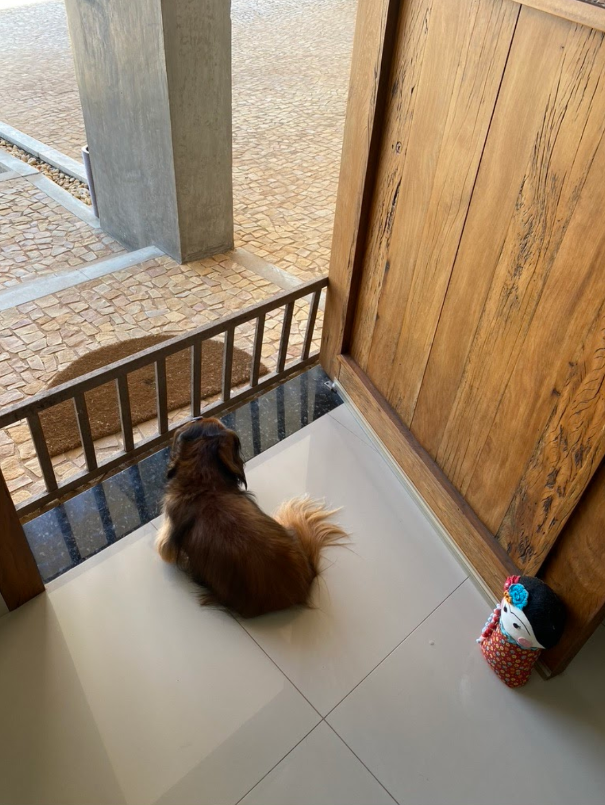

import Book from '~/components/Book.vue'

Não sei como andam vocês, mas eu por aqui, em isolamento há mais de três semanas e cada dia mais apavorada com os dados que explodem na mídia. Meu companheiro de jornada tem sido o termômetro; além é claro da minha linda cachorrinha Kira.

Kira, minha querida Deckel, sempre vigilante a porta a espera daquela visita que nao chega!

A  fuga desse ciclo louco e literalmente doentio, como sempre, tem sido os livros. Infelizmente, mais reflito do que leio. Tergiversar tem sido meu verbo.

Tinha planos, como disse na última edição, de ler livros relevantes sobre outras pestes, que não  guerras, mas não dei conta. Pesou muito e deixei para outro momento.

Meu socorro tem sido minha prateleira de Histórias em Quadrinhos (HQs), que para mim são tipo “comfort books”, ainda mais quando autobiográficas, como as duas que destaco hoje.

<book title="Fun Home: Uma Tragicomédia em Família" author="Alison Bechdel" link="https://amzn.to/2yQnxOZ">

</book>

Para quem nunca leu HQ recomendo essa fortemente e garanto será conquistado para esse tipo de leitura. Uma autobiografia de primeira linha. Retrata parte da vida da autora, de sua adolescência até o início de sua vida adulta.

O processo de escrita desse livro, descrito no outro ótimo - *[Você é minha mãe?](https://amzn.to/2Xqo9Fc)* - durou oito anos. Nesse período a autora passou por um processo de autoconhecimento, o que torna a escrita dessa HQ ainda mais comovente.

O que mais me ficou desta leitura foi o peso, muitas vezes despercebido, de nossa família na construção do que somos. Daí a importância do processo psicanalítico, para os que nele se arriscam. Outro aspecto relevante dessa HQ é o desenho. Uma paleta de cores minimalista e traços simples que demonstram as expressões com precisão.

Excelente. Recomendadíssimo. Enredo magistralmente construído e que irá conquistar o leitor novato para a riqueza do universo de HQs.

Uma boa resenha pode ser vista [neste video](https://youtu.be/P_WD_GOKoTc).

O livro a seguir eu li em conjunto com minha neta de 12 anos.

<book title="Persépolis" author="Marjane Satrapi" link="https://amzn.to/3caYtk4">

</book>

Outra autobiografia do período entre os 10 e os 28 anos dessa autora iraniana. Como foi importante ler isso em conjunto com minha neta e ver a reação dela a como mulheres passaram a ser tratadas pelo regime religioso ditatorial implantado no Irã após a Revolução Islâmica. Nos obrigou a pesquisar sobre a inúmeras guerras mencionadas no decorrer do livro.

Uma boa resenha pode ser vista em [neste video](https://youtu.be/3-aG34pOCXE).

Foi assustador ler o quanto ideologias segregadoras são perigosas quando chegam ao poder. Pude fazer com Isadora paralelos com outras leituras que ja haviamos feito, como _[Anne Frank](https://amzn.to/34s4rdG)_, e _[O Diário de Myriam: A guerra da Síria vista pelos olhos de uma menina](https://amzn.to/3c4yZF0)_. Mas, neste livro, o feminino e o feminismo, além de xenofobia são os aspectos mais marcantes. E minha “pequena feminista,” fez marcações em partes que destacam principalmente os aspectos relacionados a segregação das mulheres.

O livro já está circulando pelas amigas, pois Isadora disse que todas tem que ler, porque isso nunca pode acontecer aqui. E claro, fez os pais lerem também - "quero que vocês me tratem como os pais da Marjorie, viu?"

Por hoje, fico por aqui. No meu Instagram ([@heloisavrocha](https://instagram.com/heloisavrocha))  procuro manter em dia todas as leituras que faço e que às vezes não chegam aqui.

Boa Páscoa! Com muito chocolate e livros, sem moderação!
