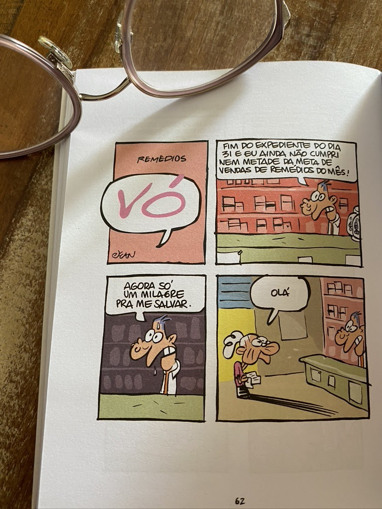
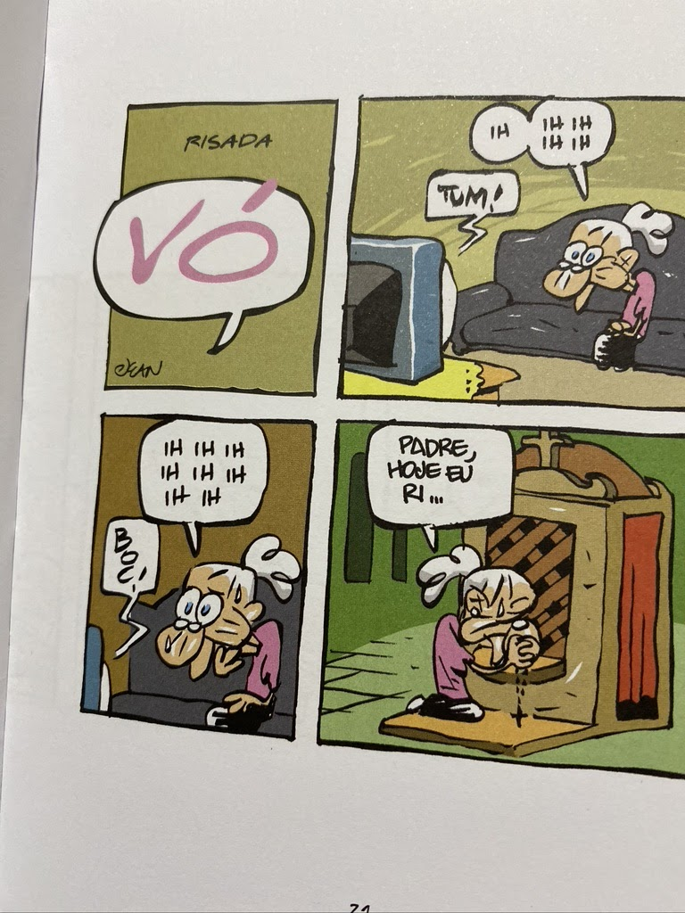

import Book from '~/components/Book.vue'

Retorno de férias é tão gostoso. 

Sempre me lembro de perder o sono na noite anterior. Quando menor, porque teria que desenhar minhas férias e quando já alfabetizada, fazer a malfadada redação. Muitos anos se passaram desse tempo, e a agonia das crianças persiste. Meu neto João ensaiou antes o desenho dele no cavalo, que seria tarefa árdua. Os outros dois não sei o que escreveram, mas certamente não foi sobre as leituras programadas que tomaram poeira na cabeceira de cada um. 

Mas é isso mesmo. Férias é sinônimo de descompromisso, do fazer o que "der na telha naquele dia", ou simplesmente não fazer nada. 

---

Eu, toda feliz vacinada, tinha planos de reencontrar irmãos e amigos de alguma forma. Nem eram planos, era uma saudade enorme. E aí tudo começou a se modificar, e nós os velhos felizes e vacinados viramos mais outra vez alvo preferencial do vírus, novamente isolados aguardando a terceira dose. E assim vamos levando essa pandemia interminável e deixando os reencontros para depois. Depois do que? Não sei.

Outro dia, conversando com uma amiga, disse que tenho a sensação de que estou envelhecendo num ritmo muito acelerado. Ela concordou, disse que entrou na pandemia sem nem pensar muito sobre a idade e sai dela uma idosa cheia de comorbidades.

---

Ganhou luz nesses últimos 18 meses um fenômeno discriminatório social ao qual eu não dava a devida atenção - o idadismo  - a discriminação e preconceito baseados na idade, geralmente das gerações mais novas em relação às mais velhas.

Envelhecer no Brasil nunca é uma tarefa das mais fáceis. E ser velho na pandemia é um desafio diário.

> Um grupo de intelectuais europeus publicou em maio de 2020 uma carta aberta denunciando a ‘cultura do descarte’ do idoso durante a pandemia. Isso ocorre também no Brasil? Muito. Todo preconceito de idade, que eu chamo de ‘idadismo’, que já existia contra os idosos, apenas aflora, aumenta com a questão da Covid. ‘Deixa morrer! Jito! E daí?’ Parece que ninguém se importa mais com a morte de alguém que já viveu. É o que eu tenho chamado de gerontocídio.   
> fonte: [Preconceito contra idosos cresce na pandemia, diz ex-diretor de envelhecimento da OMS](https://www1.folha.uol.com.br/equilibrioesaude/2020/05/preconceito-contra-idosos-cresce-na-pandemia-afirma-ex-diretor-de-envelhecimento-da-oms.shtml)

Aí comecei a pensar em como o idadismo já existia, principalmente no plano individual, pela via da negação da velhice. Especialmente para as mulheres, sendo que, durante a pandemia, quando afloraram cabeças brancas femininas entre espantos e "elogios amarelos", apareceram  tipo: "está bonito mas envelhece". 

Idadismo junto com machismo ganha uma forma ainda mais cruel. Alguns devem se lembrar da Xuxa, a famosa e linda rainha dos baixinhos, recebendo comentários desagradáveis sobre sua aparência atual; a Betty Faria, sobre sua coragem de aos 80 anos colocar um biquíni na praia. Envelhecer é feio, e aparentar sua idade ao olhar brasileiro parece ser descuidar-se. O maior elogio a ser recebido é o de que você não aparenta a idade que tem. Aquele famoso, “está tão conservado!”, que nos faz sentir um pickles. 

> Nas individualizadas e flexíveis formações identitárias atuais, prevalece, de um modo geral, o ideário do envelhecer bem associado ao manter-se ativo, bem-disposto – e jovem.   
> No binarismo normativo e hierárquico entre velhos e não velhos que permeia a construção social da juventude como padrão desejável, os jovens estão associados a atributos como saúde, beleza e sucesso. Para os mais velhos, reservam-se as conotações desagradáveis relacionadas com a deterioração de sua condição física e/ou mental na senescência. Fruto de uma combinação insidiosa entre idadismo e machismo, essa situação é mais dramática para as mulheres.
>   
> fonte: [O idadismo como viés cultural: refletindo sobre a produção de sentidos para a velhice em nossos dias](http://dx.doi.org/10.1590/1982-25542016120675)

---

E na literatura como são (re)tratados os personagens velhos?  

<book title="Assombrações" author="Domenico Starnone" link="https://amzn.to/3jqgYI0">

</book>

Este estava na minha estante há tempos. Foi lançado no embalo do sucesso de seu primeiro livro _[Laços](https://amzn.to/3kvwJN4)_.

Em ***[Assombrações](https://amzn.to/3jqgYI0)***, a história orbita ao redor de Daniele Mallarico, um ilustrador já idoso, às voltas com a finitude da própria vida e obra. Convalescente de uma cirurgia, é convocado pela filha, Betta, para ir até a cidade onde mora, cuidar do seu filho, neto dele. A cidade é Nápoles, a mesma onde o próprio Daniele cresceu, pois Betta irá viajar com o marido, Saverio, para um congresso.

É um enredo bastante… diria, simples complexo, pois o autor a partir de trivialidades faz emergir conflitos dos mais importantes. Daniele vive alheio à família (praticamente desconhece o neto e a situação atual da filha; mais tarde, revela-se que sua relação com a esposa também foi distante) e, além disso, tem de lidar com uma encomenda de trabalho que logo se mostrará problemática. 

Convidado por um jovem – e aparentemente arrogante – editor, tem de ilustrar o conto “A bela esquina”, de Henry James, para uma nova edição. Só que ele não consegue resultados que satisfaçam ao editor, a si, ou mesmo ao neto, que vê os esboços. O velho ilustrador, sentindo-se obsoleto, o jovem editor, com poder, e o neto, na infância, esses três personagens já demarcam um dos temas do livro: os conflitos geracionais entre pessoas de tempos e realidades diferentes.

> ...minha filha nunca se esforçara em me dar crédito. Do resto o que era credito? Não havia nada mais instável. Nos últimos anos, ninguém me demonstrava apreço como antigamente, muitas coisas tinham mudado. Seja como for , paciência - disse a mim mesmo - , qual a importância disso, o essencial é que ainda estou trabalhando.

> Até agora eu tinha levado adiante fingindo que estava no pleno vigor das minhas capacidades ativas….. O sucesso, quando chegou, me pareceu natural, nunca tinha feito nada para obtê-lo nem para conservá-lo: minhas obras simplesmente mereciam ser reconhecidas. Talvez justamente por isso tenha durado tanto tempo a impressão de que o sucesso era de uma substância que jamais deterioraria. Sendo assim, tinha sido fácil perceber que os trabalhos estavam diminuindo, que o mundo no qual eu tivera certo prestígio fora substituido por outros mundos não intuídos há tempo, por outros grupos de poder que nem sequer me conheciam, por forças jovens e agressivas que ignoravam tudo do meu trabalho ou que, se me procuravam, era para ver se eu podia ser útil a sua ascensão. Mas agora - disse a minha mesmo - já não posso ignorar os sinais do declínio, ......,  o telefonema ofensivo do meu contratante; daquele exaurimento da imaginação do qual eu não conseguia sair; e minha filha, minha única filha, que me aprisionara sem que eu percebesse no papel de velho avô.

Assombrações e fantasmas!? Daniele sente-se cercado por eles – é inclusive um fantasma de si próprio – e esse retorno à cidade onde cresceu, à casa onde também viveu, à proximidade da família e às lembranças afetivas que o farão questionar a própria identidade e lugar no mundo.

> Nao suporto conversar com o menino me autodefinindo como vovô. Não sou o vovô, sou eu. Não sou uma terceira pessoa, sou uma primeira.

Nem preciso dizer que esse livro "quebrou-me as pernas". Envelhecer e tornar-se um fantasma de si mesmo foi uma imagem muito forte, junto a perda de seu eu. Uau! 

---

Para suavizar peguei na estante uma HQ, coleção de tiras, de um personagem que me fez rir há alguns anos. Um perigo, pois agora, com novo olhar, o encanto pode se quebrar.

<book title="Vó" author="Jean Galvão" link="https://amzn.to/2UYCFFA">

</book>

Para relembrar ou dar a conhecer  o personagem, nada como algumas tiras:

Sim, são as mazelas do envelhecimento sendo retratadas tira a tira. Uma paródia, feita por um neto amoroso, reza a lenda. Sorrisos amarelos de minha parte, mas acho que mais gente, jovens principalmente, deveriam ler e refletir sobre as situações retratadas e de onde vem o humor!

---

Tenho aqui uma pequena lista de livros sobre a decrepitude do envelhecimento, mas adoraria receber mais sugestões. Quero muito "ir ao oriente" onde, me parece, a velhice tem outro tom.

Assim, ficamos. Aos meus queridos velhos, continuem se cuidando e muito, pois como diz minha irmã "sequelas rimam, mas não combinam, com nossas mazelas da idade".

Em tempo, num esforço para combater o idadismo, termo que define o preconceito contra os idosos, a agência Artplan lançou  a campanha #OrgulhoSessentaMais, que se propõe a abrir um diálogo com as marcas e com a sociedade para mudar a forma com que a população de mais de 60 anos é retratada. Aderi total a essa pauta como ativista. 

E durma com um barulho desse!

Até a próxima...

PS: [A partir de 1o. de janeiro de 2022, a velhice será tratada como doença pela Classificação Internacional de Doenças e Problemas Relacionados à Saúde (CID) da OMS (Organização Mundial da Saúde), sob o código MG2A](https://www.em.com.br/app/colunistas/juventude-reversa/2021/07/01/noticia-juventude-reversa,1282049/oms-classifica-velhice-como-doenca-sob-criticas-de-especialistas.shtml)

